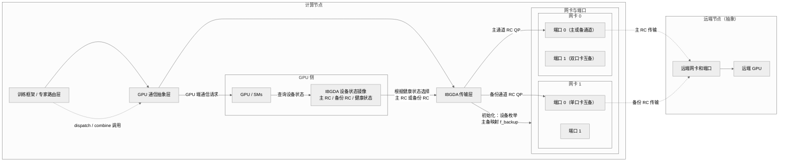

# 0 Base
git clone DeepEP/nvshmem，然后把deepEP下面的third-party内的nvshmem.patch的改动加到自己的nvshmem上。
## 0.1 Compile and Test NVSHMEM
### compile
这里的-DNVSHMEM_BUILD_PYTHON_LIB=OFF一定需要设置。
```shell
CUDA_HOME=/usr/local/cuda/ && \
NVSHMEM_SHMEM_SUPPORT=0 \
NVSHMEM_UCX_SUPPORT=0 \
NVSHMEM_USE_NCCL=0 \
NVSHMEM_IBGDA_SUPPORT=1 \
NVSHMEM_PMIX_SUPPORT=0 \
NVSHMEM_MPI_SUPPORT=0 \
NVSHMEM_TIMEOUT_DEVICE_POLLING=0 \
cmake -S . -B build/  -DCUDA_ARCHITECTURES=90 -DCMAKE_VERBOSE_MAKEFILE=ON -DCMAKE_INSTALL_PREFIX=/opt/nvshmem -DNVSHMEM_BUILD_PYTHON_LIB=OFF && \
cd build
make -j$(nproc)
```
1. **编译如果出现mlx5找不到：**
```shell
ln -s /usr/lib/x86_64-linux-gnu/libmlx5.so.1 /usr/lib/x86_64-linux-gnu/libmlx5.so
```
2. **如果显示nvshmem.cpp找不到**：
```shell
# 需要git status看一下是不是当前有些文件被nvshmem里面乱七八糟的cmake弄没了
# 这个nvshmem.cpp就会被莫名其妙删掉 有时候需要手动restore一下
```
### test
nvshmem/src/modules/transport/common/env_defs.h内有一些环境变量说明

```shell
export NVSHMEM_DIR=/workspace/liuda/dev/nvshmem-fault-tolerance  # Use for DeepEP installation
export LD_LIBRARY_PATH="${NVSHMEM_DIR}/lib:$LD_LIBRARY_PATH"
export PATH="${NVSHMEM_DIR}/bin:$PATH"
```

## 0.2 Compile  DeepEP
这里需要export TORCH_CUDA_ARCH_LIST="9.0" 不然会出问题。
```shell
export NVSHMEM_DIR=/opt/nvshmem
export LD_LIBRARY_PATH="${NVSHMEM_DIR}/lib:$LD_LIBRARY_PATH"
export PATH="${NVSHMEM_DIR}/bin:$PATH"
export TORCH_CUDA_ARCH_LIST="9.0"
NVSHMEM_DIR=/opt/nvshmem python setup.py build
```
test
```shell
MASTER_ADDR=gpu064 MASTER_PORT=29500 WORLD_SIZE=2 RANK=0 \
python /workspace/liuda/dev/DeepEP/tests/test_internode.py

MASTER_ADDR=gpu064 MASTER_PORT=29500 WORLD_SIZE=2 RANK=1 \
python /workspace/liuda/dev/DeepEP/tests/test_internode.py
```
# 1 Related
a. 在DeepEP的[[internode_ll.cu]]内包含了dispatch和combine，二者内使用了nvshmemi_ibgda_put_nbi_warp来通信，以及nvshmemi_ibgda_amo_nonfetch_add给remote进程加原子计数的原理。
b. DeepEP的[[ibgda_device.cuh]]内具体写了nvshmemi_ibgda_put_nbi_warp和nvshmemi_ibgda_amo_nonfetch_add的接口。
c. 具体的传输在NVSHMEM的[[ibgda.cpp]]内实现。
# 2 Specific Plan
## 2.1 nvshmem ibgda create backup QP
在 `nvshmemt_init` 函数中枚举 IB 设备后，根据网卡配置创建备份 QP 映射关系：
- **一卡一口**：相邻网卡互备（mlx5_0↔mlx5_1, mlx5_2↔mlx5_3, mlx5_4↔mlx5_5, mlx5_6↔mlx5_7）
- **一卡两口**：同一网卡的两个端口互备
- 建backup QP，CQ等等



![[Support DeepEP Fault Tolerance 2025-11-10 21.03.35.excalidraw  | 100%]]
### 2.1.1 扩展数据结构
在 `nvshmemt_ibgda_state_t` 结构体添加备份QP字段：
```c
typedef struct {
    int *dev_ids;
    int *port_ids;
    // ... 现有字段 ...
    
    // 备份 QP 相关字段
    int *backup_dev_ids;        // 备份设备 ID 数组
    int *backup_port_ids;       // 备份端口 ID 数组
    bool *is_single_port_card;  // 标记是否为一卡一口
} nvshmemt_ibgda_state_t;
```
在rc结构体内添加单个设备的备份QP的字段：
```cpp
struct {
        struct ibgda_ep **eps;
        struct ibgda_rc_handle *peer_ep_handles;

        struct ibgda_ep **backup_eps;            // 备份 RC 端点
        struct ibgda_rc_handle *backup_peer_ep_handles; // 备份 RC 对等句柄
        int backup_dev_id;                       // 此设备的备份设备 ID
        int backup_port_id;                      // 此设备的备份端口 ID
        
        int num_eps_per_pe;
        nvshmemi_ibgda_device_qp_map_type_t map_by;
    } rc;
```
### 2.1.2 实现备份映射逻辑
在 `nvshmemt_init` 函数中，设备枚举完成后，添加备份映射创建函数调用。
**新增函数 `ibgda_create_backup_mapping`**：
  1. 遍历所有已枚举的设备（`ibgda_state->n_dev_ids`）
  2. 检查每个设备的 `phys_port_cnt`：
     - 若 `== 1`：一卡一口，使用相邻配对策略（i 与 i^1 配对，即 0↔1, 2↔3, 4↔5, 6↔7）
     - 若 `== 2`：一卡两口，查找同一设备的另一端口
  3. 填充 `backup_dev_ids[]` 和 `backup_port_ids[]` 数组
  4. 对于无法找到备份的设备，记录警告日志
  
一卡一口:
```
for i in 0..n_dev_ids:
    device_id = dev_ids[i]
    device = devices[device_id]
    
    if device.phys_port_cnt == 1:
        // 相邻配对：i XOR 1
        backup_idx = i XOR 1
        if backup_idx < n_dev_ids:
            backup_dev_ids[i] = dev_ids[backup_idx]
            backup_port_ids[i] = port_ids[backup_idx]
```
一卡两口:
```
if device.phys_port_cnt == 2:
    // 查找同一设备的另一个端口
    for j in 0..n_dev_ids:
        if dev_ids[j] == device_id && port_ids[j] != port_ids[i]:
            backup_dev_ids[i] = dev_ids[j]
            backup_port_ids[i] = port_ids[j]
            break
```

### 2.1.3 分配和初始化备份数组
在 `nvshmemt_init` 中，在 `ibgda_state` 分配后：
```c
// 在 ibgda_state 字段赋值处添加
ibgda_state->backup_dev_ids = (int *)malloc(MAX_NUM_PES_PER_NODE * sizeof(int));
ibgda_state->backup_port_ids = (int *)malloc(MAX_NUM_PES_PER_NODE * sizeof(int));
ibgda_state->is_single_port_card = (bool *)malloc(MAX_NUM_PES_PER_NODE * sizeof(bool));
// 添加内存分配检查
```
### 2.1.4 调用备份映射函数
在设备枚举完成后（约行End - Ordered list of devices" 日志后），调用：
```c
status = ibgda_create_backup_mapping(ibgda_state);
NVSHMEMI_NZ_ERROR_JMP(status, NVSHMEMX_ERROR_INTERNAL, out,
                      "Failed to create backup QP mapping.\n");
```
### 2.1.5 连接建立时
#### a. 分配和初始化ibgda_device内备份device
在`ibgda_connect_device_resources`函数内按照如下逻辑去写每个设备的RC'结构体，就可以正确应用前面的全局的表backup_dev_ids和backup_port_ids到设备结构体内去。
```cpp
// Initialize backup device/port mapping based on ibgda_state backup mappings
    int backup_mapping_idx = -1;
    for (int j = 0; j < ibgda_state->n_dev_ids; j++) {
        if (ibgda_state->dev_ids[j] == dev_idx && 
            ibgda_state->port_ids[j] == portid) {
            backup_mapping_idx = j;
            break;
        }
    }
    if (backup_mapping_idx != -1) {
        // Set backup device and port information in the RC structure
        device->rc.backup_dev_id = ibgda_state->backup_dev_ids[backup_mapping_idx];
        device->rc.backup_port_id = ibgda_state->backup_port_ids[backup_mapping_idx];
        status = ibgda_allocate_backup_rc_structures(t, device, num_rc_eps_per_pe * n_pes);
        INFO(ibgda_state->log_level,
             "Device dev_idx=%d port=%d has backup: dev_id=%d port=%d",
             dev_idx, portid, device->rc.backup_dev_id, device->rc.backup_port_id);
    } else {
        device->rc.backup_dev_id = -1;
        device->rc.backup_port_id = -1;
    }
```
device内的rc内现在有了backup的设备和端口信息后，我们需要和主rc一样去allocate它的handle和backup_eps数组，参考 [[ibgda.cpp#a. 分配peer_ep_handles 数组 | 这里的解释]]。其中调用的 `ibgda_allocate_backup_rc_structures` 函数的逻辑就是同样根据是首次还是多次去alloc和realloc不同num_rc_eps的备份handle和备份eps，这里实现和`ibgda_allocate_rc_structures`类似。
不同的是：这里我们需要增加的是device->rc.num_backup_eps_per_pe这个变量去单独计数，原来allocate rc的函数内用的是device->rc.num_eps_per_pe，需要单独计数，不然创建endpoint的时候backup rc会直接用主rc的计数，直接把handle和eps写在了主的后面，主的拓展的时候就乱了。
```cpp
static int ibgda_allocate_backup_rc_structures(nvshmem_transport_t t, struct ibgda_device *device, int num_rc_eps) {
    int status = 0;
    if (device->backup_peer_ep_handles == NULL) {
        device->rc.backup_peer_ep_handles =
            (struct ibgda_rc_handle *)calloc(num_rc_eps, sizeof(*device->rc.backup_peer_ep_handles));
    } else {
        size_t new_size = device->rc.num_backup_eps_per_pe * t->n_pes + num_rc_eps;
        device->rc.backup_peer_ep_handles = (struct ibgda_rc_handle *)realloc(device->rc.backup_peer_ep_handles, new_size * sizeof(*device->rc.backup_peer_ep_handles));
    }
	 if (device->rc.backup_eps == NULL) {
		 device->rc.backup_eps = (struct ibgda_ep **)calloc(num_rc_eps, sizeof(*device->rc.backup_eps));
	 } else {
		 size_t new_size = device->rc.num_backup_eps_per_pe * t->n_pes + num_rc_eps;
		 device->rc.backup_eps = (struct ibgda_ep **)realloc(device->rc.backup_eps, new_size * sizeof(*device->rc.backup_eps));
 }
    return status;
}
```
#### b. 创建RC endpoint
在Phase 4的`ibgda_connect_device_endpoints`内，主RC endpoint创建后立即创建backup rc endpoint。
```cpp
// Phase 4: Per-device endpoint setup (cached)
static int ibgda_connect_device_endpoints(nvshmemt_ibgda_state_t *ibgda_state,
                                          struct ibgda_device *device, int portid,
                                          nvshmem_transport_t t) {
	 // ... setup DCT,DCI,RC
	 // Setup RC endpoints
    status = ibgda_setup_rc_endpoints(ibgda_state, device, portid, t,
                                      ibgda_state->options->IBGDA_NUM_RC_PER_PE);
    if (status) return status;
	 // Setup Backup RC endpoints
    if (device->rc.backup_dev_id != -1) {
        struct ibgda_device *backup_device = (struct ibgda_device *)ibgda_state->devices + device->rc.backup_dev_id;
        status = ibgda_setup_backup_rc_endpoints(ibgda_state, device, backup_device, device->rc.backup_port_id, t);
        if (status) return status;
    }
  // ...
```
`ibgda_setup_backup_rc_endpoints` 实现参考 [[ibgda.cpp#2.2 ibgda_setup_rc_endpoints|主RC endpoints的setup函数]]的逻辑实现。

#### c. GPU状态设置
在上面的ep创建完毕之后，接下来nvshmemt_ibgda_connect_endpoints的phase 5就是ibgda_setup_gpu_state。在这个函数内我们需要修改一些函数来让备份RC和备份QP能正常发数据：
* ibgda_setup_rc_gpu_state 计算backup RC的handle数量，分配设备上真实的内存，分配backup_rc_h和backup_rc_d。
* ibgda_populate_rc_gpu_data填充backup QP的设备信息，关联CQ等等
* ibgda_post_gpu_device_state添加备份 QP 数组指针到设备状态


### 2.1.10 清理资源
在 `out:` 标签的清理代码中，添加备份数组的释放：
```c
if (ibgda_state) {
    if (ibgda_state->backup_dev_ids) free(ibgda_state->backup_dev_ids);
    if (ibgda_state->backup_port_ids) free(ibgda_state->backup_port_ids);
    if (ibgda_state->is_single_port_card) free(ibgda_state->is_single_port_card);
}
```
## 2.2 Check CQ status and checkout to backup QP


## 2.3 Checkout to normal QP

# 3. uni-test
在