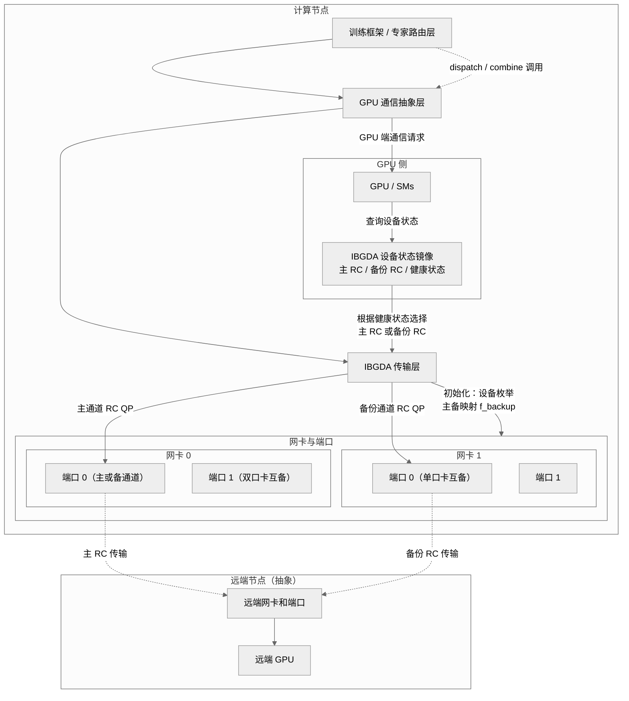

# 0 Base
git clone DeepEP/nvshmem，然后把deepEP下面的third-party内的nvshmem.patch的改动加到自己的nvshmem上。
## 0.1 Compile and Test NVSHMEM
### compile
这里的-DNVSHMEM_BUILD_PYTHON_LIB=OFF一定需要设置。
```shell
c &&
export CUDA_HOME=/usr/local/cuda
export MPI_HOME=/usr/local/mpi
export CPATH=/usr/local/mpi/include:$CPATH
export LIBRARY_PATH=/usr/local/mpi/lib:$LIBRARY_PATH
export LD_LIBRARY_PATH=/usr/local/mpi/lib:$LD_LIBRARY_PATH
MPI_HOME=$MPI_HOME \
CUDA_HOME=$CUDA_HOME \
NVSHMEM_SHMEM_SUPPORT=0 \
NVSHMEM_UCX_SUPPORT=0 \
NVSHMEM_USE_NCCL=0 \
NVSHMEM_IBGDA_SUPPORT=1 \
NVSHMEM_DEBUG=1 \
NVSHMEM_PMIX_SUPPORT=0 \
NVSHMEM_IBRC_SUPPORT=0 \
NVSHMEM_MPI_SUPPORT=1 \
NVSHMEM_IBDEVX_SUPPORT=1 \
NVSHMEMTEST_MPI_SUPPORT=1 \
NVSHMEM_USE_GDRCOPY=1 \
cmake -G Ninja -S . -B build \
  -DCMAKE_C_COMPILER=${MPI_HOME}/bin/mpicc \
  -DCMAKE_CXX_COMPILER=${MPI_HOME}/bin/mpicxx \
  -DMPI_HOME=${MPI_HOME} \
  -DCMAKE_INSTALL_PREFIX=/workspace/liuda/output/nvshmem \
  -DCUDA_ARCHITECTURES=90 \
  -DNVSHMEM_BUILD_EXAMPLES=OFF \
  -DNVSHMEM_BUILD_PYTHON_LIB=OFF
cmake --build build --target install -- -j 80
```
1. **编译如果出现mlx5找不到：**
```shell
ln -s /usr/lib/x86_64-linux-gnu/libmlx5.so.1 /usr/lib/x86_64-linux-gnu/libmlx5.so
```
2. **如果显示nvshmem.cpp找不到**：
```shell
# 需要git status看一下是不是当前有些文件被nvshmem里面乱七八糟的cmake弄没了
# 这个nvshmem.cpp就会被莫名其妙删掉 有时候需要手动restore一下
```
3. **如果出现nvidia_peermem找不到的问题**：
```cpp
# 检查ofed的驱动是不是加载了旧的默认nv_peer_mem，是的话关闭旧的 打开新的nvidia_peermem模块
rmmod nv_peer_mem && modprobe nvidia_peermem
```
4. **nvshmem的example编译的时候有问题**
直接加上下面这个
```shell
-DNVSHMEM_BUILD_EXAMPLES=OFF \
```
5. **NVSHMEM_MPI_SUPPORT打开后需要全方位给cmake指定mpi的路径，参考我的完整编译指令 这里不开MPI SUPPORT测试nvshmem的perftest就会各种报错找不到第二个process**
6. **DNVSHMEM_BUILD_PYTHON_LIB这个也必须得关掉**
### test
nvshmem/src/modules/transport/common/env_defs.h内有一些环境变量说明
```shell
export MPI_HOME=/usr/local/mpi
export CUDA_HOME=/usr/local/cuda
export NVSHMEM_HOME=/workspace/liuda/output/nvshmem
export LD_LIBRARY_PATH="${NVSHMEM_HOME}/lib:$CUDA_HOME/lib64:$MPI_HOME/lib:$LD_LIBRARY_PATH"
$MPI_HOME/bin/mpirun -np 2 --allow-run-as-root \
    --hostfile /workspace/liuda/dev/nvshmem-fault-tolerance/hostfile \
    -x NVSHMEM_DEBUG=INFO \
    -x LD_LIBRARY_PATH=${NVSHMEM_HOME}/lib:$CUDA_HOME/lib64:$MPI_HOME/lib:$LD_LIBRARY_PATH \
    -x NVSHMEM_IB_ENABLE_IBGDA=1 \
		-x NVSHMEM_IBGDA_LOG_LEVEL=3 \
    -x NVSHMEM_IB_ENABLE_IBRC=0 \
    -x NVSHMEMTEST_USE_MPI_LAUNCHER=1 \
    -x NVSHMEM_IBGDA_NIC_HANDLER=auto \
    -x NVSHMEM_IBGDA_FORCE_NIC_BUF_MEMTYPE=gpumem \
    /workspace/liuda/dev/nvshmem-fault-tolerance/build/perftest/device/pt-to-pt/shmem_put_bw -b 4 -e 1024 -n 1 2>&1 | tee /workspace/liuda/dev/nvshmem-fault-tolerance/ibgda_test.log
```
## 0.2 Compile  and Test DeepEP
### compile
这里需要export TORCH_CUDA_ARCH_LIST="9.0" 不然会出问题。
```shell
export NVSHMEM_DIR=/workspace/liuda/output/nvshmem
export LD_LIBRARY_PATH="${NVSHMEM_DIR}/lib:$LD_LIBRARY_PATH"
export PATH="${NVSHMEM_DIR}/bin:$PATH"
export TORCH_CUDA_ARCH_LIST="9.0"
NVSHMEM_DIR=/workspace/liuda/output/nvshmem  python setup.py install
```
### test
在不同机器上跑下面的指令:
```shell
# node201
MASTER_ADDR=10.1.3.201 MASTER_PORT=29500 WORLD_SIZE=2 RANK=0 \
python /workspace/liuda/fault/DeepEP/tests/test_internode.py
# node201
MASTER_ADDR=10.1.3.201 MASTER_PORT=29500 WORLD_SIZE=2 RANK=1 \
python /workspace/liuda/fault/DeepEP/tests/test_internode.py
```
或者使用mpirun：
```shell

```
# 1 Related
a. 在DeepEP的[[internode_ll.cu]]内包含了dispatch和combine，二者内使用了nvshmemi_ibgda_put_nbi_warp来通信，以及nvshmemi_ibgda_amo_nonfetch_add给remote进程加原子计数的原理。
b. DeepEP的[[DeepEP+NVSHMEM/DeepEP/ibgda_device.cuh]]内具体写了nvshmemi_ibgda_put_nbi_warp和nvshmemi_ibgda_amo_nonfetch_add的接口。
c. 具体的传输在NVSHMEM的[[ibgda.cpp]]内实现。
# 2 Specific Plan
## 2.1 nvshmem ibgda create backup QP
在 `nvshmemt_init` 函数中枚举 IB 设备后，根据网卡配置创建备份 QP 映射关系：
- **一卡一口**：相邻网卡互备（mlx5_0↔mlx5_1, mlx5_2↔mlx5_3, mlx5_4↔mlx5_5, mlx5_6↔mlx5_7）
- **一卡两口**：同一网卡的两个端口互备
- 建backup QP，CQ等等
### 2.1.1 扩展数据结构
在拓展ibgda的结构的时候有个很坑的点就是nvshmemi_ibgda_device_state_v1的内存布局是极其严格的，新定义的任何变量破坏了结构都会导致runtime的时候出错。所以在 `nvshmemt_ibgda_state_t` 结构体添加备份QP字段的时候选择了自己定义一整个结构体，然后8bytes的结构体指针放到nvshmemi_ibgda_device_state_v1内。
```cpp
typedef struct {
	...
	nvshmemi_ibgda_ft_state_t *extra;  // Fault tolerance state (NULL if not enabled)
	uint8_t reserved[NVSHMEMI_IBGDA_STATE_PADDING];
} nvshmemi_ibgda_device_state_v1;
static_assert(sizeof(nvshmemi_ibgda_device_state_v1) == 8384,
              "ibgda_device_state_v1 must be 8384 bytes.");
```
具体的结构如下，每个变量的大致用途参考注释：
```cpp
typedef enum {
    IBGDA_QP_HEALTH_GOOD = 0,        // QP 健康，使用主 QP
    IBGDA_QP_HEALTH_SUSPECTED = 1,   // 检测到失败，但未达到阈值
    IBGDA_QP_HEALTH_FAILED = 2,      // 已切换到备份 QP
    IBGDA_QP_HEALTH_RECOVERING = 3   // 正在尝试切回主 QP
} ibgda_qp_health_status_t;

typedef struct {
    // Backup RC connections
    uint32_t num_backup_rc_per_pe;               // 每个 PE 的备份 RC 数量
    int num_default_rc_per_pe;                   // 默认 RC 数量（用于恢复）
    nvshmemi_ibgda_device_qp_t *backup_rcs;      // 备份 RC QP 数组
    nvshmemi_ibgda_device_cq_t *backup_cqs;      // 备份 CQ 数组
    
    // Health monitoring (per RC connection)
    uint8_t *rc_health_status;                   // ibgda_qp_health_status_t
    uint32_t *rc_failure_count;                  // 连续失败计数
    uint64_t *rc_last_check_time;                // 上次检查时间（clock64 周期数）
    uint64_t *rc_switch_time;                    // 切换时间戳
    
    // Configuration parameters
    uint64_t recovery_interval_cycles;           // 恢复重试间隔（GPU 时钟周期）
    uint32_t failure_threshold;                  // 连续失败多少次触发切换
    uint32_t check_interval;                     // 每隔多少次操作检查一次 CQ
    float gpu_clock_freq_ghz;                    // GPU 时钟频率
} nvshmemi_ibgda_ft_state_t;
```
### 2.1.2 分配和初始化备份数组
在 `nvshmemt_init` 中，在 `ibgda_state` 分配后，分配备份映射数组内存
```c
// 在 ibgda_state 字段赋值处添加
ibgda_state->backup_dev_ids = (int *)malloc(MAX_NUM_PES_PER_NODE * sizeof(int));
ibgda_state->backup_port_ids = (int *)malloc(MAX_NUM_PES_PER_NODE * sizeof(int));
ibgda_state->is_single_port_card = (bool *)malloc(MAX_NUM_PES_PER_NODE * sizeof(bool));
```
### 2.1.3 实现备份映射逻辑
在 `nvshmemt_init` 函数中，设备枚举完成后，添加备份映射创建函数调用。
**新增函数 `ibgda_create_backup_mapping`**：
  1. 遍历所有已枚举的设备（`ibgda_state->n_dev_ids`）
  2. 检查每个设备的 `phys_port_cnt`：
     - 若 `== 1`：一卡一口，使用相邻配对策略（i 与 i^1 配对，即 0↔1, 2↔3, 4↔5, 6↔7）
     - 若 `== 2`：一卡两口，查找同一设备的另一端口
  3. 填充 `backup_dev_ids[]` 和 `backup_port_ids[]` 数组
  4. 对于无法找到备份的设备，记录警告日志
  
一卡一口:
```
for i in 0..n_dev_ids:
    device_id = dev_ids[i]
    device = devices[device_id]
    
    if device.phys_port_cnt == 1:
        // 相邻配对：i XOR 1
        backup_idx = i XOR 1
        if backup_idx < n_dev_ids:
            backup_dev_ids[i] = dev_ids[backup_idx]
            backup_port_ids[i] = port_ids[backup_idx]
```
一卡两口:
```
if device.phys_port_cnt == 2:
    // 查找同一设备的另一个端口
    for j in 0..n_dev_ids:
        if dev_ids[j] == device_id && port_ids[j] != port_ids[i]:
            backup_dev_ids[i] = dev_ids[j]
            backup_port_ids[i] = port_ids[j]
            break
```
### 2.1.4 连接建立时
#### a. 设置备份设备ID、备份端口ID和备份RC结构
在`ibgda_connect_device_resources`函数内按照如下逻辑去写每个设备的RC'结构体，就可以正确应用前面的全局的表backup_dev_ids和backup_port_ids到设备结构体内去。
```cpp
// Initialize backup device/port mapping based on ibgda_state backup mappings
    int backup_mapping_idx = -1;
    for (int j = 0; j < ibgda_state->n_dev_ids; j++) {
        if (ibgda_state->dev_ids[j] == dev_idx && 
            ibgda_state->port_ids[j] == portid) {
            backup_mapping_idx = j;
            break;
        }
    }
    if (backup_mapping_idx != -1) {
        // Set backup device and port information in the RC structure
        device->rc.backup_dev_id = ibgda_state->backup_dev_ids[backup_mapping_idx];
        device->rc.backup_port_id = ibgda_state->backup_port_ids[backup_mapping_idx];
        status = ibgda_allocate_backup_rc_structures(t, device, num_rc_eps_per_pe * n_pes);
        INFO(ibgda_state->log_level,
             "Device dev_idx=%d port=%d has backup: dev_id=%d port=%d",
             dev_idx, portid, device->rc.backup_dev_id, device->rc.backup_port_id);
    } else {
        device->rc.backup_dev_id = -1;
        device->rc.backup_port_id = -1;
    }
```
device内的rc内现在有了backup的设备和端口信息后，我们需要和主rc一样去allocate它的handles数据和端点数组，参考 [[ibgda.cpp#a. 分配peer_ep_handles 数组 | 这里的解释]]。
`ibgda_allocate_backup_rc_structures` 函数的逻辑就是同样根据是首次还是多次去alloc和realloc不同num_rc_eps的备份handle和备份eps，这里实现和`ibgda_allocate_rc_structures`类似。
不同的是：这里我们需要增加的是device->rc.num_backup_eps_per_pe这个变量去单独计数，原来allocate RC的函数内用的是device->rc.num_eps_per_pe，需要单独计数，不然创建endpoint的时候backup rc会直接用主rc的计数，直接把handle和eps写在了主的后面，主的拓展的时候就乱了。
```cpp
static int ibgda_allocate_backup_rc_structures(nvshmem_transport_t t, struct ibgda_device *device, int num_rc_eps) {
    int status = 0;
    if (device->backup_peer_ep_handles == NULL) {
        device->rc.backup_peer_ep_handles =
            (struct ibgda_rc_handle *)calloc(num_rc_eps, sizeof(*device->rc.backup_peer_ep_handles));
    } else {
        size_t new_size = device->rc.num_backup_eps_per_pe * t->n_pes + num_rc_eps;
        device->rc.backup_peer_ep_handles = (struct ibgda_rc_handle *)realloc(device->rc.backup_peer_ep_handles, new_size * sizeof(*device->rc.backup_peer_ep_handles));
    }
	 if (device->rc.backup_eps == NULL) {
		 device->rc.backup_eps = (struct ibgda_ep **)calloc(num_rc_eps, sizeof(*device->rc.backup_eps));
	 } else {
		 size_t new_size = device->rc.num_backup_eps_per_pe * t->n_pes + num_rc_eps;
		 device->rc.backup_eps = (struct ibgda_ep **)realloc(device->rc.backup_eps, new_size * sizeof(*device->rc.backup_eps));
 }
    return status;
}
```
#### b. 创建RC endpoint
在Phase 4的`ibgda_connect_device_endpoints`内，主RC endpoint创建后立即创建backup rc endpoint。
```cpp
// Phase 4: Per-device endpoint setup (cached)
static int ibgda_connect_device_endpoints(nvshmemt_ibgda_state_t *ibgda_state,
                                          struct ibgda_device *device, int portid,
                                          nvshmem_transport_t t) {
	 // ... setup DCT,DCI,RC
	 // Setup RC endpoints
    status = ibgda_setup_rc_endpoints(ibgda_state, device, portid, t,
                                      ibgda_state->options->IBGDA_NUM_RC_PER_PE);
    if (status) return status;
	 // Setup Backup RC endpoints
    if (device->rc.backup_dev_id != -1) {
        struct ibgda_device *backup_device = (struct ibgda_device *)ibgda_state->devices + device->rc.backup_dev_id;
        status = ibgda_setup_backup_rc_endpoints(ibgda_state, device, backup_device, device->rc.backup_port_id, t);
        if (status) return status;
    }
  // ...
```
`ibgda_setup_backup_rc_endpoints` 实现参考 [[ibgda.cpp#2.2 ibgda_setup_rc_endpoints|主RC endpoints的setup函数]]的逻辑实现。

#### c. GPU状态设置
在 Phase 5（ibgda_setup_gpu_state）里，ibgda_populate_rc_gpu_data 和 ibgda_populate_backup_rc_gpu_data 会把主/备 QP 的 device 视角结构体一起发布到 nvshmemi_ibgda_device_state_t，并匹配 rc_health_status、rc_switch_time 等监控数组。运行时一旦 CQ 检测到失败，设备端就能根据这些索引迅速切到 backup RC——无需再触发 host 端 allocate。

## 2.2 Check CQ status and checkout to backup QP
这个部分就要兼顾上层DeepEP调用 `nvshmemi_ibgda_put_nbi_warp` 和 `nvshmemi_ibgda_amo_nonfetch_add`后如何优雅的检查当前CQ状态和快速切换QP。NVSHMEM和DeepEP的内存布局不一致，具体原因见[[DeepEP+NVSHMEM/NVSHMEM/ibgda_device.cuh#2.1 ibgda_get_rc| ibgda_device.cuh]]，所以最终nvshmem又降版本到3.4.5。
思路就是：在DeepEP内nvshmemi_ibgda_put_nbi_warp的时候，发送数据的每个warp的threadIdx.1去看当前cq的完成状态，如果有问题就去更新当前QP的状态机，并切换到backup QP重新发送一次。
### 2.2.1 nvshmemi_ibgda_use_backup_qp
这个接口想囊括住update QP status, check CQ status and checkout backup QP这三个功能。
```cpp
__device__ static __forceinline__ bool nvshmemi_ibgda_use_backup_qp(int qp_idx, nvshmemi_ibgda_device_cq_t *cq) {
    nvshmemi_ibgda_device_state_t* state = ibgda_get_state();
    uint8_t health = state->globalmem.rc_health_status[qp_idx];
    if (health == IBGDA_QP_HEALTH_FAILED) {
        uint64_t switch_time = state->globalmem.rc_switch_time[qp_idx];
        if (ibgda_time_elapsed(switch_time, state->recovery_interval_cycles)) {
            state->globalmem.rc_health_status[qp_idx] = IBGDA_QP_HEALTH_RECOVERING;
            state->globalmem.rc_failure_count[qp_idx] = 0;
            return false; // use main QP
        }
        return true;  // continue using backup QP
    }
    if (health == IBGDA_QP_HEALTH_GOOD) {
        uint64_t last_check = state->globalmem.rc_last_check_time[qp_idx];
        unint64_t current = ibgda_get_clock_cycles();
        if (current - last_check)
    }
}
```

## 2.3 Checkout to normal QP

# 3. Overall
首先，在初始化阶段根据网卡拓扑为每条 RC 连接预先建立一条备份 QP，并在设备状态里维护主备 QP 的对应关系及健康监控所需的元数据。
* 一卡一口时采用相邻网卡互备；
* 一卡两口时采用同卡双口互备；

其后，故障检测和切换完全在 GPU 侧完成。DeepEP 在发起 RDMA 操作后由 GPU 线程直接检查 CQ 是否超时或返回错误，通过一个简单的健康状态机为每条 QP 维护健康状态、连续失败次数以及最近切换时间。一旦某条主 QP 被判定故障，GPU 立即选择对应的备份 QP，重新计算本地/远端地址与密钥并发起传输，无需回到主机端重新建立连接，从而把故障切换的时延和开销降到最低。

最后，为避免长期停留在备份 QP 影响带宽和资源利用，机制按 GPU 时钟周期设置恢复窗口：在一段时间内探测正常且失败计数清零后，状态机会自动把流量从备份 QP 切回主 QP，在 可靠性与性能之间取得平衡。


![[Support DeepEP Fault Tolerance 2025-11-10 21.03.35.excalidraw  | 100%]]
# 4. uni-test
测试的时候通过网卡或者交换机down口，所有操作见[[Down NIC Port]]。

# 5. question