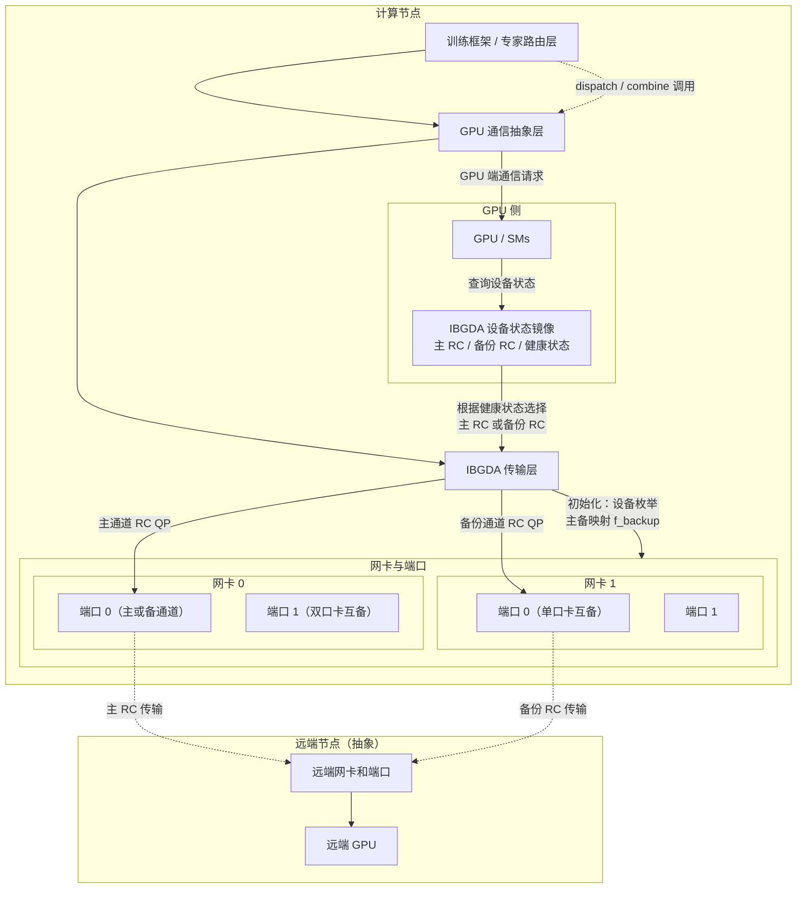

# 0 Base
## 0.1 Compile and Test NVSHMEM
### compile
这里的-DNVSHMEM_BUILD_PYTHON_LIB=OFF一定需要设置。
```shell
c &&
export CUDA_HOME=/usr/local/cuda
export MPI_HOME=/usr/local/mpi
export CPATH=/usr/local/mpi/include:$CPATH
export LIBRARY_PATH=/usr/local/mpi/lib:$LIBRARY_PATH
export LD_LIBRARY_PATH=/usr/local/mpi/lib:$LD_LIBRARY_PATH
MPI_HOME=$MPI_HOME \
CUDA_HOME=$CUDA_HOME \
NVSHMEM_SHMEM_SUPPORT=0 \
NVSHMEM_UCX_SUPPORT=0 \
NVSHMEM_USE_NCCL=0 \
NVSHMEM_IBGDA_SUPPORT=1 \
NVSHMEM_DEBUG=1 \
NVSHMEM_PMIX_SUPPORT=0 \
NVSHMEM_IBRC_SUPPORT=0 \
NVSHMEM_MPI_SUPPORT=1 \
NVSHMEM_IBDEVX_SUPPORT=1 \
NVSHMEMTEST_MPI_SUPPORT=1 \
NVSHMEM_USE_GDRCOPY=1 \
cmake -G Ninja -S . -B build \
  -DCMAKE_C_COMPILER=${MPI_HOME}/bin/mpicc \
  -DCMAKE_CXX_COMPILER=${MPI_HOME}/bin/mpicxx \
  -DMPI_HOME=${MPI_HOME} \
  -DCMAKE_INSTALL_PREFIX=/workspace/liuda/output/nvshmem \
  -DCUDA_ARCHITECTURES=90 \
  -DNVSHMEM_BUILD_EXAMPLES=OFF \
  -DNVSHMEM_BUILD_PYTHON_LIB=OFF
cmake --build build --target install -- -j 80
```
1. **编译如果出现mlx5找不到：**
```shell
ln -s /usr/lib/x86_64-linux-gnu/libmlx5.so.1 /usr/lib/x86_64-linux-gnu/libmlx5.so
```
2. **如果显示nvshmem.cpp找不到**：
```shell
# 需要git status看一下是不是当前有些文件被nvshmem里面乱七八糟的cmake弄没了
# 这个nvshmem.cpp就会被莫名其妙删掉 有时候需要手动restore一下
```
3. **如果出现nvidia_peermem找不到的问题**：
```cpp
# 检查ofed的驱动是不是加载了旧的默认nv_peer_mem，是的话关闭旧的 打开新的nvidia_peermem模块
rmmod nv_peer_mem && modprobe nvidia_peermem
```
4. **nvshmem的example编译的时候有问题**
直接加上下面这个
```shell
-DNVSHMEM_BUILD_EXAMPLES=OFF \
```
5. **NVSHMEM_MPI_SUPPORT打开后需要全方位给cmake指定mpi的路径，参考我的完整编译指令 这里不开MPI SUPPORT测试nvshmem的perftest就会各种报错找不到第二个process**
6. **DNVSHMEM_BUILD_PYTHON_LIB这个也必须得关掉**
### test
nvshmem/src/modules/transport/common/env_defs.h内有一些环境变量说明
```shell
export MPI_HOME=/usr/local/mpi
export CUDA_HOME=/usr/local/cuda
export NVSHMEM_HOME=/workspace/liuda/output/nvshmem
export LD_LIBRARY_PATH="${NVSHMEM_HOME}/lib:$CUDA_HOME/lib64:$MPI_HOME/lib:$LD_LIBRARY_PATH"
$MPI_HOME/bin/mpirun -np 2 --allow-run-as-root \
    --hostfile /workspace/liuda/dev/nvshmem-fault-tolerance/hostfile \
    -x NVSHMEM_DEBUG=INFO \
    -x LD_LIBRARY_PATH=${NVSHMEM_HOME}/lib:$CUDA_HOME/lib64:$MPI_HOME/lib:$LD_LIBRARY_PATH \
    -x NVSHMEM_IB_ENABLE_IBGDA=1 \
	-x NVSHMEM_IBGDA_LOG_LEVEL=3 \
    -x NVSHMEM_IB_ENABLE_IBRC=0 \
    -x NVSHMEMTEST_USE_MPI_LAUNCHER=1 \
    -x NVSHMEM_IBGDA_NIC_HANDLER=auto \
    -x NVSHMEM_IBGDA_FORCE_NIC_BUF_MEMTYPE=gpumem \
    /workspace/liuda/dev/nvshmem-fault-tolerance/build/perftest/device/pt-to-pt/shmem_put_bw -b 4 -e 1024 -n 1 2>&1 | tee /workspace/liuda/dev/nvshmem-fault-tolerance/ibgda_test.log
```
## 0.2 Compile  and Test DeepEP
### compile
这里需要export TORCH_CUDA_ARCH_LIST="9.0" 不然会出问题。
```shell
export NVSHMEM_DIR=/workspace/liuda/output/nvshmem
export LD_LIBRARY_PATH="${NVSHMEM_DIR}/lib:$LD_LIBRARY_PATH"
export PATH="${NVSHMEM_DIR}/bin:$PATH"
export TORCH_CUDA_ARCH_LIST="9.0"
NVSHMEM_DIR=/workspace/liuda/output/nvshmem  python setup.py install
```
1. **如果出现deepep走不到自己的deep_ep_cpp.cpython-38-x86_64-linux-gnu.so（没有共享存储的话）**
先看每个编译的机器上是不是自带了deepep：
```shell
python3 -c "import site, glob, os; \
paths = site.getsitepackages() + [site.getusersitepackages()]; \
print('\n'.join(paths)); \
[print(p) for sp in paths for p in glob.glob(os.path.join(sp, 'deep_ep*'))]"
```
有的话直接：
```shell
rm -rf /usr/local/lib/python3.12/dist-packages/deep_ep*
```
然后在每个机器上单独重新编译：
```shell
export NVSHMEM_DIR=/workspace/liuda/output/nvshmem
export LD_LIBRARY_PATH="${NVSHMEM_DIR}/lib:$LD_LIBRARY_PATH"
export PATH="${NVSHMEM_DIR}/bin:$PATH"
export TORCH_CUDA_ARCH_LIST="9.0"
rm -rf /usr/local/lib/python3.12/dist-packages/deep_ep*
cd /workspace/liuda/fault/DeepEP
rm -rf build/
rm deep_ep_cpp.cpython-312-x86*
NVSHMEM_DIR=/workspace/liuda/output/nvshmem  python setup.py install
```
然后在DeepEP的目录下：
```shell
ln -s build/lib.linux-x86_64-cpython-312/deep_ep_cpp.cpython-312-x86_64-linux-gnu.so
```
2. **有共享存储的话就直接用python3 setup.py build，不install到usr/local**
```shell
export NVSHMEM_DIR=/workspace/liuda/output/nvshmem
export LD_LIBRARY_PATH="${NVSHMEM_DIR}/lib:$LD_LIBRARY_PATH"
export PATH="${NVSHMEM_DIR}/bin:$PATH"
export TORCH_CUDA_ARCH_LIST="9.0"
rm -rf build/
cd /workspace/liuda/fault/DeepEP
rm deep_ep_cpp.cpython-312-x86*
NVSHMEM_DIR=/workspace/liuda/output/nvshmem  python3 setup.py build
ln -sf build/lib.linux-x86_64-cpython-312/deep_ep_cpp.cpython-312-x86_64-linux-gnu.so deep_ep_cpp.cpython-312-x86_64-linux-gnu.so
```
然后在测试脚本前面加上下面的python路径即可：
```shell
export PYTHONPATH=/workspace/liuda/fault/DeepEP:$PYTHONPATH
```
### test
在不同机器上跑下面的指令:
```shell
# node201
export MPI_HOME=/usr/local/mpi
export CUDA_HOME=/usr/local/cuda
export PYTHONPATH=/workspace/liuda/fault/DeepEP:$PYTHONPATH
export NVSHMEM_HOME=/workspace/liuda/output/nvshmem
export LD_LIBRARY_PATH="${NVSHMEM_HOME}/lib:$CUDA_HOME/lib64:$MPI_HOME/lib:$LD_LIBRARY_PATH"
export NVSHMEM_IBGDA_ENABLE_FAULT_TOLERANCE=1
export NVSHMEM_IBGDA_ENABLE_MULTI_PORT=1
MASTER_ADDR=10.1.3.201 MASTER_PORT=29501 WORLD_SIZE=2 RANK=0 \
python /workspace/liuda/fault/DeepEP/tests/test_low_latency.py --skip-combine --pressure-test 2>&1 | tee /workspace/liuda/fault/DeepEP/internode_test_node1.log
# nsys profile -t cuda,nvtx -o test_run1 --duration 60 python /workspace/liuda/fault/DeepEP/tests/test_low_latency.py --skip-combine --pressure-test  2>&1 | tee /workspace/liuda/fault/DeepEP/internode_test_node1.log
# python /workspace/liuda/fault/DeepEP/tests/test_internode.py --skip-combine 2>&1 | tee /workspace/liuda/fault/DeepEP/internode_test_node1.log
# export CUDA_LAUNCH_BLOCKING=1
# export CUDA_VISIBLE_DEVICES=7
# export NVSHMEM_DEBUG=INFO

# node023
export MPI_HOME=/usr/local/mpi
export CUDA_HOME=/usr/local/cuda
export PYTHONPATH=/workspace/liuda/fault/DeepEP:$PYTHONPATH
export NVSHMEM_HOME=/workspace/liuda/output/nvshmem
export LD_LIBRARY_PATH="${NVSHMEM_HOME}/lib:$CUDA_HOME/lib64:$MPI_HOME/lib:$LD_LIBRARY_PATH"
export NVSHMEM_IBGDA_ENABLE_FAULT_TOLERANCE=1
export NVSHMEM_IBGDA_ENABLE_MULTI_PORT=1
MASTER_ADDR=10.1.3.201 MASTER_PORT=29501 WORLD_SIZE=2 RANK=1 \
python /workspace/liuda/fault/DeepEP/tests/test_low_latency.py --skip-combine --pressure-test 2>&1 | tee /workspace/liuda/fault/DeepEP/internode_test_node2.log
# nsys profile -t cuda,nvtx -o test_run_amo --duration 60 python /workspace/liuda/fault/DeepEP/tests/test_low_latency.py --skip-combine --pressure-test 2>&1 | tee /workspace/liuda/fault/DeepEP/internode_test_node2.log
# python /workspace/liuda/fault/DeepEP/tests/test_internode.py --skip-combine 2>&1 | tee /workspace/liuda/fault/DeepEP/internode_test_node2.log
# export CUDA_LAUNCH_BLOCKING=1
# export CUDA_VISIBLE_DEVICES=7
# export NVSHMEM_DEBUG=INFO

```
## 0.3 Megatron-LM
nvshmem容错主要用于支持moe场景使用deepep的训练。下面为使用容错必要的步骤：
#### 模型配置
首先需要检查 `Megatron-LM/config/xxxx.sh` 内已经添加DeepEP的环境变量：
```shell
--moe-token-dispatcher-type flex \
--moe-enable-deepep \
```
#### 启动配置
在`Megatron-LM/script/xxxx.sh` 内增加
```shell
# <0, 1>, default is 0 (disabled).
export NCCL_ENABLE_FAULT_TOLERANCE=1
# NIC configuration must be specified  according to runtime environment.
export NCCL_IB_HCA=="mlx5_0:1,mlx5_1:1,mlx5_2:1,mlx5_3:1,mlx5_4:1,mlx5_5:1,mlx5_6:1,mlx5_7:1"
# <0, 1>, default is 0 (disabled).
export NVSHMEM_IBGDA_ENABLE_FAULT_TOLERANCE=1
# <0, 1>, default is 0 (disabled).
export NVSHMEM_IBGDA_ENABLE_MULTI_PORT=1
```

# 1 Related
a. 在DeepEP的[[internode_ll.cu]]内包含了lowlatency模式的dispatch和combine，[[internode.cu]]内包含了normal模式的dispatch和combine，二者都使用了nvshmemi_ibgda_put_nbi_warp来通信，以及nvshmemi_ibgda_amo_nonfetch_add给remote进程加原子计数。
b. DeepEP的[[DeepEP+NVSHMEM/DeepEP/ibgda_device.cuh]]内具体写了nvshmemi_ibgda_put_nbi_warp和nvshmemi_ibgda_amo_nonfetch_add的接口。
c. 具体的传输层的init在NVSHMEM的[[ibgda.cpp]]内实现。
# 2 Specific Plan
## 2.1 per-PE初始化的话 pe0怎么去给pe1的nic设备初始化？
在nvshmem内正常情况是每个pe一个nic，所以不能跨进程去db另一个nic。在环境变量内有IBGDA_ENABLE_MULTI_PORT，可以让 `num_selected_devs`的值不会被hardcode成1，所以就可以doorbell多个NIC。具体原因是：
1. uar = mlx5dv_devx_alloc_uar(context, MLX5DV_UAR_ALLOC_TYPE_NC);给每个device分配UAR(user access region)
2. 用cudaHostRegisterIoMemory把NIC的MMIO区域注册给CUDA
3. 然后调用 `ibgda_alloc_and_map_qp_uar` 去映射UAR到GPU
    此外就是`num_selected_devs`需要去host侧修改 `nvshmemi_setup_connections` 函数解除nvshmem的限制，见下面源码。在 `nvshmemi_setup_connections` 内，主要就是先遍历所有transport插件（比如，ibgda,ibrc,ibuc,ucx等），然后剔除了被选择为bitmap和没建立连接的transport。`tcurr->n_devices / state->npes_node` 把当前transport最大nic数 平均分给每个PE。就得到了selected_devices数组（每个数对应一个nic）。
然后在默认的分支内， `nvshmemi_get_devices_by_distance` 函数去根据topo(NVLink && Pcie)，找到每个GPU最近的NIC，对应填写到selected_devices[i]内，所以后面的for (int i = 0; i < max_devices_per_pe; i++) loop内，每个gpu只会有一个最近的卡，其余情况都break了，所以就是found_devices是1。最后在把具体的selected_devices传递给具体transport的`connect_endpoints`实现。IBGDA 那边接收的 num_selected_devs 就是这里的 found_devices，随后的 Mr, QP 创建都基于这个数。connect 完还会 barrier 同步，然后调用 nvshmemi_update_device_state() 更新全局状态。
```cpp
// src/host/transport/transport.cpp
int nvshmemi_setup_connections(nvshmemi_state_t *state) {
    nvshmem_transport_t *transports = (nvshmem_transport_t *)state->transports;
    nvshmem_transport_t tcurr;
    for (int i = 0; i < state->num_initialized_transports; i++) {
        if (!((state->transport_bitmap) & (1 << i))) continue;
        tcurr = transports[i];
        if (!(tcurr->attr & NVSHMEM_TRANSPORT_ATTR_CONNECTED)) {
            continue;
        }
        
        int devices_temp = tcurr->n_devices / state->npes_node;
        if (devices_temp == 0) devices_temp = 1;
        const int max_devices_per_pe = devices_temp;
        int selected_devices[max_devices_per_pe];
        int found_devices = 0;

        for (int j = 0; j < max_devices_per_pe; j++) {
            selected_devices[j] = -1;
        }
        if (tcurr->n_devices <= 1) {
            selected_devices[0] = tcurr->n_devices - 1;
            found_devices++;
        } else if (nvshmemi_options.ENABLE_NIC_PE_MAPPING) {
            selected_devices[0] = nvshmemi_state->mype_node % (tcurr->n_devices > 0 ? tcurr->n_devices : 1);
            found_devices++;
        } else {
            nvshmemi_get_devices_by_distance(selected_devices, max_devices_per_pe, tcurr);
            for (int i = 0; i < max_devices_per_pe; i++) { 
                if (selected_devices[i] == -1) {
                    break;
                }
                found_devices++;
            }
        }
        status = tcurr->host_ops.connect_endpoints(tcurr, selected_devices, found_devices);
        status = nvshmemi_boot_handle.barrier(&nvshmemi_boot_handle);
        status = nvshmemi_update_device_state();
    }
}
```
知道原理后，在nvshmemi_get_devices_by_distance计算完topo之后，每个seleted_device都找到了自己最近的nic，所以我们在最近的基础上去找隔壁的，大致逻辑就是：gpu1选的是nic1，我现在去让gpu1的seleted_devices[1]的位置存现在的backup的id，原来的seleted_devices[0]还是存它的主设备的id。这样所有gpu的device都是两个
```cpp
if (ibgda_backup && found_devices > 0 && found_devices < max_devices_per_pe) {
            const int backup_dev =
                nvshmemi_pick_adjacent_nic(selected_devices[0], tcurr->n_devices);
            if (backup_dev >= 0) {
                selected_devices[found_devices++] = backup_dev;
                INFO(NVSHMEM_INIT, "IBGDA backup NIC mapping: primary %d backup %d",
                     selected_devices[0], backup_dev);
            } else {
                WARN("IBGDA multi-port requested but no adjacent NIC found; backup disabled.");
            }
        }
```
选择backup的id则通过偶数+1，奇数-1去互相备份选择设备。
```cpp
static int nvshmemi_pick_adjacent_nic(int primary, int total) {
    if (total < 2 || primary < 0) return -1;
    int candidate = (primary % 2 == 0) ? primary + 1 : primary - 1;
    if (candidate >= 0 && candidate < total) return candidate;
    candidate = primary - 1;
    if (candidate >= 0) return candidate;
    candidate = (primary + 1) % total;
    return (candidate != primary) ? candidate : -1;
}
```
现在可以看到selected_devices的选择变成2，那么每个gpu执行到 `status = tcurr->host_ops.connect_endpoints(tcurr, selected_devices, found_devices);`  的时候就可以拿到这里我提前计算好主和备网卡id的数组。测试如下：

### a. nvshmem支持多device的条件
回过头来思考了一下，`nvshmemi_get_devices_by_distance` 为什么只选一张最近网卡，难道nvshmem不支持选择多个网卡吗？ 结论：不支持，除非一个GPU挂同一个PCIe switch，Switch后面接两个NIC，这样就会出现NIC到GPU都是PIX。
在该函数的实现里面，nvshmem直接暴力获取所有gpu和NIC的sysfs路径。在`get_pci_distance` 去根据公共的前缀 / NUMA节点把网卡标记为（pix/ pxb / phb / node/ sys / count），`pci_distance_perf[]` 给出“越近数值越大”的评分。`pe_dev_pairs` 会存所有 ((PE, GPU), NIC) 组合，并按 distance 从近到远排序（比较的是枚举值）。再由两次for loop去找到当前GPU最优NIC和平衡一个NIC被多个GPU绑定。<mark style="background: #FF5582A6;">一旦某个 GPU 的第 0 个 slot（最优）已经拿到，比如 PIX；当后面遇到 PXB/PHB 这种更差的，就触发上面的 -2 填充，把该 GPU 的剩余 slot 全部封掉。</mark>最终用 `mype_array_index` 把本GPU的槽位写到输出的* device_arr指针。
大致核心代码如下：
```cpp
int nvshmemi_get_devices_by_distance(int *device_arr, int max_dev_per_pe,
                                     struct nvshmem_transport *tcurr) {
    status = get_cuda_bus_id(gpu_device_id, gpu_info.gpu_bus_id);
    for (i = 0; i < n_pes; i++) {
        status = get_device_path(gpu_info_all[i].gpu_bus_id, &cuda_device_paths[pe_id]);
        if (i == mype) {
            mype_array_index = pe_id * max_dev_per_pe;
        }
    }
    for (pe_id = 0; pe_id < n_pes_node; pe_id++) {
        for (dev_id = 0; dev_id < ndev; dev_id++) {
            distance_compare =
                get_pci_distance(cuda_device_paths[pe_id], dev_info_all[dev_id].dev_path);
                pe_dev_pairs.push_front({pe_id, dev_id, distance_compare});
            // ...
        }
    }
    /* 
        loop one, do initial assignments of NIC(s) to each GPU 
        把“最优距离”的 NIC 先分给每个 GPU，结果可能出现多 GPU 共用同一 NIC（used_devs[nic] > 1）。
    */
    for (pairs_iter = pe_dev_pairs.begin(); pairs_iter != pe_dev_pairs.end(); pairs_iter++) {
        // 在“初次分配”阶段只要遇到比当前 best 更差的距离就直接把后续槽位写成 -2
        if (pci_distance_perf[new_distance] < pci_distance_perf[pe_device_distance[pe_base_index]]) {
            // 把剩余的 slots 全部标成 -2
            for (; pe_pair_index < max_dev_per_pe; pe_pair_index++) {
                pe_selected_devices[pe_base_index + pe_pair_index] = PE_DEVICE_NO_OPTIMAL_ASSIGNMENT;
            }
        } else {
            pe_selected_devices[pe_base_index + pe_pair_index] = (*pairs_iter).dev_idx;
            pe_device_distance[pe_base_index + pe_pair_index] = (*pairs_iter).pcie_distance;
            used_devs[(*pairs_iter).dev_idx]++;
        }
    }
    /* 
        loop two, load balance the NICs. 
        这里只处理前面的used_devs[current_nic]>=2的情况，就回去pe_dev_pairs再找当前GPU其他可选NIC
    */
    for (pe_id = 0; pe_id < n_pes_node * max_dev_per_pe; pe_id++) {
        // 1. pci_distance_perf[new_distance] >= pci_distance_perf[current_distance]，距离不比现有更差；
        // 2. nic_density - used_devs[new_nic] >= 2，意即新 NIC 至少比旧 NIC 空两倍（旧的多人共享，新的相对空闲）。
        // .....
    }
    for (pe_pair_index = 0; pe_pair_index < max_dev_per_pe; pe_pair_index++) {
        if (pe_selected_devices[mype_array_index + pe_pair_index] >= 0) {
            mydev_index = pe_selected_devices[mype_array_index + pe_pair_index];
            device_arr[pe_pair_index] = mydev_index;
        }
    }
}
```
## 2.2 创建备份QP
在 `nvshmemt_ibgda_connect_endpoints`内我们根据selected_dev_ids已经知道主nic和备份nic，现在就是去备份nic上创建backup QP。在调用 `ibgda_create_qp`给备份nic创建QP的时候，`mapped_i`  使用的和主的mapped_i的索引一致。在 `ibgda_get_rc_handle` 内会从backup_eps内拿到qpn和gid（spn+iid），从device内拿到lid，用于后面alltoall交换。交换后每个QP开始设置状态rst->init->rtr->rts。回过头来的时候，发现这里有一些乱七八糟细节要考虑：
* 其实selected_dev_ids在大多情况下都是1，默认each gpu会去find最优最近网卡，而我们增加了一个备份的device。怎么还能让原来的走原来的逻辑（dci dct rc），而我们的备份的device只需要rc就够了。这里就先默认了这是单口RNIC情况下的case，因为没有双口环境 我不知道这里的selected_dev_ids会不会实际上测出来是2。所以fault_tolerance_enabled开启的话，我就让num_selected_devs直接写成1，所以大部分ibgda.cpp内原来逻辑可以保留。备份的话这个backup_entry_idx等于selected_dev_ids[1]，也能找到备份device的id。
  当我`ibgda_state->backup_dev_ids[primary_dev_idx] = backup_entry_idx;`的时候就可以让backup_dev_ids的数据里面每个主NIC都能索引到备份NIC。
整体流程抽象如下：
```cpp
int nvshmemt_ibgda_connect_endpoints(nvshmem_transport_t t, int *selected_dev_ids,
                                     int num_selected_devs) {
    const bool fault_tolerance_enabled = ibgda_state->fault_tolerance_enabled;
    const int total_selected_entries = num_selected_devs;
    const int num_primary_devices = total_selected_entries > 0 ? 1 : 0;
    int backup_entry_idx =
        (fault_tolerance_enabled && total_selected_entries > 1) ? selected_dev_ids[1] : -1;
    const bool has_backup_entry = fault_tolerance_enabled && (backup_entry_idx >= 0);
    const int logical_iterations = num_primary_devices + (has_backup_entry ? 1 : 0);
    num_selected_devs = num_primary_devices;
    
    // ...省略，这里的主就是i==0,备份的就是i==1去创建的
    for (auto i : logical_iterations) {
        status = ibgda_create_cq_shared_objects(ibgda_state, backup_device, n_pes);
        status = ibgda_create_qp_shared_objects(ibgda_state, backup_device, n_pes);
        for (int rc_idx = 0; rc_idx < num_rc_eps_backup; ++rc_idx) {
            int dst_pe = (rc_idx + 1 + mype) % n_pes;
            int offset = rc_idx / n_pes;
            int mapped_i = dst_pe * num_rc_eps_per_pe + offset;
            if (dst_pe == mype) {
                continue;
            }
            
            status = ibgda_create_qp(&primary_device_ref->rc.backup_eps[mapped_i],
                                     backup_device, backup_portid, mapped_i,
                                     NVSHMEMI_IBGDA_DEVICE_QP_TYPE_RC);
            status = ibgda_get_rc_handle(&backup_rc_handles_tmp[mapped_i],
                                         primary_device_ref->rc.backup_eps[mapped_i],
                                         backup_device);
        }
        
        for (int rc_idx = 0; rc_idx < num_rc_eps_backup; ++rc_idx) {
            if (rc_idx / num_rc_eps_per_pe == mype) {
                continue;
            }
            status = ibgda_qp_rst2init(primary_device_ref->rc.backup_eps[rc_idx],
                                       backup_device, backup_portid);
            status = ibgda_rc_init2rtr(ibgda_state, primary_device_ref->rc.backup_eps[rc_idx],
                                       backup_device, backup_portid,
                                       &primary_device_ref->rc.backup_peer_ep_handles[rc_idx]);
            status = ibgda_qp_rtr2rts(primary_device_ref->rc.backup_eps[rc_idx],
                                      backup_device, backup_portid);
        }
    }
}
```
> [!当 mype=0 时遍历 rc=0, 1,2,3：] 
rc=0 → dst_pe=1, offset=0, mapped_i = 1 * 2 + 0 = 2
rc=1 → dst_pe=0（同 PE，直接 continue）
rc=2 → dst_pe=1, offset=1, mapped_i = 1 * 2+1 = 3
rc=3 → dst_pe=0（同 PE，直接 continue）

打印看到：

### 主/备 卡流量测试
在gpu0上测试internode_ll可以看到原来网卡流量如下:

备份网卡流量如下：


## 2.3 备份QP在另一个NIC上，主设备的MR不能直接用于备份QP，所以怎么去给备份设备的PD上注册自己MR？以及lkey和rkey的部分应该怎么设计？
在 `ibgda_mem_handle` 内增加对应的备份MR的需要的字段如下：
```cpp
struct ibgda_mem_handle {
    struct nvshmemt_ib_common_mem_handle dev_mem_handles[NVSHMEMI_IBGDA_MAX_DEVICES_PER_PE];
    struct nvshmemt_ib_common_mem_handle backup_dev_mem_handles[NVSHMEMI_IBGDA_MAX_DEVICES_PER_PE];
    int num_devs;
    int num_backup_devs;  // Number of backup devices with registered MRs
};
```
注册Mr和Lkey的代码在 `nvshmemt_ibgda_get_mem_handle` 内，原来是在每个主NIC的PD上注册MR，在主NIC的PD上完成MR注册后，现在需要再去拿备份NIC的PD完成MR注册，这样我当前这个GPU同一段buf上length长度的显存就可以被两个NIC直接RDMA访问。
```cpp
// 主的：
status = nvshmemt_ib_common_reg_mem_handle(
            &ftable, &mlx5dv_ftable, device->pd, dev_handle, buf, length, local_only,
            ibgda_state->dmabuf_support_for_data_buffers, ibgda_cuda_syms, ibgda_state->log_level,
            ibgda_state->options->IB_ENABLE_RELAXED_ORDERING, device->data_direct, alias_va_ptr);
handle->num_backup_devs = 0;
// 备份的：
if (ibgda_state->fault_tolerance_enabled && ibgda_state->backup_dev_ids) {
    for (int i = 0; i < n_devs_selected; ++i) {
        // 通过 backup_dev_ids 映射找到备份设备 ID
        int backup_dev_id = ibgda_state->backup_dev_ids[ibgda_state->selected_dev_ids[i]];
        // 在备份设备的 PD 上注册 MR
        status = nvshmemt_ib_common_reg_mem_handle(
                &ftable, &mlx5dv_ftable, backup_device->pd, backup_handle, buf, length, local_only,
                ibgda_state->dmabuf_support_for_data_buffers, ibgda_cuda_syms, ibgda_state->log_level,
                ibgda_state->options->IB_ENABLE_RELAXED_ORDERING, backup_device->data_direct,
                alias_va_ptr);
        handle->num_backup_devs++;
    }
}
```
nvshmemt_ib_common_reg_mem_handle内具体的注册MR函数是rdma-core 提供的 libibverbs 接口，初始化阶段 `nvshmemt_ibv_ftable_init` 用dlsym把ibv_reg_dmabuf_mr装到函数表 `ftable->reg_dmabuf_mr` 内。实际注册的时候根据当前支持（GPU Direct Async、dma-buf、iova、直接pd上注册buf）的情况选择一种去注册。例如`reg_dmabuf_mr`：
```cpp
mr = ftable->reg_dmabuf_mr(pd, 0, size_aligned, (uint64_t)p, handle->fd,
                           IBV_ACCESS_LOCAL_WRITE | IBV_ACCESS_REMOTE_WRITE |
                           IBV_ACCESS_REMOTE_READ | IBV_ACCESS_REMOTE_ATOMIC |
                           ro_flag);
```
通过以上的方法在两个gpu上打印日志看到可以看到gpu都用了nic1的PD注册了当前GPU显存的MR。

在 `reg_dmabuf_mr` 内注册了MR后（handle内主和备的`dev_mem_handles`和`backup_dev_mem_handles`）会拿到lkey和rkey，我们对应的需要去拓展他们的表来存备份设备的key。备份QP需要的lkey和rkey按照`n_dev_seleted`往后的区域索引。
主和备份的mr的lkey还在 `nvshmemt_ibgda_get_mem_handle` 内，依次把这两个lkey填写到ibgda_device_lkeys内。后续nvshmem会把分别放到cpu侧的`ibgda_device_state->constmem.lkeys`内，以及gpu侧的`ibgda_device_state->globalmem.lkeys`。主备的rkey则在 `nvshmemt_ibgda_add_device_remote_mem_handles` 内拓展，所有逻辑和lkey一致，lkey的拓展逻辑如下。
```cpp
// 原来: 表大小为 num_chunks * n_devs_selected，只写主设备 lkey
if (ibgda_device_lkeys.size() < num_chunks * n_devs_selected) {
    ibgda_device_lkeys.resize(num_chunks * n_devs_selected);
}
while (num_elements > 0) {
    for (int i = 0; i < n_devs_selected; i++) {
        // ... 只写主设备 lkey
        ibgda_device_lkeys.at(((chunk_idx + num_elements - 1) * n_devs_selected) + i) = dev_key;
    }
    --num_elements;
}

// 改为: 表大小为 num_chunks * total_devs，同时写入主设备和备份设备的 lkey
int total_devs = n_devs_selected + handle->num_backup_devs;
if (ibgda_device_lkeys.size() < num_chunks * total_devs) {
    ibgda_device_lkeys.resize(num_chunks * total_devs);
}

while (num_elements_copy > 0) {
    // 写主设备 lkey (索引 0 到 n_devs_selected-1)
    for (int i = 0; i < n_devs_selected; i++) {
        ibgda_device_lkeys.at(((chunk_idx + num_elements_copy - 1) * total_devs) + i) = dev_key;
    }
    // 写备份设备 lkey (索引 n_devs_selected 到 total_devs-1)
    for (int i = 0; i < handle->num_backup_devs; i++) {
        device_lkey = htobe32(handle->backup_dev_mem_handles[i].lkey);
        ibgda_device_lkeys.at(((chunk_idx + num_elements_copy - 1) * total_devs) + n_devs_selected + i) = dev_key;
    }
    --num_elements_copy;
}
```
rkey在mem_transport层里面，`gather_mem_handles`的时候才会被调用，
```cpp
// src/host/mem/mem_transport.cpp
int nvshmemi_mem_remote_transport::gather_mem_handles(nvshmemi_symmetric_heap &obj,
                                                      uint64_t heap_offset, size_t size,
                                                      bool ext_allocation) {
    int status = 0;
    NVSHMEMU_FOR_EACH(i, obj.get_state()->num_initialized_transports) {
        nvshmem_transport_t tcurr = obj.get_state()->transports[i];
        if (NVSHMEMU_IS_BIT_SET(obj.get_state()->transport_bitmap, i) &&
            NVSHMEMI_TRANSPORT_OPS_IS_ADD_DEVICE_REMOTE_MEM(tcurr)) {
            if (ext_allocation) {
                status = tcurr->host_ops.add_device_remote_mem_handles(
                    tcurr, obj.get_state()->num_initialized_transports,
                    obj.remote_mmap_handles_.back().data(), heap_offset, size);
            }
        // ......
        }
    }
}
```
## 2.4 设计一个ibgda_get_backup_rc能正确索引到在备份NIC上的RC:
在deepep内就是很暴力的直接从rcs数组里面拿出当前pe上的qp_id的qp。所以我们的backup qp也选择暴力的直接从我们准备好的backup_rcs数组上拿出当前pe上的qp_id的backup qp。这里的qp_id在dispatch传下来的时候是 `dst_expert_local_idx` 。按照如下设计：
```cpp
__device__ static __forceinline__ nvshmemi_ibgda_device_qp_t* ibgda_get_backup_rc(int pe, int id) {
    auto state = ibgda_get_state();
    const int num_primary = state->ff ? state->ff->num_primary_devices : state->num_devices_initialized;
    const int stride = state->ff->num_backup_rc_per_pe * num_primary;
    const int offset = id % stride;
    return &state->ff->backup_rcs[pe * stride + offset];
}
```
很快就发现，我的back up的QP创建(init阶段)打印了QPN，GID，lkey，rkey都对，但是backup_rcs里面选择出来的QP打印的却是主NIC上的QPN，是这个导致的hang吗？
找了一圈，发现不同NIC上确实可能出现相同QPN，但是只要GID不同就没事。那么问题就是别的，核对了一遍发现问题出在nvshmem内`ibgda_get_device_qp`的时候传的backup_device是(struct ibgda_device * )ibgda_state->devices后面的偏移。而我算错了偏移量 `backup_dev_entry`，现在backup_dev_entry = ibgda_state->backup_dev_ids[dev_idx];（我提前准备好的backup_dev_ids），输入当前的dev_idx就可以找到正确的backup device丢到ibgda_get_device_qp后，于是问题解决了。
> [!注意]
> 因为我备份设备的QP是在 device->rc.backup_eps[i]上，我的想法就是主网卡的数据结构里面存好我准备好的bakcup网卡的数据结构，出问题了往后偏移就可以拿到我用什么备份的rc去发数据了，备份设备也是如此，直接在ibgda_state->devices上往后偏移。
```cpp
for (int j = 0; j < n_devs_selected; j++) {
    int arr_idx = arr_offset + j;
    int dev_idx = ibgda_state->selected_dev_ids[j];
    struct ibgda_device *device = (struct ibgda_device *)ibgda_state->devices + dev_idx;
    int backup_dev_entry = ibgda_state->backup_dev_ids[dev_idx];
    struct ibgda_device *backup_device =
        (struct ibgda_device *)ibgda_state->devices + backup_dev_entry;
    int backup_dev_slot = j;  // backup dev_idx in [primary, primary+1)
    uintptr_t base_mvars_d_addr = (uintptr_t)(&backup_rc_d[arr_idx]) + mvars_offset;

    // Use n_devs_selected + j as dev_idx for backup QPs so they index into
    // the backup portion of lkeys/rkeys tables (indices [n_devs_selected, total_devs))
    ibgda_get_device_qp(&backup_rc_h[arr_idx], backup_device, device->rc.backup_eps[i], i,
                        n_devs_selected + backup_dev_slot);
}
```
## 2.5 怎么设计cq check判断
在只使用primary QP / backup QP都能完成deepep的internode ibgda后，写了第一版本出故障后切到backup QP发送数据的逻辑。把核心逻辑就是直接看当前这次QP的wqe是否前进了，超时拿不到cq就直接用backup的rc重新准备wqe再下wr和amo操作。nvshmem提供的逻辑cq检查是在 `while ((static_cast<uint16_t>(static_cast<uint16_t>(idx) - wqe_counter - static_cast<uint16_t>(2)) < ncqes));`内死等真实的网卡wqe_counter推进到用户的wqe的idx，我这里while改成了if，然后再外层套一个while计算时间，来规定它死等变成判断我规定时间内wqe超时。设计如下：
```cpp
// Wrap-safe CQ completion predicate reused by both polling and timed wait.
// NVSHMEM convention: we compare against `idx` which is maintained as (wqe_idx + 1).
__device__ static __forceinline__ bool ibgda_cq_completed(nvshmemi_ibgda_device_cq_t* cq, uint64_t idx) {
    const auto cqe64 = static_cast<mlx5_cqe64*>(cq->cqe);
    const uint32_t ncqes = cq->ncqes;

    memory_fence_cta();
    if (*cq->cons_idx >= idx) return true;

    // See comments in `ibgda_poll_cq` for the wrap-safe comparison.
    const uint16_t wqe_counter = HtoBE16(ld_na_relaxed(&cqe64->wqe_counter));
    return (static_cast<uint16_t>(static_cast<uint16_t>(idx) - wqe_counter - static_cast<uint16_t>(2)) >= ncqes);
}

// 用一个超时检查把ibgda_cq_completed()包起来, 省略如下：
__device__ static __forceinline__ bool nvshmemi_ibgda_check_cq() {
    constexpr uint64_t kTimeoutCycles = static_cast<uint64_t>(15.0 * 1.5e9);
    // ......
    do {
        if (ibgda_cq_completed(cq, idx)) return false;
        if ((ibgda_get_clock_cycles() - start_time) > kTimeoutCycles) {
            if (target_pe >= 0 && target_pe < 32) {
                atomicExch(reinterpret_cast<unsigned int*>(&deep_ep_ibgda_primary_bad[target_pe]), 1u);
            }
            return true;  // Timeout = failure
        }
    } while (true);
}
```
## 2.6 统一vccl和nvshmem容错
### a. VCCL/NVSHMEM超时判定
==vccl认为超时的时间如下：==
```cpp
NCCL_PARAM(IbTimeout, "IB_TIMEOUT", 18);
NCCL_PARAM(IbRetryCnt, "IB_RETRY_CNT", 7);
```
modify_qp会把这两个信息写到QP内，当poll cq或者说wc在这个时间无法完成则认为现在口已经down了需要切换到backup nic上的qp。这两个参数在nccl的document内写明，一次完整的QP超时的时间为：
$$
QP_{timeout} = 4.096 \mu s \times 2  ^  \text{IB\_TIMEOUT}  \times  \text{IB\_RETRY\_CNT}
$$
当前的配置 4.096$\mu s$ x 2<sup>18</sup> x 7 = 2,147,483.648$\mu s$  x 7 = 15,032,385.536$\mu s$ =15s左右。
==nvshmem现在为10s左右==
### b. 设计


# 3. Overall
首先，在初始化阶段根据网卡拓扑为每条 RC 连接预先建立一条备份 QP，并在设备状态里维护主备 QP 的对应关系及健康监控所需的元数据。
* 一卡一口时采用相邻网卡互备；
* 一卡两口时采用同卡双口互备；

其后，故障检测和切换完全在 GPU 侧完成。DeepEP 在发起 RDMA 操作后由 GPU 线程直接检查 CQ 是否超时或返回错误，通过一个简单的健康状态机为每条 QP 维护健康状态、连续失败次数以及最近切换时间。一旦某条主 QP 被判定故障，GPU 立即选择对应的备份 QP，重新计算本地/远端地址与密钥并发起传输，无需回到主机端重新建立连接，从而把故障切换的时延和开销降到最低。

最后，为避免长期停留在备份 QP 影响带宽和资源利用，机制按 GPU 时钟周期设置恢复窗口：在一段时间内探测正常且失败计数清零后，状态机会自动把流量从备份 QP 切回主 QP，在 可靠性与性能之间取得平衡。

# 4. self-test
## 4.1 测试小手册
### down口
测试的时候通过网卡或者交换机down口，所有操作见[[How to Down RNIC Port]]。
### 查看网卡流量
用mlnx_perf + ibstat看到的对应网卡名字
```shell
mlnx_perf -i enp41s0np0
```
### 查看网卡GID
这一部分通过在nvshmem内拓展get_device_qp的函数(可以把sqn和iid写到qp内)，并在device_qp的结构体增加这两个字段，后期在deepep的kernel内就可以打印出来QP的gid，来debug走备份的时候每个备份网卡是不是走到正确的规定的backup nic的gid。
## 4.2 debug
下面以a-z的顺序记录hang的过程：

==a. ==排查了一大段时间，发现是submit wr的时候之前没注意到low_latency的话准备好4个wqe才doorbell一次。在调用 `nvshmemi_ibgda_put_nbi_warp` 如果没给模版参数传kAlwaysDoPostSend就会导致这个问题，传递true给kAlwaysDoPostSend后往前走了一步。
```cpp
template <bool kAlwaysDoPostSend>
__device__ static __forceinline__ void ibgda_submit_requests(...) {
    // Wait for prior WQE slots to be filled first
    while (atomicCAS(ready_idx, base_wqe_idx, new_wqe_idx) != base_wqe_idx)
        ;
    // Always post, not in batch
    if (!state->use_async_postsend) {
        constexpr int kNumRequestInBatch = 4;
        if (kAlwaysDoPostSend or (message_idx + 1) % kNumRequestInBatch == 0)
            ibgda_post_send(qp, new_wqe_idx);
    }
}
```

==b.== 在随机某个时刻随机down某个nic的时候(这是一个n方的复杂度了 干)，发现有时候会切到备份，有时候切不到。在经过减少process，去掉combine，在dispatch的thread/warp/sm/kernel/process各种力度打印日志，最后观察到如果随机down网卡deepep会hang在以下两种情况：

**case1:** down了之后dispatch的收端的在`while ((num_recv_tokens == 0))`，持续无法退出。所以说明发端没有正确完成rdma_recv_count的amo更新。
* 刚down的时刻，backup nic没看见流量，说明切的时刻虽然切了backup QP，但是有东西计算错了。（假设最开始主的nic在跑，down备份nic不会影响主的nic）
* 如果恢复刚刚down的口就会恢复dispatch功能，此时会看到主/备上都有流量，说明外面的某个地方强依赖主nic的传输(主的nic在跑，此时down主/备份nic都会hang住)。
* 假如上来就走backup nic时，数据能正常发送，但是primary nic上也会有极其轻微的流量。

**case2:** 突然down的时候sender能正确用dev_idx=1这个备份nic下QP，nvshmemi_ibgda_amo_nonfetch_add也退出了（<mark style="background: #FF5582A6;">需要再去确定sender走到了哪里</mark>）。receiver侧kernel也正常退出了。这个hang完全不会打印，所以现在需要加nsys抓一下看看hang在哪里。后来nsys发现走备份的nic的kernel都已经正确下到stream上了。
```cpp
DEADLOCK_HYP_F: dispatch recv entry: src_rank=1, local_expert_idx=0, masked=0
Debug: Waiting for tokens from src_rank 1
Debug: Waiting for tokens from src_rank 0
DEADLOCK_HYP_J: dispatch checking send phase: phases=2, has_send=0
DEADLOCK_HYP_P: dispatch recv before bar.sync: warp_group_id=0, num_recv_tokens=6
DEADLOCK_HYP_P: dispatch recv after bar.sync: warp_group_id=0
DEADLOCK_HYP_Q: dispatch recv before copy loop: num_recv_tokens=6
DEADLOCK_HYP_R: dispatch kernel exit: responsible_expert_idx=0
DEADLOCK_HYP_H: dispatch kernel entry: phases=1, num_sms=2, num_tokens=8
DEADLOCK_HYP_J: dispatch checking send phase: phases=1, has_send=1
DEADLOCK_HYP_E: dispatch send before put_nbi: token_idx=0, dst_rank=0, dst_expert_idx=0, masked=0
DEADLOCK_HYP_E: dispatch send before put_nbi: token_idx=0, dst_rank=1, dst_expert_idx=1, masked=0
DEADLOCK_HYP_E: dispatch send calling put_nbi_warp: dst_rank=1
DEADLOCK_HYP_E: dispatch send after put_nbi_warp: dst_rank=1
DEADLOCK_HYP_E: dispatch send before put_nbi: token_idx=2, dst_rank=1, dst_expert_idx=1, masked=0
DEADLOCK_HYP_E: dispatch send before put_nbi: token_idx=2, dst_rank=0, dst_expert_idx=0, masked=0
DEADLOCK_HYP_E: dispatch send calling put_nbi_warp: dst_rank=1
DEADLOCK_HYP_E: dispatch send after put_nbi_warp: dst_rank=1
DEADLOCK_HYP_E: dispatch send before put_nbi: token_idx=4, dst_rank=1, dst_expert_idx=1, masked=0
DEADLOCK_HYP_E: dispatch send before put_nbi: token_idx=4, dst_rank=0, dst_expert_idx=0, masked=0
DEADLOCK_HYP_E: dispatch send calling put_nbi_warp: dst_rank=1
DEADLOCK_HYP_E: dispatch send after put_nbi_warp: dst_rank=1
DEADLOCK_HYP_K: dispatch before __syncthreads after send phase
DEADLOCK_HYP_E: dispatch send before put_nbi: token_idx=6, dst_rank=0, dst_expert_idx=0, masked=0
DEADLOCK_HYP_S: dispatch nvshmemi_ibgda_amo_nonfetch_add exit, current use dev_idx=1 QP
DEADLOCK_HYP_K: dispatch after __syncthreads after send phase
DEADLOCK_HYP_H: dispatch kernel entry: phases=2, num_sms=2, num_tokens=8
DEADLOCK_HYP_F: dispatch recv entry: src_rank=0, local_expert_idx=0, masked=0
DEADLOCK_HYP_F: dispatch recv entry: src_rank=1, local_expert_idx=0, masked=0
Debug: Waiting for tokens from src_rank 1
Debug: Waiting for tokens from src_rank 0
DEADLOCK_HYP_J: dispatch checking send phase: phases=2, has_send=0
DEADLOCK_HYP_P: dispatch recv before bar.sync: warp_group_id=0, num_recv_tokens=6
DEADLOCK_HYP_P: dispatch recv after bar.sync: warp_group_id=0
DEADLOCK_HYP_Q: dispatch recv before copy loop: num_recv_tokens=6
DEADLOCK_HYP_R: dispatch kernel exit: responsible_expert_idx=0
```

时隔3天，因为put操作的时候正常，我amo就会认为也正常，到amo的时候网卡down了就gg。在amo内也加上了检查cq，确保amo能完成写到对端再退出。同时在amo读取deep_ep_ibgda_primary_is_bad的时候__threadfence()一下。（amo是一个<mark style="background: #FF5582A6;">warp group的lane0</mark>线程执行，而deep_ep_ibgda_primary_is_bad变量是每个下put操作的<mark style="background: #FF5582A6;">warp的lane0</mark>去写）。此时以为大功告成。

==c.== 测试了一圈后，hang在了下一个地方。排查发现我必须手动去up主nic才能完成容错，这个case分析起来就说明nvshmem内控制面某个地方还在走主nic没走备份nic。（因为nvshmem默认topo选pcie最近的nic（only one））

解决方案：
因为nccl/vccl暂时还没有兼容当前deepep的nvshmem的网卡级别容错，所以dispatch/combine用的nccl改gloo来先all_gather。例如第一次all_gather要去拿group组内的topk，走nccl的allgather的话就直接hang（cause nccl不知道nic down了）。
```python
# all_topk_idx = torch.empty((num_ranks, num_tokens, num_topk), dtype=topk_idx.dtype, device='cuda')
# dist.all_gather_into_tensor(all_topk_idx, topk_idx, group=group)

topk_idx_cpu = topk_idx.cpu()
glooGp =dist.new_group(backend='gloo')
all_topk_idx_cpu_flat = torch.empty((num_ranks * num_tokens, num_topk), dtype=topk_idx_cpu.dtype, device='cpu')
dist.all_gather_into_tensor(all_topk_idx_cpu_flat, topk_idx_cpu, group=glooGp)
all_topk_idx_cpu = all_topk_idx_cpu_flat.view(num_ranks, num_tokens, num_topk)
all_topk_idx = all_topk_idx_cpu.to(device='cuda')
```
201/23机器 /etc/nccl.conf设置了一下这两个机器各自的GLOO_SOCKET_IFNAME，测试发现现在down口能切到备份网卡，都没问题。此时以为又大功告成了。

==d.== 跨机4卡的时候 新的hang观察到是cpu侧launch后没有变成正常dispatch，gpu侧也调度不上。

分析：大于两张卡的时候我必须要手动up一下被down的网卡 就可以恢复这一次cudaLaunchKernel，就能正常把dispatch下给cuda去执行。在launch的时候设置了config里面 `cudaLaunchAttributeCooperative`，需要多个GPU同时启动，一旦stream上有任何未完成的操作CUDA Driver就不会把新kernel提交给GPU。所以说明一定是前置的任务无法完成，加上日志后看到，此时收端的dispatch的 `rdma_recv_count` 等发端amo过来等不到，所以一直hang。
- [x] ~~怀疑1: gpu0跨轨发数据的时候建链有问题。~~于是测试gpu0打对端gpu1，down gpu0的nic0，超时可以正常切换到nic1走发数据到对端。这里mlnx_perf看了gpu0的nic1和gpu1的nic0上都有流量 gpu0的nic0和gpu1的nic1都没有流量（也就是正确切换到红色的路径完成数据的发送）。排除跨轨交差qp有问题的嫌疑(alltoall换的qp的handle，理论上不该有问题的，幸亏这里没出问题)。
![[Support DeepEP Fault Tolerance 2025-12-24 21.15.21.excalidraw.svg]]
- [x] ~~怀疑2~~：gpu1(第二张卡)没选到mlx5_0(备份卡)?(因为看到gpu1正常的时候现在的主QP走的就是nic1，但是不懂qp->dev_idx为什么打印的是0，离谱命名。。。nvshmem)
```cpp
// nvshmem内看到dev_idx打印的是selected_dev_idx，得打印selected_dev_idx[0]才是对于的网卡索引。。。。。。。。。。。。。
dev_qp->dev_idx = selected_dev_idx;
```
- [x] 怀疑3：node2上日志显示都是node1的，一直都是node1的rank1无法给node2的rank2和rank3发送。这里nsys上看不出来具体是因为什么操作无法完成，gpu侧给不了更多网卡的信息。所以只能去nvshmem内，把QP的GID信息在gpu侧同样写一份（增加了ibgda_get_device_qp内区分主/备 nic上是写主还是备份ep的spn + iid），拓展了 `nvshmemi_ibgda_device_qp_v1`来存GID(就是spn+iid)。此时就可以在gpu侧打印出来GID信息了。
```cpp
dev_qp->spn = primary_device_ref->rc.backup_peer_ep_handles[ep_idx].spn;
dev_qp->iid = primary_device_ref->rc.backup_peer_ep_handles[ep_idx].iid;
```

在加上GID信息后，确定为GPU2在给GPU0发的时候，由于0b01网卡down，红色超时，所以gpu2认为自己的mlx5_0坏了。所以后续GPU2发给GPU1的时候都走备份QP(此时GPU1的备份网卡还是刚刚down的GPU0的主网卡)，看到gpu2切到了gid是0200网卡mlx5_1，但是node1的gid:0b01是down的，所以hang住。所以对于每个GPU的局部视角来看，都应该存的是我到对面GPU走主的通还是不通，而不是看每个GPU的主网卡通还是不通。所以修改每个GPU上的存网卡状态的变量为 每个gpu对所有其他gpu走主nic通还是不通。测试后能够run，至此多卡容错应该是不会再出现问题了吧。。。。。
![[Support DeepEP Fault Tolerance 2025-12-28 11.15.48.excalidraw.svg]]
%%[[Support DeepEP Fault Tolerance 2025-12-28 11.15.48.excalidraw.md|🖋 Edit in Excalidraw]]%%

==e.== internode.cu hang
按理说和internode_ll的切换逻辑一致，这里不应该hang。发现deepep的test_internode如果加了nsys抓日志就会奇怪报错。。。 然后双机还必须16卡来测试，internode早期kernel内hardcode了一些8卡的逻辑，16卡加日志就很难观察。。。。。 然后在 `bench_kineto`内完全不打印日志。。。。
- [ ] 怀疑1:这里的dispatch有多种角色，是不是不同角色之间加入down网口用不用的QP，结果另一个角色不知道，就会hang。
- [x] ~~怀疑2: `bench_kineto` 导致的？为什么internode的在tuning完全打不出来。。。。。排除，先去掉了tuning阶段来debug。~~
- [ ] 怀疑3:超时会打印barrier_block内的日志显示 `DeepEP timeout check failed: ... ` 然后后面有一个trap();这个会去调用ptx的指令写入 `asm("trap;");` 就会导致立即停止 kernel。于是把trap变成break。可以让代码在down口后继续走容错而不是直接停止kernel。
```cpp
__forceinline__ __device__ void barrier_block(int** barrier_signal_ptrs, int rank) {
    // ...
    if (thread_id < kNumRanks) {
        atomicAdd_system(barrier_signal_ptrs[rank] + thread_id, FINISHED_SUM_TAG);
        atomicSub_system(barrier_signal_ptrs[thread_id] + rank, FINISHED_SUM_TAG);
    }
    // ...
    while (true) {
        auto value = thread_id < kNumRanks ? ld_volatile_global(barrier_signal_ptrs[rank] + thread_id) : 0;
        if (__all_sync(0xffffffff, value <= 0))
            break;

        if (clock64() - start_time > NUM_TIMEOUT_CYCLES and thread_id < kNumRanks) {
            printf("DeepEP timeout check failed: rank = %d, thread = %d, value = %d)\n", rank, thread_id, value);
            trap();
        }
    }
    __syncthreads();
}
```
在test_internode.py内会测试两种dispatch（cached / no cached），对应到internode.cu内表现就是先调用cached_notify / notify_dispatch + internode::dispatch，combine只有一种组合就是cached_notify + internode::combine。notify_dispatch和cached_notify的详细说明见：[[internode.cu#2. cached_notify(internode.cu)| 2]]


# 5. time-line
- [x] Fixing NVSHMEM memory issue ✅ 2025-12-03
- [x] 修改后的DeepEP python能链接到修改后的deepep和nvshmem的c++代码。 ✅ 2025-11-28
- [x] 设置num_selected_devs为2  ✅ 2025-12-06
- [x] 修复primary+backup切换到backup NIC上的QP发送数据测试✅ 2025-12-08
- [x] 修复backup rc退出destory的coredump✅ 2025-12-09
- [x] 修复物理down口时 重新计算backup rc的时候 索引到backup QP但是使用的是primary NIC的QPN✅ 2025-12-10
- [x] 修复物理down口时 现在的nvshmemi_ibgda_check_cq为什么会在low_latency和normal下表现出超时/没问题 但是切换都不对的问题✅ 2025-12-24
- [x] 变更为receiver看哪个口失败 然后拿到backupqp id整个dispatch完全重发✅ 2025-12-27
- [x] 优化代码结构，测试初版容错性能✅ 2026-1-4
- [ ] 找到internode容错hang的原因并修复