## 0. 布局
在一次deepep调用dispatch后的流程大致如下：
```md
=== 初始化阶段 (CPU) ===
1. nvshmem_ibgda_init()
   ├─ 加载 IB 库 (libibverbs, libmlx5)
   ├─ 枚举 IB 设备
   ├─ 创建 PD (Protection Domain)
   ├─ 为每个 PE 创建 QP 和 CQ
   ├─ 注册 Symmetric Heap 内存
   ├─ 生成 lkey/rkey 表
   └─ 通过 Bootstrap 交换连接信息

2. 建立连接
   ├─ RC QP: RESET → INIT → RTR → RTS
   └─ DCI: 创建 DCT + DCI QP

3. 拷贝状态到 GPU
   └─ cudaMemcpy(state_gpu, state_cpu, ...)

=== 运行时阶段 (GPU) ===
4. GPU Kernel 调用 nvshmemi_ibgda_put_nbi_warp()
   ├─ 计算 chunking (MR 边界对齐)
   ├─ 查询 lkey/rkey (ibgda_get_lkey_and_rkey)
   ├─ 构造 WQE (ibgda_write_rdma_write_wqe)
   │   ├─ Control Segment (QPN, opcode)
   │   ├─ Remote Address Segment (raddr, rkey)
   │   └─ Data Segment (laddr, lkey, size)
   ├─ 提交 WQE (ibgda_submit_requests)
   │   ├─ __threadfence() 确保可见性
   │   ├─ atomicCAS() 保证顺序
   │   └─ ibgda_post_send() ring doorbell
   └─ NIC 读取 WQE, 执行 RDMA, 写 CQE

=== 硬件执行 (NIC) ===
5. NIC 收到 doorbell
   ├─ 从 WQ 读取 WQE
   ├─ 根据 lkey 翻译本地地址
   ├─ DMA 读取数据
   ├─ 封装 IB 数据包
   ├─ 通过网络发送
   └─ 远端 NIC 根据 rkey 写入目标内存
```
在nvshmem内的这次机间ibgda的流程大致如下:

```mermaid
graph TB
    Start[NVSHMEM 初始化] --> Init[nvshmemt_init 传输层初始化]
    
    Init --> EnumDev[枚举并验证 IB 设备<br/>- MLX5/ConnectX 支持<br/>- DMABUF/GDR 能力<br/>- 原子操作支持]
    
    EnumDev --> CreateBackup[ibgda_create_backup_mapping<br/>建立备份映射表]
    
    CreateBackup --> BackupLogic{备份策略}
    BackupLogic -->|单端口卡| SinglePort[XOR 配对<br/>设备0↔设备1<br/>设备2↔设备3]
    BackupLogic -->|双端口卡| DualPort[同设备端口互备<br/>设备A端口1↔端口2]
    
    SinglePort --> ConnectEP
    DualPort --> ConnectEP
    
    ConnectEP[nvshmemt_ibgda_connect_endpoints] --> FirstCall{首次调用?}
    
    FirstCall -->|否| RCOnly[ibgda_connect_rc_only<br/>仅创建新RC<br/>复用DCT/DCI]
    FirstCall -->|是| FullInit[完整初始化]
    
    FullInit --> P1[Phase 1: 全局设置<br/>缓存CUDA信息<br/>验证设备ID]
    
    P1 --> DevLoop[遍历选中设备]
    
    DevLoop --> P2[Phase 2: 计算端点数量<br/>验证DCT/DCI/RC配置]
    
    P2 --> P3[Phase 3: 创建设备资源<br/>分配结构+共享对象<br/>初始化备份映射]
    
    P3 --> BackupCheck{有备份映射?}
    BackupCheck -->|是| AllocBackup[分配 backup_eps<br/>backup_peer_ep_handles]
    BackupCheck -->|否| P4
    AllocBackup --> P4
    
    P4[Phase 4: 创建并连接QP<br/>DCT/DCI/RC状态转换]
    
    P4 --> SetupMain[创建主RC<br/>RST→INIT→RTR→RTS<br/>alltoall交换句柄]
    
    SetupMain --> BackupQP{需要备份RC?}
    BackupQP -->|是| SetupBackup[ibgda_setup_backup_rc_endpoints<br/>使用backup_device/port<br/>独立alltoall]
    BackupQP -->|否| P5
    SetupBackup --> P5
    
    P5[Phase 5: GPU状态设置<br/>拷贝所有QP信息到GPU]
    
    P5 --> SetupGPU[DCT→DCI→RC→CQ<br/>主+备份数据结构]
    
    SetupGPU --> MarkDone[标记首次完成<br/>connect_endpoints_first_call=false]
    
    MarkDone --> Ready
    RCOnly --> Ready
    
    Ready[传输层就绪] --> Runtime{运行时}
    
    Runtime -->|GPU直接操作| DirectPath[无需CPU代理<br/>GPU直接写WQ/DBR]
    Runtime -->|CPU代理| ProxyPath[ibgda_dci/rc_progress<br/>CPU轮询prod_idx<br/>写DBR/BF触发QP]
    
    DirectPath --> Failover{检测到故障?}
    ProxyPath --> Failover
    
    Failover -->|是| SwitchBackup[切换到备份RC<br/>使用backup_eps<br/>透明故障恢复]
    Failover -->|否| NormalComm[正常通信]
    
    SwitchBackup --> NormalComm
    NormalComm --> Finalize[nvshmemt_ibgda_finalize<br/>销毁所有QP<br/>释放资源]
    
    style Start fill:#e1f5ff
    style Ready fill:#c8e6c9
    style Finalize fill:#ffcdd2
    style CreateBackup fill:#ffe0b2
    style BackupCheck fill:#ffe0b2
    style SetupBackup fill:#ffe0b2
    style SwitchBackup fill:#ffb74d
```


## 2  nvshmemt_ibgda_connect_endpoints
在`nvshmemt_ibgda_connect_endpoints`内，nvshmem看到不是首次调用就会调用ibgda_connect_rc_only，上层请求新RC QP的时候走**2.1和2.2**，不会走DCI/DCT的流程。这样可以在不中断 GPU 的情况下补齐更多 QP，并在 ibgda_setup_gpu_state 里重新打包最新的 RC/backup 数据块。
```cpp
if (!ibgda_state->connect_endpoints_first_call) {
    return ibgda_connect_rc_only(ibgda_state, t, out_qp_indices, num_qps);
}
```
在第一次调用的时候，会for循环所有device：
1. ibgda_connect_global_setup
2. ibgda_connect_device_calculations（calculation and validation）
3. ibgda_connect_device_resources（ibgda_allocate_rc_structures）
4. ibgda_connect_device_endpoints（ibgda_setup_rc_endpoints）
5. ibgda_setup_gpu_state

### 2.1 ibgda_allocate_rc_structures
为每个device分配host侧的RC数据，准备后续创建QP和CQ时需要的内存
```cpp
static int ibgda_allocate_rc_structures(nvshmem_transport_t t, struct ibgda_device *device, int num_rc_eps) {
    int n_pes = t->n_pes;  // 总进程数
    // a. 分配 peer_ep_handles 数组
	if (device->rc.peer_ep_handles == NULL) {
        // 首次分配：直接 calloc
        device->rc.peer_ep_handles =
            (struct ibgda_rc_handle *)calloc(num_rc_eps, sizeof(*device->rc.peer_ep_handles));
    } else {
        // 已有分配：需要扩展（使用 realloc）
        size_t new_size = device->rc.num_eps_per_pe * n_pes + num_rc_eps;
        device->rc.peer_ep_handles = (struct ibgda_rc_handle *)realloc(
            device->rc.peer_ep_handles, new_size * sizeof(*device->rc.peer_ep_handles));
    }
    // b. 分配 eps 数组
    if (device->rc.eps == NULL) {
        // 首次分配
        device->rc.eps = (struct ibgda_ep **)calloc(num_rc_eps, sizeof(*device->rc.eps));
    } else {
        // 扩展分配
        size_t new_size = device->rc.num_eps_per_pe * n_pes + num_rc_eps;
        device->rc.eps =
            (struct ibgda_ep **)realloc(device->rc.eps, new_size * sizeof(*device->rc.eps));
    }
```
#### a. 分配peer_ep_handles 数组
存储对端RC QP的连接信息，首次直接 `alloc` num_rc_eps个ibgda_rc_handle，后续再拓展的时候，用 `realloc` 再追加num_rc_eps个ibgda_rc_handle。简单来说就是每个PE的RC数 x 总PE数 + 新拓展的handles数，如下：
$$
\text{device->rc.num\_eps\_per\_pe} \times n_{\mathrm{pes}} + \text{num\_rc\_eps}
$$
handle的数据结构：
```cpp
struct ibgda_rc_handle {
    uint32_t qpn;   // 对端 QP 号
    uint16_t lid;   // 对端 LID（IB）
    uint64_t spn;   // 对端子网前缀（RoCE）
    uint64_t iid;   // 对端接口 ID（RoCE）
};
```

#### b. 分配eps数组
存储的是本地的RC endpoint的指针数组，可拓展性的方法和上面分配handle一样。这里的 `ibgda_ep` 后续会被填写：
	* QP控制结构（wq,uar,dbr）
	* QP句柄（devx_qp）
	* 缓冲区
	* send和recv的CQ

### 2.2 ibgda_setup_rc_endpoints
利用刚才分配好的handle去真是创建RC和QP，把QP/CQ的地址写到device_state_cache->rc_h并更新 ibgda_state->cur_qp_index 等索引，最终为 GPU 端 nvshmemi_ibgda_device_state_t 提供可发布的数据。
```cpp
static int ibgda_setup_rc_endpoints(nvshmemt_ibgda_state_t *ibgda_state,
                                    struct ibgda_device *device, int portid, 
									nvshmem_transport_t t, int num_eps_per_pe) {
	/* allocate local RC handles start */
    local_rc_handles = (struct ibgda_rc_handle *)calloc(num_rc_eps, sizeof(*local_rc_handles));
    /* a. 创建RC QP Pairs（create and assign RCs start） */
    for (int i = 0; i < num_eps_per_pe; ++i) {
        for (int j = 0; j < n_pes; ++j) {
            // Do not create loopback to self
            int dst_pe = (i * n_pes + 1 + mype + j) % n_pes;
            if (dst_pe == mype) continue; // skip myself
            int mapped_i = rc_first_index + i * n_pes + dst_pe;
            int local_mapped_i = i + num_eps_per_pe * dst_pe;
		    ibgda_create_qp(ibgda_state, &device->rc.eps[mapped_i], device, portid, mapped_i, NVSHMEMI_IBGDA_DEVICE_QP_TYPE_RC);
            ibgda_get_rc_handle(&local_rc_handles[local_mapped_i],
                                         device->rc.eps[mapped_i], device);
    }
    /* b. 交换连接信息 */
    status = t->boot_handle->alltoall(
	    (void *)local_rc_handles,                          // 发送：本地创建的QP信息
    (void *)(device->rc.peer_ep_handles + rc_first_index), // 接收：远程QP信息
    sizeof(*local_rc_handles) * num_eps_per_pe,
    t->boot_handle
	);
	/* c. QP 状态转换 */
	for (int i = 0; i < num_eps_per_pe; ++i) {
		for (int j = 0; j < n_pes; ++j) {
			int ep_index = rc_first_index + i * n_pes + j;
			int peer_handle_index = rc_first_index + num_eps_per_pe * j + i;
			// No loopback to self
			if (j == mype) {
				continue;
			}
			// 1️⃣ RST → INIT: 基本参数配置
	        status = ibgda_qp_rst2init(device->rc.eps[ep_index], device, portid);
	        // 2️⃣ INIT → RTR: 连接到远端（使用对方的QPN/LID/GID）
	        status = ibgda_rc_init2rtr(ibgda_state, device->rc.eps[ep_index], device, portid, &device->rc.peer_ep_handles[peer_handle_index]);
	        // 3️⃣ RTR → RTS: 设置重传/超时参数，允许发送数据
	        status = ibgda_qp_rtr2rts(device->rc.eps[ep_index], device, portid);
		}
	}
}
```
#### a. 创建RC QP Pairs
* 两个for loop相当于每个rank/PE之间是全连接的，除了自己跟自己。那么单个rank就需要和其他所有rank建立n - 1条连接，就是变量 `num_eps_per_pe`。
* 在device上的每个eps(endpoints)上创建 ibgda_create_qp ，包括RC QP/ DCI QP。
* 每个发送端自己有自己的RC连接的本地handle用于下面alltoall交换节点的句柄信息。
#### b. alltoall交换连接信息
RC是点对点的，需要知道对端的QPN，且需要全局所有rank都完成QP创建后才进行状态的转换。
#### c. QP 状态转换
使用对等节点的句柄信息来初始化本地 RC 连接
### 2.3 ibgda_setup_rc_gpu_state
该函数只负责容量规划和内存就绪，不写到实际的QP/CQ数据内。在后面ibgda_populate_rc_gpu_data和ibgda_copy_rc_gpu_data才真正填充。
```cpp
static int ibgda_setup_rc_gpu_state(nvshmemt_ibgda_state_t *ibgda_state, nvshmem_transport_t t,
                                    int *num_rc_handles, nvshmemi_ibgda_device_qp_t **rc_h,
                                    nvshmemi_ibgda_device_qp_t **rc_d) {
    ......
    for (int j = 0; j < n_devs_selected; j++) {
        int dev_idx = ibgda_state->selected_dev_ids[j];
        struct ibgda_device *device = (struct ibgda_device *)ibgda_state->devices + dev_idx;
        *num_rc_handles += device->rc.num_eps_per_pe * n_pes;
    }
    if (*num_rc_handles > 0) {
        if (*rc_h == NULL) {
            *rc_h = (nvshmemi_ibgda_device_qp_t *)calloc(*num_rc_handles, sizeof(**rc_h));
        } else {
            *rc_h = (nvshmemi_ibgda_device_qp_t *)realloc(*rc_h, *num_rc_handles * sizeof(**rc_h));
        }
        for (int i = ibgda_state->last_num_rcs; i < *num_rc_handles; i++) {
            TRACE(ibgda_state->log_level, "Initializing RC at index #%d", i);
            nvshmemi_init_ibgda_device_qp((*rc_h)[i]);
        }
    }
    if (*num_rc_handles > 0) {
        if (*rc_d != NULL) {
            status = cudaMalloc(&rc_d_temp, *num_rc_handles * sizeof(**rc_d));
            cudaMemcpyAsync(rc_d_temp, *rc_d, ibgda_state->last_num_rcs * sizeof(**rc_d), cudaMemcpyDeviceToDevice, ibgda_state->my_stream);
            cudaStreamSynchronize(ibgda_state->my_stream);
            cudaFree(*rc_d);
            *rc_d = rc_d_temp;
        } else {
            status = cudaMalloc(rc_d, *num_rc_handles * sizeof(**rc_d));
        }
    return status;
}

```
* 先for loop，对每个选中的NIC的每个device->rc.num_eps_per_pe乘PE数量(n_pes)得出总的RC handle数量。
* Host侧：开始分配nvshmemi_ibgda_device_qp_t结构的rc_h，同时用全局变量last_num_rcs来控制当前的host侧初始化了多少rc_h
* Device侧：开始分配rc_d
### 2.4 ibgda_populate_rc_gpu_data
把host创建好的RC QP/CQ/XRC写入连续的GPU数组内，并把最终的cq_idx写回上层。
```cpp
static int ibgda_populate_rc_gpu_data(nvshmemt_ibgda_state_t *ibgda_state, nvshmem_transport_t t, nvshmemi_ibgda_device_qp_t *rc_h, nvshmemi_ibgda_device_qp_t *rc_d, nvshmemi_ibgda_device_cq_t *cq_h, nvshmemi_ibgda_device_cq_t *cq_d, int num_rc_handles, int *cq_index) {
	for (int i = 0; i < n_devs_selected; i++) {
		int dev_idx = ibgda_state->selected_dev_ids[i];
		struct ibgda_device *device = (struct ibgda_device *)ibgda_state->devices + dev_idx;
		for (int j = 0; j < device->rc.num_eps_per_pe * n_pes; j++) {
			num_rc_handles_populated++;
			if (j % n_pes == mype) {
				cq_idx += 2;
				continue;
			}
			int ep_index = device->rc.num_eps_per_pe * i + j;
			ibgda_ep *ep = device->rc.eps[ep_index];
			int qp_index = ep->user_index;
			uintptr_t base_mvars_d_addr = (uintptr_t)(&rc_d[qp_index]) + mvars_offset;
			ibgda_get_device_qp(ibgda_state, &rc_h[qp_index], device, ep, ep_index, i);

			rc_h[qp_index].tx_wq.cq = &cq_d[cq_idx];
			ibgda_get_device_cq(&cq_h[cq_idx], ep->send_cq);
			cq_h[cq_idx].cons_idx = (uint64_t *)(base_mvars_d_addr + cons_t_offset);
			cq_h[cq_idx].resv_head = (uint64_t *)(base_mvars_d_addr + wqe_h_offset);
			cq_h[cq_idx].ready_head = (uint64_t *)(base_mvars_d_addr + wqe_t_offset);
			cq_h[cq_idx].qpn = rc_h[qp_index].qpn;
			cq_h[cq_idx].qp_type = rc_h[qp_index].qp_type;
			rc_h[qp_index].tx_wq.prod_idx = (uint64_t *)(base_mvars_d_addr + prod_idx_offset);
			cq_h[cq_idx].prod_idx = (uint64_t *)(base_mvars_d_addr + prod_idx_offset);
			cq_idx++;

			rc_h[qp_index].rx_wq.cq = &cq_d[cq_idx];
			ibgda_get_device_cq(&cq_h[cq_idx], ep->recv_cq);
			cq_h[cq_idx].resv_head = (uint64_t *)(base_mvars_d_addr + rx_resv_head_offset);
			cq_h[cq_idx].cons_idx = (uint64_t *)(base_mvars_d_addr + rx_cons_offset);
			cq_h[cq_idx].qpn = rc_h[qp_index].qpn;
			cq_h[cq_idx].qp_type = rc_h[qp_index].qp_type;
			cq_idx++;
		}
	}
}
```
* double for loop，遍历所有NIC设备，处理每个device内的`device->rc.num_eps_per_pe * n_pes`的每一条RC连接。对于自己而言不需要QP，就直接给CQ索引+=2，消耗掉send和recv两个entry。
* 获取EP和QP的index，调用ibgda_get_device_qp把host侧的 ibverbs/DEVX 的指针、DBR、blue flame 等信息拷贝到 rc_h[qp_index]，同时 rc_d 对应位置也会被异步 memcpy。
* 建立 CQ ↔ mvars 的映射：通过 offsetof 计算 mvars 中生产者/消费者索引的设备地址（base_mvars_d_addr + prod_idx_offset 等），把 send/recv CQ 里的 prod_idx/cons_idx/resv_head/ready_head 指针全部指向 QP 自己的管理变量。这样 GPU 端在轮询 CQ 时就能直接读写这些索引。
* 发送队列CQ配置，rc_h[qp_index].tx_wq.cq = &cq_d[cq_idx]，**ibgda_get_device_cq 将 host cq 描述写入 cq_h[cq_idx]，设置cons_idx/resv_head/ready_head/prod_idx指针** ，具体这些指针干嘛的参考 [[ibgda.cpp#3.1 nvshmemi_ibgda_device_cq_t | cq struct]]。收端同理。
* 每完成一次代码就num_rc_handles_populated++，最后assert(num_rc_handles_populated == num_rc_handles);
### 2.5 ibgda_copy_rc_gpu_data
把前面在host端rc_h内组装好的结构批量拷贝到GPU的rc_d，并维护一个增量，避免搬重复的数据。
```cpp
static int ibgda_copy_rc_gpu_data(nvshmemt_ibgda_state_t *ibgda_state, nvshmemi_ibgda_device_qp_t *rc_h, nvshmemi_ibgda_device_qp_t *rc_d, int num_rc_handles) {
    int num_rc_handles_to_copy = num_rc_handles - ibgda_state->last_num_rcs;
    nvshmemi_ibgda_device_qp_t *rc_copy_start = rc_d + ibgda_state->last_num_rcs;
    nvshmemi_ibgda_device_qp_t *rc_host_copy_start = rc_h + ibgda_state->last_num_rcs;

    if (num_rc_handles > 0) {
        status = cudaMemcpyAsync(rc_copy_start, 
							     (const void *)rc_host_copy_start,
							     sizeof(*rc_h) * num_rc_handles_to_copy, 
							     cudaMemcpyHostToDevice,
							     ibgda_state->my_stream);
    }
    ibgda_state->last_num_rcs = num_rc_handles;
    return status;
}
```
* 计算当前这一次拷贝的数量：num_rc_handles_to_copy = num_rc_handles - ibgda_state->last_num_rcs，也就是只拷新增的那一段（RC 构建是累加式的，不重复写旧数据）。
* 通过指针偏移量last_num_rcs在源地址rc_h和目标地址rc_d后面一一对应的拷贝。
* 假如有rc handle进来用cudaMemcpyAsync（H2D）拷贝。
### 2.6 ibgda_setup_cq_gpu_state
给所有GPU能看到的CQ描述符缓冲区，dci、主和备RC，每条RC连接都挂两条CQ(send + recv)，GPU侧的globalmem.cqs就可以顺序index到所有CQ。
```cpp
static int ibgda_setup_cq_gpu_state(nvshmemt_ibgda_state_t *ibgda_state, nvshmem_transport_t t, int num_dci_handles, int *num_cq_handles, nvshmemi_ibgda_device_cq_t **cq_h, nvshmemi_ibgda_device_cq_t **cq_d) {
	*num_cq_handles = 0;
	for (int j = 0; j < n_devs_selected; j++) {
        int dev_idx = ibgda_state->selected_dev_ids[j];
        struct ibgda_device *device = (struct ibgda_device *)ibgda_state->devices + dev_idx;
        *num_cq_handles += device->dci.num_eps + (device->rc.num_eps_per_pe * n_pes * 2) + (device->rc.num_backup_eps_per_pe * n_pes * 2);
    }
    *cq_h = (nvshmemi_ibgda_device_cq_t *)realloc(*cq_h, *num_cq_handles * sizeof(**cq_h));
    
    if (*cq_d != NULL) {
        TRACE(ibgda_state->log_level, "Rellocating CQ device memory");
        status = cudaMalloc(&cq_d_temp, *num_cq_handles * sizeof(**cq_d));
        cudaMemcpyAsync(cq_d_temp, *cq_d, ibgda_state->last_num_cqs * sizeof(**cq_d),
                        cudaMemcpyDeviceToDevice, ibgda_state->my_stream);
        cudaStreamSynchronize(ibgda_state->my_stream);
        cudaFree(*cq_d);
        *cq_d = cq_d_temp;
    } else {
        TRACE(ibgda_state->log_level, "Allocating CQ device memory");
        status = cudaMalloc(cq_d, *num_cq_handles * sizeof(**cq_d));
    }
}
```
* 循环了NIC，每个设备上双倍主/备 QP+dci计算CQ需要的buffer（num_cq_handles）
* host:接着按照num_cq_handles的sizeof直接calloc了CQ host memory，同样使用一个全局变量last_num_cqs来表示当前host侧初始化了多少cq_h
* device:同理cq_d用cudaMalloc开辟了需要的cq_d
### 2.7 ibgda_copy_cq_gpu_data
这个和2.5一致，但是这里不是拷贝rc_d，而是拷贝cq_d。

## 3 nvshmemt_ibgda_get_mem_handle
host侧为 IBGDA transport注册个缓冲区，并把这个缓冲区的lkey写入到GPU使用的表结构内。
```cpp
int nvshmemt_ibgda_get_mem_handle(nvshmem_mem_handle_t *mem_handle, void *buf, size_t length,
                                  nvshmem_transport_t t, bool local_only) {

}
```


## 4 nvshmemt_ibgda_add_device_remote_mem_handles

## 3 struct
### 3.1 nvshmemi_ibgda_device_cq_t
函数签名如下，
```cpp
typedef struct {
    int version;
    nvshmemi_ibgda_device_qp_type_t qp_type; // 标记该 CQ 绑定的 QP 类型（DCI、DCT、RC 等），用于设备端执行不同的处理路径
    __be32 *dbrec; // CQ 的 doorbell record 映射地址，GPU 需要写入它来通知 NIC 已经消费了多少 CQE
    void *cqe;// 指向 CQE 环（CQ entries）的首地址，GPU 通过它轮询完成条目。
    uint64_t *prod_idx;// 生产者索引，表示主机/NIC 已经写入的 CQE 数（加 1 的形式）；设备端根据它判断可读的范围。
    uint64_t *cons_idx;// 消费者索引，GPU 自己维护，表示已经处理过的 CQE 数（同样是 idx+1 表示方式）。
    uint64_t *resv_head;// 在共享 CQ 场景下的缓冲指针, 用于“已保留但未就绪”的边界，帮助原子地批量处理 CQE。
    uint64_t *ready_head;// 在共享 CQ 场景下的缓冲指针, 用于“就绪可消费”的边界，帮助原子地批量处理 CQE。
    uint32_t cqn;// 底层 verbs CQ 对象的 CQ number，调试和诊断时用。
    uint32_t ncqes;// CQ 支持的条目数量（深度），GPU 侧需要据此取模处理环形缓冲。
    uint32_t qpn;// 与此 CQ 绑定的 QP number，用于将 CQ 与具体 QP 对上号
} nvshmemi_ibgda_device_cq_v1;
```
### 3.2 nvshmemi_ibgda_device_qp_t
```cpp
typedef struct nvshmemi_ibgda_device_qp {
	int version;
	nvshmemi_ibgda_device_qp_type_t qp_type; // QP 类型：RC (可靠连接), DCI (动态连接), DCT (动态连接目标)
	uint32_t qpn;     // Queue Pair Number，硬件分配的唯一 ID，用于网络包路由
	uint32_t dev_idx; // 关联的设备索引
	struct {
	    uint32_t nslots;  // 用于 fetch 操作的槽位数量
	    void *buf;        // 缓冲区指针
	    __be32 lkey;      // 本地内存密钥 (Local Key)
	    __be32 rkey;      // 远程内存密钥 (Remote Key)
	} ibuf; // 执行shmem_get/fetch_add等，RNIC去远端读回来的数据先存ibuf，再拷贝给user
	struct {
	    uint16_t nwqes;  // WQE (Work Queue Entry) 的数量，即队列深度
	    void *wqe;       // 指向 WQE 环形缓冲区的指针（通常映射到 GPU 显存或网卡内存）
	    __be32 *dbrec;   // Doorbell Record，门铃记录。用来告诉网卡"我有新任务了"
	    void *bf;        // BlueFlame 缓冲区，一种低延迟的门铃机制（直接把 WQE 写到网卡寄存器）
	    nvshmemi_ibgda_device_cq_t *cq; // 指向关联的完成队列 (CQ)，用来检查任务是否完成
	    uint64_t *prod_idx; // 生产者索引指针，指向 mvars 中的 prod_idx
	} tx_wq; // cuda thread构造一个WQE写到指向的内存->update prod_idx->敲响dbrec门铃->RNIC开始工作
	struct {
	    uint16_t nwqes;      // 1. 队列深度
	    uint64_t tail;       // 2. 尾部索引 (用于流控或回绕处理)
	    void *wqe;           // 3. WQE 环形缓冲区指针
	    __be32 *dbrec;       // 4. 门铃记录 (Doorbell Record)
	    void *bf;            // 5. BlueFlame (通常用于 TX，这里保留可能是为了结构对称或特殊用途)
	    nvshmemi_ibgda_device_cq_t *cq; // 6. 接收完成队列
	    uint64_t *prod_idx;  // 7. 生产者索引指针
	} rx_wq;
	nvshmemi_ibgda_device_qp_management_v1 mvars; // 保存QP的动态状态
} nvshmemi_ibgda_device_qp_v1;
```
### 3.3 nvshmemi_ibgda_device_qp_management
```cpp
typedef struct {
    int version; // 结构体版本号
    int post_send_lock; // 一个简单的自旋锁，用于在多个线程同时尝试向发送队列提交工作请求（WQE）时保证WQE的原子性
    struct {
        // 所有索引都以 wqe 为单位
        uint64_t resv_head;   // 最后一个被预留的 wqe 索引 + 1
        uint64_t ready_head;  // 最后一个准备就绪的 wqe 索引 + 1
        uint64_t prod_idx;    // 已提交的 wqe 索引 + 1 (生产者索引 + 1)
        uint64_t cons_idx;    // 已轮询完成的 wqe 索引 + 1 (消费者索引 + 1)
        uint64_t get_head;    // 最后一个 "fetch" 操作 (g, get, amo_fetch) 的 wqe 索引 + 1
        uint64_t get_tail;    // 最后一个通过 cst 轮询完成的 wqe 索引 + 1; get_tail > get_head 是可能的
    } tx_wq;
    struct {
        uint64_t resv_head;   // 最后一个被预留的 wqe 索引 + 1, 预留指针头。在接收端，这通常由软件预先填充好接收缓冲区，然后更新此索引，表示有多少个缓冲区准备好接收数据。
        uint64_t cons_idx;    // 已轮询完成的 wqe 索引 + 1 (消费者索引 + 1), 当硬件接收到数据并放入一个接收缓冲区后，软件通过检查 CQ 确认完成，然后更新此索引，表示它已经“消费”了这个接收到的数据包。
    } rx_wq;
    struct {
        uint64_t head;
        uint64_t tail;
    } ibuf; // 管理一个环形缓冲区ibuf
} nvshmemi_ibgda_device_qp_management_v1;
```