## 0. 布局
在一次deepep调用dispatch后的流程大致如下：
```md
=== 初始化阶段 (CPU) ===
1. nvshmem_ibgda_init()
   ├─ 加载 IB 库 (libibverbs, libmlx5)
   ├─ 枚举 IB 设备
   ├─ 创建 PD (Protection Domain)
   ├─ 为每个 PE 创建 QP 和 CQ
   ├─ 注册 Symmetric Heap 内存
   ├─ 生成 lkey/rkey 表
   └─ 通过 Bootstrap 交换连接信息

2. 建立连接
   ├─ RC QP: RESET → INIT → RTR → RTS
   └─ DCI: 创建 DCT + DCI QP

3. 拷贝状态到 GPU
   └─ cudaMemcpy(state_gpu, state_cpu, ...)

=== 运行时阶段 (GPU) ===
4. GPU Kernel 调用 nvshmemi_ibgda_put_nbi_warp()
   ├─ 计算 chunking (MR 边界对齐)
   ├─ 查询 lkey/rkey (ibgda_get_lkey_and_rkey)
   ├─ 构造 WQE (ibgda_write_rdma_write_wqe)
   │   ├─ Control Segment (QPN, opcode)
   │   ├─ Remote Address Segment (raddr, rkey)
   │   └─ Data Segment (laddr, lkey, size)
   ├─ 提交 WQE (ibgda_submit_requests)
   │   ├─ __threadfence() 确保可见性
   │   ├─ atomicCAS() 保证顺序
   │   └─ ibgda_post_send() ring doorbell
   └─ NIC 读取 WQE, 执行 RDMA, 写 CQE

=== 硬件执行 (NIC) ===
5. NIC 收到 doorbell
   ├─ 从 WQ 读取 WQE
   ├─ 根据 lkey 翻译本地地址
   ├─ DMA 读取数据
   ├─ 封装 IB 数据包
   ├─ 通过网络发送
   └─ 远端 NIC 根据 rkey 写入目标内存
```
在nvshmem内的这次机间ibgda的流程大致如下:

```mermaid
graph TB
    Start[NVSHMEM 初始化] --> Init[nvshmemt_init 传输层初始化]
    
    Init --> EnumDev[枚举并验证 IB 设备<br/>- MLX5/ConnectX 支持<br/>- DMABUF/GDR 能力<br/>- 原子操作支持]
    
    EnumDev --> CreateBackup[ibgda_create_backup_mapping<br/>建立备份映射表]
    
    CreateBackup --> BackupLogic{备份策略}
    BackupLogic -->|单端口卡| SinglePort[XOR 配对<br/>设备0↔设备1<br/>设备2↔设备3]
    BackupLogic -->|双端口卡| DualPort[同设备端口互备<br/>设备A端口1↔端口2]
    
    SinglePort --> ConnectEP
    DualPort --> ConnectEP
    
    ConnectEP[nvshmemt_ibgda_connect_endpoints] --> FirstCall{首次调用?}
    
    FirstCall -->|否| RCOnly[ibgda_connect_rc_only<br/>仅创建新RC<br/>复用DCT/DCI]
    FirstCall -->|是| FullInit[完整初始化]
    
    FullInit --> P1[Phase 1: 全局设置<br/>缓存CUDA信息<br/>验证设备ID]
    
    P1 --> DevLoop[遍历选中设备]
    
    DevLoop --> P2[Phase 2: 计算端点数量<br/>验证DCT/DCI/RC配置]
    
    P2 --> P3[Phase 3: 创建设备资源<br/>分配结构+共享对象<br/>初始化备份映射]
    
    P3 --> BackupCheck{有备份映射?}
    BackupCheck -->|是| AllocBackup[分配 backup_eps<br/>backup_peer_ep_handles]
    BackupCheck -->|否| P4
    AllocBackup --> P4
    
    P4[Phase 4: 创建并连接QP<br/>DCT/DCI/RC状态转换]
    
    P4 --> SetupMain[创建主RC<br/>RST→INIT→RTR→RTS<br/>alltoall交换句柄]
    
    SetupMain --> BackupQP{需要备份RC?}
    BackupQP -->|是| SetupBackup[ibgda_setup_backup_rc_endpoints<br/>使用backup_device/port<br/>独立alltoall]
    BackupQP -->|否| P5
    SetupBackup --> P5
    
    P5[Phase 5: GPU状态设置<br/>拷贝所有QP信息到GPU]
    
    P5 --> SetupGPU[DCT→DCI→RC→CQ<br/>主+备份数据结构]
    
    SetupGPU --> MarkDone[标记首次完成<br/>connect_endpoints_first_call=false]
    
    MarkDone --> Ready
    RCOnly --> Ready
    
    Ready[传输层就绪] --> Runtime{运行时}
    
    Runtime -->|GPU直接操作| DirectPath[无需CPU代理<br/>GPU直接写WQ/DBR]
    Runtime -->|CPU代理| ProxyPath[ibgda_dci/rc_progress<br/>CPU轮询prod_idx<br/>写DBR/BF触发QP]
    
    DirectPath --> Failover{检测到故障?}
    ProxyPath --> Failover
    
    Failover -->|是| SwitchBackup[切换到备份RC<br/>使用backup_eps<br/>透明故障恢复]
    Failover -->|否| NormalComm[正常通信]
    
    SwitchBackup --> NormalComm
    NormalComm --> Finalize[nvshmemt_ibgda_finalize<br/>销毁所有QP<br/>释放资源]
    
    style Start fill:#e1f5ff
    style Ready fill:#c8e6c9
    style Finalize fill:#ffcdd2
    style CreateBackup fill:#ffe0b2
    style BackupCheck fill:#ffe0b2
    style SetupBackup fill:#ffe0b2
    style SwitchBackup fill:#ffb74d
```


## 2  function
### 2.1 ibgda_allocate_rc_structures
负责为RC(reliable connection) QP分配数据结构，支持动态扩展。
```cpp
static int ibgda_allocate_rc_structures(nvshmem_transport_t t, struct ibgda_device *device, int num_rc_eps) {
    int n_pes = t->n_pes;  // 总进程数
    // a. 分配 peer_ep_handles 数组
	if (device->rc.peer_ep_handles == NULL) {
        // 首次分配：直接 calloc
        device->rc.peer_ep_handles =
            (struct ibgda_rc_handle *)calloc(num_rc_eps, sizeof(*device->rc.peer_ep_handles));
    } else {
        // 已有分配：需要扩展（使用 realloc）
        size_t new_size = device->rc.num_eps_per_pe * n_pes + num_rc_eps;
        device->rc.peer_ep_handles = (struct ibgda_rc_handle *)realloc(
            device->rc.peer_ep_handles, new_size * sizeof(*device->rc.peer_ep_handles));
    }
    // b. 分配 eps 数组
    if (device->rc.eps == NULL) {
        // 首次分配
        device->rc.eps = (struct ibgda_ep **)calloc(num_rc_eps, sizeof(*device->rc.eps));
    } else {
        // 扩展分配
        size_t new_size = device->rc.num_eps_per_pe * n_pes + num_rc_eps;
        device->rc.eps =
            (struct ibgda_ep **)realloc(device->rc.eps, new_size * sizeof(*device->rc.eps));
    }
```
#### a. 分配peer_ep_handles 数组
存储对端RC QP的连接信息，首次直接 `alloc` num_rc_eps个ibgda_rc_handle，后续再拓展的时候，用 `realloc` 再追加num_rc_eps个ibgda_rc_handle。简单来说就是每个PE的RC数 x 总PE数 + 新拓展的handles数，如下：
$$
\text{device->rc.num\_eps\_per\_pe} \times n_{\mathrm{pes}} + \text{num\_rc\_eps}
$$
handle的数据结构：
```cpp
struct ibgda_rc_handle {
    uint32_t qpn;   // 对端 QP 号
    uint16_t lid;   // 对端 LID（IB）
    uint64_t spn;   // 对端子网前缀（RoCE）
    uint64_t iid;   // 对端接口 ID（RoCE）
};
```

#### b. 分配eps数组
存储的是本地的RC endpoint的指针数组，可拓展性的方法和上面分配handle一样。这里的 `ibgda_ep` 后续会被填写：
	* QP控制结构（wq,uar,dbr）
	* QP句柄（devx_qp）
	* 缓冲区
	* send和recv的CQ

### 2.2 ibgda_setup_rc_endpoints
创建并配置主RC队列对，是RDMA连接的核心逻辑。
```cpp
static int ibgda_setup_rc_endpoints(nvshmemt_ibgda_state_t *ibgda_state,
                                    struct ibgda_device *device, int portid, 
									nvshmem_transport_t t, int num_eps_per_pe) {
	/* allocate local RC handles start */
    local_rc_handles = (struct ibgda_rc_handle *)calloc(num_rc_eps, sizeof(*local_rc_handles));
    /* a. 创建RC QP Pairs（create and assign RCs start） */
    for (int i = 0; i < num_eps_per_pe; ++i) {
        for (int j = 0; j < n_pes; ++j) {
            // Do not create loopback to self
            int dst_pe = (i * n_pes + 1 + mype + j) % n_pes;
            if (dst_pe == mype) continue; // skip myself
            int mapped_i = rc_first_index + i * n_pes + dst_pe;
            int local_mapped_i = i + num_eps_per_pe * dst_pe;
		    ibgda_create_qp(ibgda_state, &device->rc.eps[mapped_i], device, portid, mapped_i, NVSHMEMI_IBGDA_DEVICE_QP_TYPE_RC);
            ibgda_get_rc_handle(&local_rc_handles[local_mapped_i],
                                         device->rc.eps[mapped_i], device);
    }
    /* b. 交换连接信息 */
    status = t->boot_handle->alltoall(
	    (void *)local_rc_handles,                          // 发送：本地创建的QP信息
    (void *)(device->rc.peer_ep_handles + rc_first_index), // 接收：远程QP信息
    sizeof(*local_rc_handles) * num_eps_per_pe,
    t->boot_handle
	);
	/* c. QP 状态转换 */
	for (int i = 0; i < num_eps_per_pe; ++i) {
		for (int j = 0; j < n_pes; ++j) {
			int ep_index = rc_first_index + i * n_pes + j;
			int peer_handle_index = rc_first_index + num_eps_per_pe * j + i;
			// No loopback to self
			if (j == mype) {
				continue;
			}
			// 1️⃣ RST → INIT: 基本参数配置
	        status = ibgda_qp_rst2init(device->rc.eps[ep_index], device, portid);
	        // 2️⃣ INIT → RTR: 连接到远端（使用对方的QPN/LID/GID）
	        status = ibgda_rc_init2rtr(ibgda_state, device->rc.eps[ep_index], device, portid, &device->rc.peer_ep_handles[peer_handle_index]);
	        // 3️⃣ RTR → RTS: 设置重传/超时参数，允许发送数据
	        status = ibgda_qp_rtr2rts(device->rc.eps[ep_index], device, portid);
		}
	}
}
```
#### a. 创建RC QP Pairs
* 两个for loop相当于每个rank/PE之间是全连接的，除了自己跟自己。那么单个rank就需要和其他所有rank建立n - 1条连接，就是变量 `num_eps_per_pe`。
* 在device上的每个eps(endpoints)上创建QP。
* 每个发送端自己有自己的RC连接的本地handle用于下面alltoall交换节点的句柄信息。
#### b. alltoall交换连接信息
RC是点对点的，需要知道对端的QPN，且需要全局所有rank都完成QP创建后才进行状态的转换。
#### c. QP 状态转换
使用对等节点的句柄信息来初始化本地 RC 连接