## 0 布局

```mermaid
graph LR
    subgraph "通信入口"
        Start["通信操作 (如 put, get, amo)"] --> GetQP
        GetQP["ibgda_get_qp(pe, qp_index)"]
    end

    subgraph "QP 选择与故障恢复"
        GetQP --> IsRemote{是远程 PE 且 RC 已启用?}
        
        IsRemote -- "是" --> GetRC["ibgda_get_rc(pe, qp_index)"]
        IsRemote -- "否 (本地或DCI模式)" --> GetDCI["ibgda_get_dci(pe)"]
        
        GetRC --> SelectRCQP["选择主 RC QP 索引 (idx)"]
        SelectRCQP --> CheckHealth["ibgda_should_use_backup_qp(idx, cq)"]
        
        CheckHealth --> HealthStatus{QP 健康状态?}
        HealthStatus -- "GOOD" --> UseMainQP["返回主 QP"]
        HealthStatus -- "FAILED" --> UseBackupQP["返回备份 QP"]
        HealthStatus -- "SUSPECTED" --> UseMainQP
        HealthStatus -- "RECOVERING" --> UseMainQP
        
        GetDCI --> UseDCIQP["返回 DCI QP"]
    end

    subgraph "WQE 准备与提交"
        direction LR
        UseMainQP --> ReserveWQE
        UseBackupQP --> ReserveWQE
        UseDCIQP --> ReserveWQE
        
        ReserveWQE["ibgda_reserve_wqe_slots\n(原子增加 resv_head)"] --> WriteWQE["ibgda_write_*_wqe\n(填充 WQE 内容)"]
        WriteWQE --> Submit["ibgda_submit_requests\n(更新 ready_head, 可能敲门)"]
    end

    subgraph "操作完成与状态更新"
        Submit --> OpComplete["操作完成"]
        OpComplete --> UpdateHealth["ibgda_update_qp_health_status\n(根据操作成功/失败更新状态)"]
        UpdateHealth --> PollCQ["ibgda_poll_cq\n(等待 CQE, 更新 cons_idx)"]
        PollCQ --> End["通信结束"]
    end

    %% 样式定义
    style Start fill:#e1f5ff,stroke:#333,stroke-width:2px
    style GetQP fill:#e3f2fd
    style CheckHealth fill:#ffb74d,stroke:#333,stroke-width:2px
    style UseBackupQP fill:#ffe0b2
    style End fill:#c8e6c9,stroke:#333,stroke-width:2px

```

## 2 function
### 2.1 ibgda_get_rc
**nvshmem内的实现：**
它是 GPU 核函数获取网络通信资源（RC QP）的入口，能够智能把任务分发到不同的硬件队列上。
```cpp
// device内联，返回一个设备端nvshmemi_ibgda_device_qp_t结构的QP
__device__ NVSHMEMI_STATIC NVSHMEMI_DEVICE_ALWAYS_INLINE nvshmemi_ibgda_device_qp_t *ibgda_get_rc(
    int pe, bool *out_shared_among_ctas, nvshmemx_qp_handle_t qp_index = NVSHMEMX_QP_DEFAULT) {
	// 获取指向device侧的全局状态指针，这里用了GPU常量内存
	CONSTANT_ADDRESS_SPACE nvshmemi_ibgda_device_state_t *state = ibgda_get_state();
	uint32_t rc_modulo;
    int qp_switch_group;
    int npes = nvshmemi_device_state_d.npes; // PE 总数
    int ndevices_initialized = state->num_devices_initialized; // 已初始化的网络设备数
    uint32_t id = qp_index;
    uint32_t idx;
	// --- QP选择 ---
	// 如果没有制定qp的id就走自动选择模式：
	if (qp_index == NVSHMEMX_QP_DEFAULT || qp_index == NVSHMEMX_QP_ANY) {
		// 1. 计算可供选择的 QP 总数 (rc_modulo)
        //    - 如果是 ANY，使用所有为该 PE 配置的 RC QP。
        //    - 如果是 DEFAULT，只使用默认的 RC QP 池。
        rc_modulo = qp_index == NVSHMEMX_QP_ANY
                        ? state->num_rc_per_pe * ndevices_initialized
                        : state->num_default_rc_per_pe * ndevices_initialized;
        
        // 2. 选择一个计数器组
        qp_switch_group = qp_index == NVSHMEMX_QP_ANY ? 1 : 0;
        
        // 3. 轮询选择一个 QP ID (负载均衡)
        //    - `qp_group_switches` 是一个全局计数器数组。
        //    - `++` 实际上是一个原子自增操作，确保多线程并发调用时能获得唯一的序号。
        //    - `% rc_modulo` 取模操作实现了在可用 QP 间的循环轮询。
        id = (++state->globalmem.qp_group_switches[qp_switch_group]) % rc_modulo;
        
        // 4. 计算最终索引
        //    这表明 `rcs` 数组的内存布局是以 QP 索引为主序的 (QP-major layout)。
        //    例如: [QP0_to_PE0, QP0_to_PE1, ..., QP1_to_PE0, QP1_to_PE1, ...]
        idx = id * npes + pe;
    } else {
        // 如果调用者指定了 QP 索引，则直接计算
        idx = id + pe;
    }
    // 告知调用者，通过此函数获取的 RC QP 总是可以在多个 CTA 之间共享的。
    *out_shared_among_ctas = true;
    
    // 返回计算出的 QP 结构体的地址
    return &state->globalmem.rcs[idx];
}
```
核心逻辑就是：`id * npes + pe`，可以看到id就是本地QP的逻辑索引（例如，从0到num_rc_per_pe - 1），乘以PE的总数，再加上目标pe的id。
所以，nvshmem内的存放QP的布局是QP-major的，大致布局就是：[QP0->PE0, QP0->PE1, ..., QP0->PEn, QP1->PE0, QP1->PE1, ..., QP1->PEn, ...]。

**DeepEP内的实现:**
它是直接根据目标PE和QP id，在全局RC队列对的QP池中，快速拿到QP指针。
```cpp
__device__ static __forceinline__ nvshmemi_ibgda_device_qp_t* ibgda_get_rc(int pe, int id) {
    auto state = ibgda_get_state();
    const auto num_rc_per_pe = ibgda_get_state()->num_rc_per_pe;
    return &state->globalmem
	    .rcs[pe * num_rc_per_pe * state->num_devices_initialized + id % (num_rc_per_pe * state->num_devices_initialized)];
}
```
核心逻辑就是 `pe * num_rc_per_pe * state->num_devices_initialized + id % (num_rc_per_pe * state->num_devices_initialized`
* 基址就是：其中num_rc_per_pe * state->num_devices_initialized表示**一个pe上的RC QP数量和当前已经初始化了多少个网口(device)相乘，算出了一个pe一共的QP总数**。接着用pe乘以这个总数就可以拿到目标pe在rcs数组上的**起始基地址**。
* 偏移：加号后面就是在目标pe的QP的区间选择一个QP，已经传了id进来，所以直接%了前面算出来的一个pe的QP总数就可以在这个区间内选择QP了。

所以，可以知道DeepEP内是PE-major主序，存放QP的布局大致就是： [QP0->PE0, QP1->PE0, QP2->PE0, QP3->PE0, QP0->PE1, QP1->PE1, QP2->PE1, QP3->PE1, ...]。