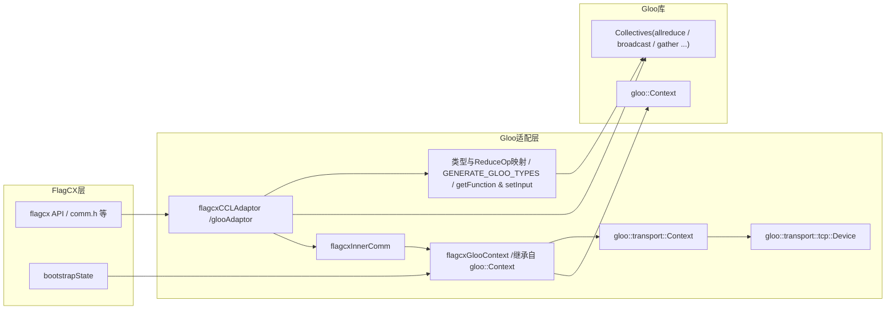

### 0. Graph

### 1. 数据类型 函数映射
`flagcxRedOp_t`返回gloo内置静态指针。
```cpp
typedef void (*flagcxGlooReduceFunc)(void*, const void*, const void*, size_t);
template <typename T>
flagcxGlooReduceFunc getGlooReduceFunc(flagcxRedOp_t op)
{
    switch (op)
    {
    case flagcxSum:
        return flagcxGlooReduceFunc(&::gloo::sum<T>);
    case flagcxProd:
        return flagcxGlooReduceFunc(&::gloo::product<T>);
    case flagcxMax:
        return flagcxGlooReduceFunc(&::gloo::max<T>);
    case flagcxMin:
        return flagcxGlooReduceFunc(&::gloo::min<T>);
    case flagcxAvg:
        printf("Gloo backend does not support flagcxAvg Redop\n");
        return nullptr;
    default:
        return nullptr;
    }
}
```
