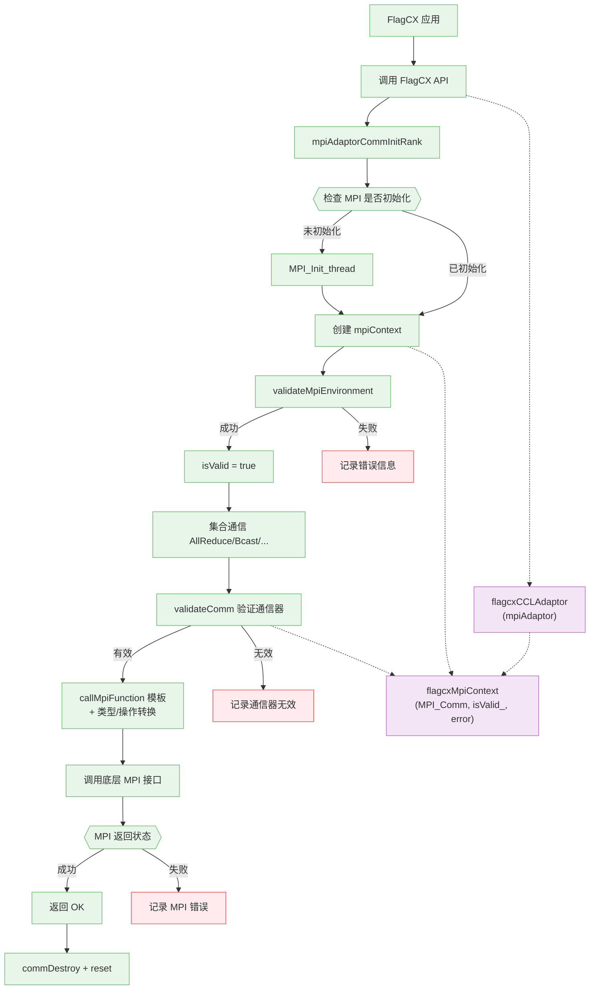

```mermaid

graph TD
  %% ===== 样式定义 =====
  classDef phase fill:#e3f2fd,stroke:#64b5f6,stroke-width:1px
  classDef logic fill:#e8f5e9,stroke:#66bb6a,stroke-width:1px
  classDef error fill:#ffebee,stroke:#ef5350,stroke-width:1px
  classDef data fill:#f3e5f5,stroke:#ba68c8,stroke-width:1px
  classDef faded fill:#eeeeee,stroke:#bbb,stroke-width:1px

  %% ===== 顶层应用 =====
  userApp["FlagCX 应用"]:::phase --> flagcxCall["调用 FlagCX API"]:::phase

  %% ===== 初始化阶段 =====
  flagcxCall --> commInit["mpiAdaptorCommInitRank"]:::logic
  commInit --> mpiCheck{{检查 MPI 是否初始化}}:::logic
  mpiCheck -->|未初始化| mpiInit["MPI_Init_thread"]:::logic
  mpiCheck -->|已初始化| createCtx
  mpiInit --> createCtx["创建 mpiContext"]:::logic
  createCtx --> validateEnv["validateMpiEnvironment"]:::logic
  validateEnv -->|成功| setValid["isValid = true"]:::logic
  validateEnv -->|失败| setErr1["记录错误信息"]:::error

  %% ===== 通信阶段（核心流程）=====
  setValid --> commOps["集合通信 AllReduce/Bcast/..."]:::logic
  commOps --> checkComm["validateComm 验证通信器"]:::logic
  checkComm -->|有效| execCall["callMpiFunction 模板\n+ 类型/操作转换"]:::logic
  checkComm -->|无效| setErr2["记录通信器无效"]:::error
  execCall --> callMPI["调用底层 MPI 接口"]:::logic
  callMPI --> checkResult{{MPI 返回状态}}:::logic
  checkResult -->|成功| returnOk["返回 OK"]:::logic
  checkResult -->|失败| setErr3["记录 MPI 错误"]:::error

  %% ===== 资源清理 =====
  returnOk --> cleanup["commDestroy + reset"]:::logic

  %% ===== 数据结构关系（灰色虚线）=====
  flagcxCall -.-> adaptor["flagcxCCLAdaptor\n(mpiAdaptor)"]:::faded
  adaptor -.-> mpiCtx["flagcxMpiContext\n(MPI_Comm, isValid_, error)"]:::data
  createCtx -.-> mpiCtx
  checkComm -.-> mpiCtx

  %% class assignments
  class userApp,flagcxCall,createCtx,validateEnv,commOps,checkComm,execCall,callMPI,checkResult,cleanup,commInit,mpiCheck,mpiInit,setValid,returnOk logic
  class setErr1,setErr2,setErr3 error
  class adaptor,mpiCtx data

```
