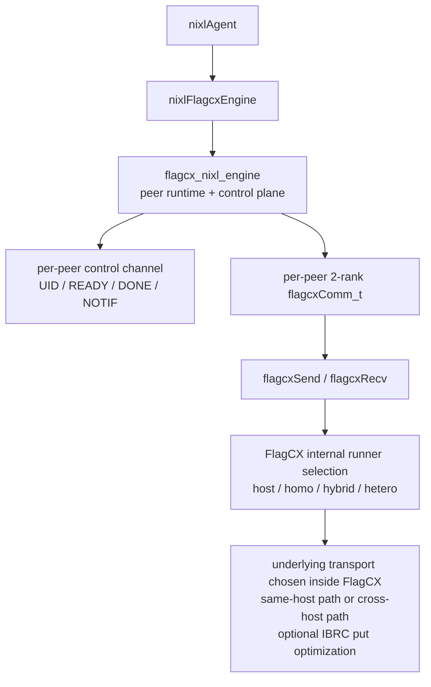

## 0. 前言

这份文档定义 `NIXL plugin` 侧如何接入当前 `FlagCX backend`。

这里关注的文件是：

- `nixl/src/plugins/flagcx/flagcx_backend.cpp`
- `nixl/src/plugins/flagcx/flagcx_backend.h`
- `nixl/src/plugins/flagcx/flagcx_plugin.cpp`
- `FlagCX` 内部配套的 `flagcx_nixl_engine`

这版设计和前一版有一个明确变化：

- 不再由 backend 自己拆 `deviceAdaptor IPC` 和 `netAdaptor`
- same-host 和 cross-host 都统一进入 `FlagCX communicator`
- backend 内部通过 `flagcxGetUniqueId + flagcxCommInitRank` 建每对 peer 的 `2-rank flagcxComm_t`
- 实际数据面默认统一走双边 `flagcxSend/flagcxRecv`
- cross-host 的 `IBRC one-sided put` 若要启用，只作为 `FlagCX` 内部优化，不改变 `NIXL backend` 对外语义

因此，这个 backend 的定位是：

- `remote backend`
- `supportsLocal() == false`
- `supportsNotif() == true`
- `same-host` 仍然属于 remote P2P，只是底层 communicator 可能走 host/intra-node runner

---

## 1. 结论

### 1.1 这版 backend 的固定事实

1. `flagcx` 在 `NIXL` 里表现为一个 `nixlBackendEngine` 插件。
2. `NIXL` 没有 communicator 抽象，只有 `remote_agent + xfer request` 抽象。
3. `NIXL core` 的 `postXfer()` 是单边调用，不会自动去远端再调用一次 backend。
4. 因此，“一边下 `flagcxSend`、另一边下 `flagcxRecv`” 必须由 `flagcx backend` 内部控制面和进度线程配对完成。
5. same-host 和 cross-host 都复用同一个 backend 请求模型：
   - `getConnInfo/loadRemoteConnInfo`
   - `connect/disconnect`
   - `registerMem/getPublicData/loadRemoteMD/unloadMD`
   - `prepXfer/postXfer/checkXfer/releaseReqH`

### 1.2 这版 backend 真正维护的对象

`nixlFlagcxEngine` 需要维护三类状态：

1. `peer connection state`
   - 每个 `remote_agent` 一个逻辑 peer
   - 每个 peer 一个 `2-rank flagcxComm_t`
   - 每个 peer 一条 backend 自己的控制通道

2. `memory registration state`
   - 本地 buffer 的注册表
   - 导出的 public metadata blob
   - 远端 buffer 的 token/range 视图

3. `request state`
   - 本地已准备的请求
   - 已投递给 southbound 的请求
   - 已完成但还没回收的请求

### 1.3 wrapper 不该感知的事情

下面这些都不写进 `nixlFlagcxEngine`：

- `flagcxUniqueId` 的双边分发细节
- `flagcxCommInitRank` 的 rank 分配细节
- 远端什么时候先下 `flagcxRecv` 或 `flagcxSend`
- same-host 具体落到 `host/homo/hybrid/hetero` 哪个 runner
- cross-host 是否最终由底层映射到 `IBRC` 普通 send/recv 还是 one-sided put
- 控制面上的 `READY/DONE/ERROR/CLOSE` 协议细节

这些都属于 `flagcx_nixl_engine`。

### 1.4 opaque blob 原则

`NIXL agent <-> nixlFlagcxEngine` 这层接口天然是 blob 接口。

因此：

- `getConnInfo()` 返回什么 blob，由 `flagcx_nixl_engine` 决定
- `loadRemoteConnInfo()` 只把 blob 原样交给 `flagcx_nixl_engine`
- `getPublicData()` 返回什么 blob，由 `flagcx_nixl_engine` 决定
- `loadRemoteMD()` 不在 wrapper 里解析 transport-specific 字段

这版里：

- `connInfo blob` 只承载建 peer 控制连接和 communicator 所需的信息
- `public md blob` 只承载远端 buffer 的逻辑身份和范围
- 不再要求 wrapper 处理 IPC handle

### 1.5 same-host / cross-host 的判断仍然不在 wrapper

`nixlFlagcxEngine` 只持有 `flagcx_nixl_conn_t*`。

是否 same-host 依然由 southbound 根据 `hostHash`、device 信息和 peer metadata 决定，但区别是：

- wrapper 不再因为 same-host 走显式 IPC import path
- wrapper 不再因为 cross-host 走显式 `netAdaptor` path
- wrapper 只要求 southbound 建好 pairwise communicator，并把请求落成 `flagcxSend/flagcxRecv`

也就是说：

- same-host / cross-host 仍然是 southbound 的 topology 决策
- 但 backend 对上层暴露的是统一 communicator 请求语义

### 1.6 `IBRC one-sided put` 在这版设计里的位置

这版 backend 的基线数据面是双边 `flagcxSend/flagcxRecv`。

因此：

- `NIXL` 不直接感知 `put`
- `nixlFlagcxEngine` 也不对外暴露 `put` 语义
- 如果 `FlagCX` 内部 cross-host runner 能把某类 `send/recv` 请求下沉成 `IBRC one-sided put`，这是内部优化
- 如果后续需要显式启用 `flagcxHeteroPut/flagcxHeteroPutSignal`，也应该作为 `flagcx_nixl_engine` 的可选 fast path，不改变 wrapper contract

一句话说清楚：

- backend 语义统一成 `xfer`
- 默认执行形态统一成 `flagcxSend/flagcxRecv`
- `put` 只作为 cross-host 优化实现细节

---

## 2. 总体分层



这个分层里：

- `nixlFlagcxEngine` 负责实现 `NIXL backend interface`
- `flagcx_nixl_engine` 负责：
  - peer 控制通道
  - `uniqueId` 分发
  - `flagcxCommInitRank`
  - 远端匹配投递
  - request progress
- 真正数据调用统一是 `flagcxSend/flagcxRecv`
- 具体 transport 由 `FlagCX communicator` 内部决定

---

## 3. NIXL 侧核心类

### 3.1 `nixlFlagcxEngine`

```cpp
class nixlFlagcxEngine : public nixlBackendEngine {
public:
    explicit nixlFlagcxEngine(const nixlBackendInitParams *init_params);
    ~nixlFlagcxEngine() override;

    bool supportsRemote() const override { return true; }
    bool supportsLocal() const override { return false; }
    bool supportsNotif() const override { return true; }

    nixl_mem_list_t getSupportedMems() const override;

    nixl_status_t getPublicData(const nixlBackendMD *meta, std::string &str) const override;
    nixl_status_t getConnInfo(std::string &str) const override;
    nixl_status_t loadRemoteConnInfo(const std::string &remote_agent,
                                     const std::string &remote_conn_info) override;

    nixl_status_t connect(const std::string &remote_agent) override;
    nixl_status_t disconnect(const std::string &remote_agent) override;

    nixl_status_t registerMem(const nixlBlobDesc &mem,
                              const nixl_mem_t &nixl_mem,
                              nixlBackendMD *&out) override;
    nixl_status_t deregisterMem(nixlBackendMD *meta) override;

    nixl_status_t loadLocalMD(nixlBackendMD *input,
                              nixlBackendMD *&output) override;
    nixl_status_t loadRemoteMD(const nixlBlobDesc &input,
                               const nixl_mem_t &nixl_mem,
                               const std::string &remote_agent,
                               nixlBackendMD *&output) override;
    nixl_status_t unloadMD(nixlBackendMD *input) override;

    nixl_status_t prepXfer(const nixl_xfer_op_t &operation,
                           const nixl_meta_dlist_t &local,
                           const nixl_meta_dlist_t &remote,
                           const std::string &remote_agent,
                           nixlBackendReqH *&handle,
                           const nixl_opt_b_args_t *opt_args = nullptr) const override;
    nixl_status_t postXfer(const nixl_xfer_op_t &operation,
                           const nixl_meta_dlist_t &local,
                           const nixl_meta_dlist_t &remote,
                           const std::string &remote_agent,
                           nixlBackendReqH *&handle,
                           const nixl_opt_b_args_t *opt_args = nullptr) const override;
    nixl_status_t checkXfer(nixlBackendReqH *handle) const override;
    nixl_status_t releaseReqH(nixlBackendReqH *handle) const override;

    nixl_status_t getNotifs(notif_list_t &notif_list) override;
    nixl_status_t genNotif(const std::string &remote_agent,
                           const std::string &msg) const override;

private:
    struct PeerState;

    flagcx_nixl_engine_t *engine_ = nullptr;
    std::string local_agent_name_;

    mutable std::mutex mem_mutex_;
    mutable std::mutex conn_mutex_;

    std::unordered_map<uint64_t, nixlFlagcxBackendMD *> mem_reg_info_;
    std::unordered_map<std::string, PeerState> connected_agents_;
};
```

`PeerState` 只保留 wrapper 真需要的状态：

```cpp
struct nixlFlagcxEngine::PeerState {
    std::string remote_agent;
    std::string imported_conn_blob;
    flagcx_nixl_conn_t *conn = nullptr;
    bool connected = false;
};
```

这里的 `flagcx_nixl_conn_t` 内部应该再封装：

- backend 控制通道
- `flagcxComm_t`
- 本地 rank / 远端 rank
- peer runtime 状态

### 3.2 `nixlFlagcxBackendMD`

```cpp
class nixlFlagcxBackendMD : public nixlBackendMD {
public:
    enum class Kind {
        LOCAL_REG,
        REMOTE_IMPORTED,
    };

    explicit nixlFlagcxBackendMD(bool is_private) : nixlBackendMD(is_private) {}
    ~nixlFlagcxBackendMD() override = default;

    Kind kind;
    uintptr_t base_addr = 0;
    size_t length = 0;
    uint32_t ref_cnt = 0;

    flagcx_nixl_local_mem_t *local_mem = nullptr;
    flagcx_nixl_remote_mem_t *remote_mem = nullptr;

    std::string exported_public_md;
    std::string remote_agent;
};
```

这里保留的核心信息只有：

- 本地注册对象还是远端导入对象
- base range 是多少
- southbound 的 opaque handle 是什么
- 导出的 public blob 是什么

这版里 `remote_mem` 不再要求保存已打开的 IPC pointer。

它最低只需要能标识：

- `remote mem token`
- `base`
- `length`
- `remote_agent`

### 3.3 `nixlFlagcxReqH`

```cpp
class nixlFlagcxReqH : public nixlBackendReqH {
public:
    enum class Stage {
        PREPARED,
        POSTED,
        COMPLETED,
        FAILED,
    };

    ~nixlFlagcxReqH() override = default;

    std::string remote_agent;
    flagcx_nixl_conn_t *conn = nullptr;
    flagcx_nixl_req_t *req = nullptr;
    nixl_xfer_op_t op;
    Stage stage = Stage::PREPARED;

    std::vector<flagcx_nixl_iov_t> local_iovs;
    std::vector<flagcx_nixl_iov_t> remote_iovs;

    bool want_notif = false;
    std::string notif_msg;
    bool notif_sent = false;
};
```

`ReqH` 只记录 NIXL 真需要知道的东西：

- 对应哪个 peer
- southbound request handle
- 本地和远端 IOV
- 是否需要完成后发 notif

---

## 4. `nixlFlagcxEngine` 方法

### 4.1 构造和析构

构造函数职责：

1. 保存 `local_agent_name_`
2. 读取 backend 参数
3. 调 `flagcx_nixl_engine_create()`

析构函数职责：

1. 释放 outstanding request
2. 释放本地和远端 metadata
3. 断开 peer 连接
4. 最后 destroy `flagcx_nixl_engine`

资源释放顺序固定为：

`req -> md -> conn -> engine`

注意：

- wrapper 不复制 UCCL 那套 listener 模型
- 真正的 control/progress 线程仍在 `flagcx_nixl_engine`
- 线程职责不是搬运 device IPC，而是：
  - 接 control message
  - 投递匹配的 `flagcxSend/flagcxRecv`
  - 维护请求状态

### 4.2 capability

v1 固定：

```cpp
supportsRemote() == true
supportsLocal()  == false
supportsNotif()  == true
```

`getSupportedMems()` v1 先返回：

```cpp
{VRAM_SEG}
```

原因：

- 这版 communicator 路径首先服务 GPU buffer
- `flagcxSend/Recv` 的 backend 映射按 byte transport 处理 device memory
- `DRAM_SEG` 以后单独评估

### 4.3 连接 metadata

`getConnInfo()`：

- 向 southbound 要一个 opaque blob
- wrapper 不解析

这版 `connInfo blob` 建议包含：

- `version`
- `local_agent`
- `device_id`
- `host_hash`
- backend 控制通道的监听信息

这里不放：

- memory handle
- IPC handle
- 某块具体 buffer 的信息

`loadRemoteConnInfo(remote_agent, blob)`：

- 缓存远端 blob
- 原样交给 southbound import
- 这一步不要求 active connect

`connect(remote_agent)`：

- 幂等
- 若尚未连接，则调用 `flagcx_nixl_connect()`
- 把 active `conn` 缓存在 `PeerState`

这一步 southbound 真正做的事情是：

1. 用 `connInfo` 建 backend 控制通道
2. 用确定性规则分配 communicator rank
3. `rank 0` 侧调用 `flagcxGetUniqueId()`
4. 通过控制通道把同一个 `uniqueId` 发给对端
5. 双边各自调用 `flagcxCommInitRank(comm, 2, uid, rank)`
6. 把 `comm`、rank 信息和控制状态封装成 `flagcx_nixl_conn_t`

rank 分配必须稳定，不能依赖谁先调用。

推荐规则：

```cpp
local_rank = (localAgent < remote_agent) ? 0 : 1;
remote_rank = 1 - local_rank;
```

这样双边不用再额外协商 rank。

`disconnect(remote_agent)`：

- 若 `conn` 存在则断开
- 调 `flagcxCommFinalize/Destroy`
- 清掉 active `conn`
- 已缓存的 imported blob 可以保留

### 4.4 本地内存注册

`registerMem(mem, nixl_mem, out)`：

1. 以 `mem.addr` 查重
2. 调 `flagcx_nixl_reg_mem()`
3. 调 `flagcx_nixl_export_mem()` 生成 public blob
4. 创建 `nixlFlagcxBackendMD`
5. 写入 `mem_reg_info_`

这版 `flagcx_nixl_reg_mem()` 的职责比上一版更简单：

- 给本地 buffer 分配逻辑 `mem_token`
- 保存 `base_addr/length/device_id`
- 必要时做 `FlagCX` 发送前检查

它不再要求：

- 导出 IPC handle
- 打开 remote IPC

`flagcx_nixl_export_mem()` 生成的 public blob 建议包含：

- `version`
- `mem_token`
- `base_addr`
- `length`
- `device_id`
- `mem_type`

`deregisterMem(meta)`：

- 递减 ref count
- 归零时调 `flagcx_nixl_dereg_mem()`
- 从 `mem_reg_info_` 擦除

### 4.5 远端 memory metadata

`getPublicData(meta, str)`：

- 直接返回缓存好的 `exported_public_md`

`loadRemoteMD(input, nixl_mem, remote_agent, output)`：

1. 把 `input.metaInfo` 原样交给 `flagcx_nixl_import_mem()`
2. 保存 `input.addr` / `input.len` 作为 remote base range
3. 创建 `REMOTE_IMPORTED` 类型的 `MD`

这里的关键变化是：

- wrapper 仍然只知道自己拿到了一块 remote memory 的 opaque handle
- 但这块 handle 不再要求是“已映射可直接访问的远端地址”
- 它只需要能让 remote side 通过 `mem_token + offset` 找到真正要 `Recv` 到哪里的 buffer

因此这版 `loadRemoteMD()`：

- 不做 IPC open
- 不依赖 same-host/cross-host 分支
- 只做 remote memory 逻辑导入

`unloadMD(input)`：

- `REMOTE_IMPORTED` 则释放 `remote_mem`
- 释放 wrapper 自己的 `MD` 对象

### 4.6 `loadLocalMD()`

既然 `supportsLocal() == false`，这里直接：

```cpp
return NIXL_ERR_NOT_SUPPORTED;
```

### 4.7 `prepXfer()`

`prepXfer()` 只做准备，不做提交。

1. 校验 `local.descCount() == remote.descCount()`
2. 校验 peer 已 connect
3. 取出 local/remote `MD`
4. 计算 offset
5. 组装 `flagcx_nixl_iov_t`
6. 创建 `nixlFlagcxReqH`
7. 记录 notif 需求

这里的 `flagcx_nixl_iov_t` 建议至少包含：

- `local_ptr`
- `local_len`
- `remote_mem_token`
- `remote_offset`
- `length`

wrapper 自己不需要知道最终是 send/recv 还是 put。

### 4.8 `postXfer()`

`postXfer()` 仍然只做一件事：

- 调 `flagcx_nixl_submit()`

这一步是整个设计最关键的地方：

- `NIXL` 只会单边调一次 `postXfer()`
- 所以 remote side 的匹配 `flagcxSend/Recv` 必须由 southbound 控制线程触发

因此 `flagcx_nixl_submit()` 的稳定语义应是：

1. 发起侧提交本地请求
2. southbound 通过控制通道把请求头发给远端
3. 远端进度线程收到后，先投递匹配的 `flagcxRecv` 或 `flagcxSend`
4. 双边都准备好后，进入 communicator 数据面
5. 本地 `checkXfer()` 只看 southbound 请求是否完成

推荐状态机：

- `NIXL_WRITE`
  - 发起侧发 `POST_RECV`
  - 远端根据 `remote_mem_token + offset` 找到目标 buffer
  - 远端先下 `flagcxRecv`
  - 远端回 `READY`
  - 发起侧下 `flagcxSend`

- `NIXL_READ`
  - 发起侧发 `POST_SEND`
  - 远端根据 `remote_mem_token + offset` 找到源 buffer
  - 远端先下 `flagcxSend`
  - 发起侧下 `flagcxRecv`

这里的“谁先下”不是 `NIXL` 决定的，而是 southbound 决定的。

### 4.9 `checkXfer()`

职责：

1. 调 `flagcx_nixl_poll()`
2. 未完成返回 `NIXL_IN_PROG`
3. 完成后若 `want_notif == true` 且 `notif_sent == false`，则调 `flagcx_nixl_send_notif()`
4. 返回 `NIXL_SUCCESS`

`flagcx_nixl_poll()` 内部需要同时考虑：

- 本地 `flagcx` operation 是否完成
- 远端是否已经给出 `DONE`
- 是否有异步错误

### 4.10 `releaseReqH()`

职责：

- 若请求还活着，释放 southbound `req`
- 删除 `nixlFlagcxReqH`

这个接口要幂等。

### 4.11 notif

`getNotifs()`：

- 调 `flagcx_nixl_drain_notifs()`
- 转成 `notif_list_t`

`genNotif()`：

- 查 active peer conn
- 调 `flagcx_nixl_send_notif()`

---

## 5. 地址、count 和 datatype 规则

### 5.1 base range

`registerMem()` 和 `loadRemoteMD()` 记录的都是 base range：

- `base_addr`
- `length`

### 5.2 请求子区间

真正发请求时，descriptor 往往只覆盖注册区间里的一个子区间。

因此始终按下面规则算 offset：

```cpp
local_offset  = local[i].addr  - local_md->base_addr;
remote_offset = remote[i].addr - remote_md->base_addr;
```

### 5.3 backend 一律按 byte transport 映射

`NIXL` 的 backend 请求本质上是“搬多少字节”，不是 `FlagCX collective datatype`。

因此 v1 推荐固定映射成：

```cpp
datatype = flagcxUint8
count    = length_in_bytes
```

这样可以避免在 backend 层引入额外 datatype 语义。

### 5.4 多片段请求要用 group 语义

如果一条请求需要：

- 连续下多个 `flagcxSend/Recv`
- 或者本端为了完成一次请求需要并发推进多个 pair

则 southbound 应在内部使用：

```cpp
flagcxGroupStart(...)
...
flagcxGroupEnd(...)
```

wrapper 不直接操心 group 细节。

---

## 6. 锁和所有权

### 6.1 锁

wrapper 只保留两把锁：

- `mem_mutex_`：保护 `mem_reg_info_`
- `conn_mutex_`：保护 `connected_agents_`

### 6.2 所有权

- `nixlFlagcxEngine` 拥有 `flagcx_nixl_engine_t`
- `nixlFlagcxEngine` 拥有本地 `MD` 缓存和 `PeerState`
- `nixlFlagcxReqH` 持有但不拥有 `conn`
- `nixlFlagcxReqH` 拥有 `req`

### 6.3 southbound 线程职责

`flagcx_nixl_engine` 至少要有自己的 progress 机制。

因为即便数据调用统一成 `flagcxSend/Recv`，仍然需要有人持续做：

- 接收 peer control message
- 远端匹配投递 `flagcxRecv` / `flagcxSend`
- 收割 communicator 完成状态
- 发送 `READY/DONE/ERROR/CLOSE`
- 维护 notif 队列

所以：

- 不能复用现有 `FlagCX proxyProgress`
- 但也不能把线程放到 `NIXL core`
- 正确位置仍然是 `flagcx_nixl_engine`

---

## 7. plugin 层

`flagcx_plugin.cpp` 按普通 `NIXL plugin` 模式实现即可。

v1 advertised mem list 先写成：

```cpp
{VRAM_SEG}
```

动态插件名目标仍然是：

`libplugin_flagcx.so`

---

## 8. v1 验收目标

### 8.1 连接路径

- `getConnInfo/loadRemoteConnInfo`
- `connect/disconnect`

做到：

- 每对 peer 能稳定建一条 backend 控制通道
- 每对 peer 能稳定建一个 `2-rank flagcxComm_t`
- rank 分配和 `uniqueId` 分发完全由 backend 内部处理

### 8.2 metadata 路径

- `registerMem/deregisterMem`
- `getPublicData/loadRemoteMD/unloadMD`

做到：

- 本地 device memory 能导出 public blob
- 远端 public blob 能导入为 remote md
- remote md 只依赖 `token + range`，不依赖 IPC import

### 8.3 传输路径

- `prepXfer/postXfer/checkXfer/releaseReqH`

做到：

- same-host 不同 agent 的 device buffer 也走 `flagcxSend/Recv`
- cross-host device buffer 同样走 `flagcxSend/Recv`
- `NIXL_READ` / `NIXL_WRITE` 都有统一异步 handle 语义
- 所有请求统一按 `flagcxUint8 + byte count` 映射

### 8.4 notif

- `getNotifs`
- `genNotif`
- 完成后可选通知

做到：

- remote backend 初始化不失败
- 运行时 notification 语义完整

### 8.5 cross-host 优化目标

这部分不影响 v1 contract，但建议提前留口子：

- cross-host `WRITE` 若 `FlagCX` 内部 runner 支持 `IBRC one-sided put`，允许作为优化实现
- `NIXL` 不需要知道自己走的是 send/recv 还是 put
- wrapper 的 `prep/post/check/release` contract 不发生变化

---

## 9. summary

- `NIXL` 继续只看到一个普通 `flagcx backend`
- backend 内部对每个 `remote_agent` 建一个 `2-rank flagcx communicator`
- 所有请求默认都被翻译成双边 `flagcxSend/flagcxRecv`
- same-host 和 cross-host 用同一套 backend 语义
- cross-host 的 `IBRC put` 只作为 `FlagCX` 内部优化，不上浮到 `NIXL` 接口层
