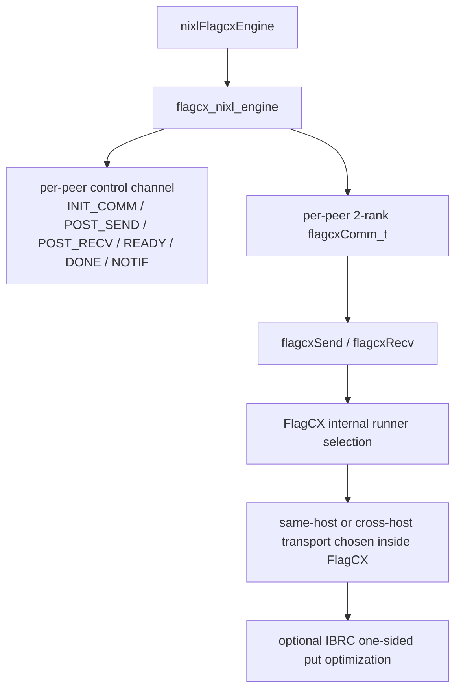

## 0. 前言

这份文档只定义 `flagcx_nixl_engine` 这层 southbound runtime。

这里的目标已经明确收敛成下面这版：

- backend 不再自己抽 `deviceAdaptor IPC` 和 `netAdaptor` 两条数据面
- same-host 和 cross-host 都统一走 `FlagCX communicator`
- 每对 `remote_agent` 建一个 `2-rank flagcxComm_t`
- communicator 通过 `flagcxGetUniqueId + flagcxCommInitRank` 建立
- 默认数据调用统一成双边 `flagcxSend/flagcxRecv`
- cross-host 的 `IBRC one-sided put` 只保留为 `FlagCX` 内部优化位点

这意味着 `flagcx_nixl_engine` 的职责不再是“选择 device IPC 还是 net send/recv”，而是：

- 维护 peer 控制通道
- 为每个 peer 建 communicator
- 维护 memory token 表
- 在远端被动投递匹配的 `flagcxRecv/flagcxSend`
- 推进 request / notif / error / close

---

## 1. 总体架构



这张图的重点是：

- `flagcx_nixl_engine` 自己维护控制面
- 数据面只有一条统一的 communicator 路径
- wrapper 不再显式感知 `same-host IPC` 或 `cross-host netAdaptor`
- topology 仍然存在，但只影响：
  - peer rank/telemetry
  - communicator 内部 runner 选择
  - 未来 cross-host `put` 优化的可用性

---

## 2. 设计原则

### 2.1 `NIXL` 仍然是单边 `postXfer`

`NIXL` 不会自动帮 backend 去远端也调用一次 `postXfer()`。

因此 southbound 必须自己解决：

- 发起侧下本地请求
- 远端收到控制消息后被动下匹配的 `flagcxRecv` 或 `flagcxSend`

一句话：

- `NIXL` 只负责“这次 xfer 要发给谁”
- `flagcx_nixl_engine` 负责“怎么让双边真的都把 communicator op 下下去”

### 2.2 peer 级资源只有两类

每个 `remote_agent` 对应一份 peer runtime：

1. 一条控制通道
   - 交换 `uniqueId`
   - 下发 `POST_SEND / POST_RECV`
   - 回传 `READY / DONE / ERROR / CLOSE`
   - 传递 `NOTIF`

2. 一个 `2-rank flagcxComm_t`
   - 真正的数据面入口
   - same-host / cross-host 都统一走这里

这版不再维护：

- same-host 共享控制块
- cross-host 数据 plane handle
- IPC import 后的 remote ptr

### 2.3 memory metadata 只做逻辑标识，不做远端映射

这版 `public md` 只解决一个问题：

- 远端收到一条请求后，怎么根据 `mem_token + offset` 找到本地应该接收或发送的 buffer

因此：

- `registerMem()` 只分配 token 和记录 range
- `export_mem()` 只导出 token/range/device 信息
- `import_mem()` 只构造远端逻辑视图
- 不做 IPC handle open

### 2.5 `IBRC one-sided put` 的边界
- 默认把请求翻译成 `flagcxSend/flagcxRecv`
如果未来需要 cross-host `put` 优化，正确位置是：
- `flagcx_nixl_submit()` 或内部 runner 选择阶段
而不是：

- 让 wrapper 出现第二套接口
- 让 `NIXL` 感知一条新的 `put` 语义路径

---

## 3. 对外 southbound 接口

`nixlFlagcxEngine` 只依赖下面这组接口。

```cpp
typedef struct flagcx_nixl_engine flagcx_nixl_engine_t;
typedef struct flagcx_nixl_conn flagcx_nixl_conn_t;
typedef struct flagcx_nixl_local_mem flagcx_nixl_local_mem_t;
typedef struct flagcx_nixl_remote_mem flagcx_nixl_remote_mem_t;
typedef struct flagcx_nixl_req flagcx_nixl_req_t;

typedef struct flagcx_nixl_iov {
    flagcx_nixl_local_mem_t *local_mem;
    flagcx_nixl_remote_mem_t *remote_mem;
    uint64_t local_offset;
    uint64_t remote_offset;
    size_t len;
} flagcx_nixl_iov_t;

flagcx_nixl_engine_t *flagcx_nixl_engine_create(...);
void flagcx_nixl_engine_destroy(flagcx_nixl_engine_t *eng);

int flagcx_nixl_export_conn_info(flagcx_nixl_engine_t *eng,
                                 char **blob, size_t *blob_len);
int flagcx_nixl_import_conn_info(flagcx_nixl_engine_t *eng,
                                 const char *remote_agent,
                                 const char *blob, size_t blob_len);

int flagcx_nixl_connect(flagcx_nixl_engine_t *eng,
                        const char *remote_agent,
                        flagcx_nixl_conn_t **out);
int flagcx_nixl_disconnect(flagcx_nixl_engine_t *eng,
                           flagcx_nixl_conn_t *conn);

int flagcx_nixl_reg_mem(flagcx_nixl_engine_t *eng,
                        void *addr, size_t len, int mem_type,
                        flagcx_nixl_local_mem_t **out);
int flagcx_nixl_dereg_mem(flagcx_nixl_engine_t *eng,
                          flagcx_nixl_local_mem_t *lm);
int flagcx_nixl_export_mem(flagcx_nixl_local_mem_t *lm,
                           char **blob, size_t *blob_len);
int flagcx_nixl_import_mem(flagcx_nixl_engine_t *eng,
                           const char *remote_agent,
                           const char *blob, size_t blob_len,
                           flagcx_nixl_remote_mem_t **out);
void flagcx_nixl_free_remote_mem(flagcx_nixl_remote_mem_t *rmd);

int flagcx_nixl_submit(flagcx_nixl_engine_t *eng,
                       flagcx_nixl_conn_t *conn,
                       int op,
                       const flagcx_nixl_iov_t *iovs, size_t niov,
                       flagcx_nixl_req_t **out);
int flagcx_nixl_poll(flagcx_nixl_engine_t *eng,
                     flagcx_nixl_req_t *req, int *done);
void flagcx_nixl_req_free(flagcx_nixl_engine_t *eng,
                          flagcx_nixl_req_t *req);

int flagcx_nixl_send_notif(flagcx_nixl_engine_t *eng,
                           flagcx_nixl_conn_t *conn,
                           const char *msg, size_t msg_len);
int flagcx_nixl_drain_notifs(flagcx_nixl_engine_t *eng,
                             char ***agents, char ***msgs, int *count);
void flagcx_nixl_free_notifs(char **agents, char **msgs, int count);
```

这里最重要的统一点是：

- wrapper 只调用一个统一的 `submit(op, iovs, ...)`
- southbound 自己决定双边怎么配对
- wrapper 不直接调用 `flagcxSend/Recv`

---

## 4. 控制消息协议

这版设计里，控制面是必需品，而且 same-host / cross-host 统一使用同一套逻辑消息。

### 4.1 控制消息类型

建议至少定义下面几类：

```cpp
enum flagcx_nixl_ctrl_type {
    INIT_COMM,
    INIT_COMM_ACK,
    POST_RECV,
    POST_SEND,
    READY,
    DONE,
    USER_NOTIF,
    ERROR,
    CLOSE,
};
```

### 4.2 控制消息内容

建议固定头：

```cpp
struct flagcx_nixl_ctrl_hdr {
    uint32_t type;
    uint32_t flags;
    uint64_t req_id;
    uint64_t mem_token;
    uint64_t offset;
    uint64_t len;
};
```

其中：

- `INIT_COMM` 额外携带 `flagcxUniqueId`
- `POST_RECV / POST_SEND` 携带 `req_id + mem_token + offset + len`
- `READY / DONE / ERROR` 至少带 `req_id`
- `USER_NOTIF` 携带用户 payload

---

## 5. 内部对象

### 5.1 `flagcx_nixl_engine`

```cpp
struct flagcx_nixl_engine {
    uint64_t local_host_hash;
    int local_device_id;

    std::atomic<bool> stop_threads;
    std::thread progress_thread;

    std::mutex conn_mutex;
    std::unordered_map<std::string, remote_conn_info> remote_infos;
    std::unordered_map<std::string, flagcx_nixl_conn_t *> peers;

    std::mutex mem_mutex;
    std::unordered_map<uintptr_t, flagcx_nixl_local_mem_t *> local_mems;
    std::unordered_map<uint64_t, flagcx_nixl_local_mem_t *> mem_token_map;

    std::mutex req_mutex;
    std::unordered_map<uint64_t, flagcx_nixl_req_t *> pending_reqs;

    std::mutex notif_mutex;
    std::vector<std::pair<std::string, std::string>> notif_queue;

    std::atomic<uint64_t> next_mem_token{1};
    std::atomic<uint64_t> next_req_id{1};
};
```

这个对象的职责只有三个：

- 管理 peer / memory / request 的全局状态
- 管理 progress thread
- 管理统一控制面

### 5.2 `remote_conn_info`

```cpp
struct remote_conn_info {
    std::string remote_agent;
    uint64_t host_hash;
    int device_id;
    std::string ctrl_endpoint_blob;
};
```

这里不再放：

- cross-host data listen handle
- same-host shared memory desc

因为数据面已经统一收敛成 `flagcxComm_t`。

### 5.3 `flagcx_nixl_conn`

```cpp
struct flagcx_nixl_conn {
    std::string remote_agent;
    bool same_host;

    int local_rank;
    int remote_rank;

    void *ctrl_chan = nullptr;
    flagcxComm_t comm = nullptr;

    flagcxStream_t stream = nullptr;
    flagcxEvent_t complete_event = nullptr;
};
```

真正需要的核心只有：

- 远端是谁
- 这个 peer 是否 same-host
- `2-rank comm`
- 控制通道
- southbound 用来投递和查询完成的 stream/event

### 5.4 `flagcx_nixl_local_mem`

```cpp
struct flagcx_nixl_local_mem {
    uintptr_t base_addr;
    size_t length;
    int mem_type;
    uint64_t mem_token;
    uint32_t ref_cnt;
};
```

### 5.5 `flagcx_nixl_remote_mem`

```cpp
struct flagcx_nixl_remote_mem {
    uintptr_t base_addr;
    size_t length;
    int mem_type;
    uint64_t mem_token;
    std::string remote_agent;
};
```

这版 `remote_mem` 只是一块逻辑视图。

它不再保存：

- IPC handle
- 已打开的 remote ptr

### 5.6 `flagcx_nixl_req`

```cpp
struct flagcx_nixl_req {
    enum state_t {
        INIT,
        WAIT_REMOTE_READY,
        LOCAL_POSTED,
        WAIT_REMOTE_DONE,
        COMPLETED,
        FAILED,
    };

    uint64_t req_id;
    int op;
    state_t state;

    flagcx_nixl_conn_t *conn;
    std::vector<flagcx_nixl_iov_t> iovs;

    bool local_posted = false;
    bool local_done = false;
    bool remote_ready = false;
    bool remote_done = false;
};
```

这个 request 明确是“控制面 + communicator 数据面”的组合状态。

---

## 6. metadata 设计

### 6.1 connInfo

`connInfo` 至少包含：

- `version`
- `local_agent`
- `host_hash`
- `device_id`
- `ctrl_endpoint_blob`

它的用途只有两个：

1. 让远端能连上本端控制通道
2. 让 `connect()` 记录 peer 的基础拓扑信息

这版 `connInfo` 不再包含：

- same-host 共享控制块描述符
- cross-host data listen handle

### 6.2 public md

`public md` 至少包含：

- `version`
- `mem_token`
- `base_addr`
- `length`
- `mem_type`
- `device_id`

它只负责告诉远端：

- 这块内存的逻辑身份是什么
- 合法 range 是什么

---

## 7. 生命周期

### 7.1 create / import / connect

`flagcx_nixl_engine_create()`：

- 记录 `local_host_hash`
- 记录 `local_device_id`
- 初始化 request / memory / peer 表
- 启动 `progress_thread`

`flagcx_nixl_import_conn_info()`：

- 只解析并缓存 remote conn blob

`flagcx_nixl_connect(remote_agent)`：

1. 查 remote conn info
2. 建立对该 peer 的控制通道
3. 根据稳定规则分配 communicator rank
4. 若本端是 `rank 0`，调用 `flagcxGetUniqueId()`
5. 通过控制通道给对端发 `INIT_COMM`
6. 双边各自调 `flagcxCommInitRank(comm, 2, uid, rank)`
7. 存入 `flagcx_nixl_conn_t`

推荐的 rank 规则：

```cpp
local_rank = (local_agent < remote_agent) ? 0 : 1;
remote_rank = 1 - local_rank;
```

这里要强调：

- topology 在 `connect()` 阶段就能记下来
- 但 topology 不再决定显式数据 path
- 真正数据 path 统一是 communicator

### 7.2 register / export / import memory

`flagcx_nixl_reg_mem()`：

- 接受本地 buffer
- 分配 `mem_token`
- 保存 `base_addr/length/mem_type`

`flagcx_nixl_export_mem()`：

- 序列化 `mem_token/base_addr/length/mem_type/device_id`

`flagcx_nixl_import_mem(remote_agent, blob)`：

1. 解析 blob
2. 保存远端 token/range
3. 关联 `remote_agent`

这一步不再：

- 打开 IPC
- 获取 remote device pointer

### 7.3 submit

`flagcx_nixl_submit()` 的逻辑固定成两层。

第一层，先做控制面配对。

第二层，再下本地 communicator op。

#### `NIXL_WRITE`

1. 发起侧生成 `req_id`
2. 发起侧通过控制通道发 `POST_RECV(req_id, mem_token, offset, len, ...)`
3. 远端 progress thread 收到后，根据 `mem_token` 找到目标本地 buffer
4. 远端先下 `flagcxRecv(dst_ptr + offset, len, flagcxUint8, peer, comm, stream)`
5. 远端回 `READY(req_id)`
6. 发起侧收到 `READY` 后，下 `flagcxSend(src_ptr + offset, len, flagcxUint8, peer, comm, stream)`
7. 发起侧 record event
8. 本地事件完成后发 `DONE(req_id)`

#### `NIXL_READ`

1. 发起侧生成 `req_id`
2. 发起侧通过控制通道发 `POST_SEND(req_id, mem_token, offset, len, ...)`
3. 远端 progress thread 收到后，根据 `mem_token` 找到源本地 buffer
4. 远端先下 `flagcxSend(src_ptr + offset, len, flagcxUint8, peer, comm, stream)`
5. 远端回 `READY(req_id)`
6. 发起侧收到 `READY` 后，下 `flagcxRecv(dst_ptr + offset, len, flagcxUint8, peer, comm, stream)`
7. 发起侧 record event
8. 本地事件完成后发 `DONE(req_id)`

#### 多片段 IOV

如果一个 request 含多个 `iov`，southbound 内部应：

- 用 `flagcxGroupStart/flagcxGroupEnd`
- 在同一个 request state machine 下统一推进

#### `IBRC put` 预留口

如果后续 cross-host `WRITE` 需要显式启用 `put` 优化，正确位置是：

- 在 `flagcx_nixl_submit()` 里判断 peer/runner/capability
- 把原本的 `flagcxSend/Recv` 分支替换成 `flagcxHeteroPut/Signal`

但是：

- request 状态机仍然保持 `POST -> READY -> DATA -> DONE`
- wrapper 接口不变

### 7.4 poll

`flagcx_nixl_poll()` 需要同时推进三件事：

1. 控制面状态
   - `READY`
   - `DONE`
   - `ERROR`
   - `CLOSE`

2. 本地 communicator 完成状态
   - query 本地 event

3. request state machine
   - `WAIT_REMOTE_READY -> LOCAL_POSTED`
   - `LOCAL_POSTED -> WAIT_REMOTE_DONE`
   - `WAIT_REMOTE_DONE -> COMPLETED`

完成判定建议为：

- 本地 event 已完成
- 已收到对端 `DONE`

### 7.5 notif

`flagcx_nixl_send_notif()`：

- 走 peer control channel 发 `USER_NOTIF`

`flagcx_nixl_drain_notifs()`：

- 从本地 notif queue 收割

---

## 8. 线程模型

只保留 southbound 自己的线程：

- `progress_thread`

如果控制通道实现需要额外 listener，也可以有：

- `accept_thread`

但从模型上看，真正必要的是 `progress_thread`。

职责：

- 轮询 peer control channel
- 收到 `POST_RECV/POST_SEND` 后为远端请求投递本地 `flagcxRecv/Send`
- 收割 communicator 本地 event 完成
- 发送 `READY/DONE/ERROR/NOTIF`
- 维护 `pending_reqs`

NIXL wrapper 不拥有这些线程。

---
## 9. summary

这版 `flagcx_nixl_engine` 的最终形态是：

- 用一条统一控制通道驱动远端匹配
- 用一个 `2-rank flagcxComm_t` 承载每个 peer 的数据面
- 默认把所有 `NIXL xfer` 翻译成双边 `flagcxSend/flagcxRecv`
- same-host 和 cross-host 共享同一套 southbound 状态机
- `IBRC one-sided put` 只保留为 `FlagCX` 内部的可选优化路径
