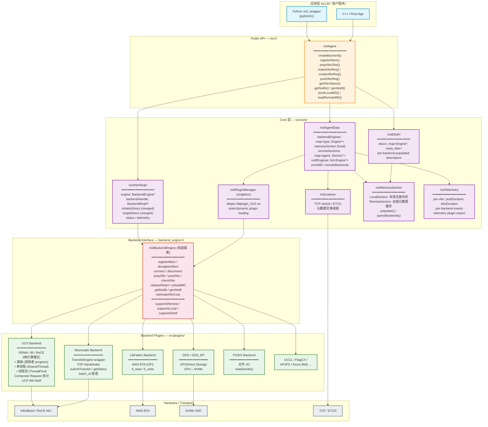

## 0. 前言
nixl 就是推理场景下点对点数据传输的 abstract，支持了DRAM，VRAM，文件，块存储，对象存储。==推理的数据路径可能内存->存储，上层框架关心 UCX\GDS\对象存储\其他后端==，nixl直接提供一个统一的northbound 接口，上层只需要描述 buffer 从本地传到远端or本地另一端，backend 由 NIXL 选。
## 1. nixl transfer struct
核心分为以下几大类：
1. `nixlAgent`
NIXL的统一入口，负责创建 backend、注册本地内存、管理远端 metadata、创建传输请求、调度 backend 执行、查询状态和通知。
2. `nixlPluginManager`
负责 backend 插件的发现、加载、缓存和实例化。提供的功能包括：动态/静态插件和用户给个 build。
3. `nixlBackendEngine`
nixl 的向下的接口，nixlBackendEngine提供了一堆虚函数去重载不同 backend 对应的实现：
```cpp
virtual bool supportsRemote() const = 0;
virtual bool supportsLocal() const = 0;
virtual bool supportsNotif() const = 0;

virtual nixl_status_t registerMem (const nixlBlobDesc &mem,
                                        const nixl_mem_t &nixl_mem,
                                        nixlBackendMD* &out) = 0;
virtual nixl_status_t connect(const std::string &remote_agent) = 0;
virtual nixl_status_t unloadMD (nixlBackendMD* input) = 0;

virtual nixl_status_t prepXfer (const nixl_xfer_op_t &operation,
                                const nixl_meta_dlist_t &local,
                                const nixl_meta_dlist_t &remote,
                                const std::string &remote_agent,
                                nixlBackendReqH* &handle,
                                const nixl_opt_b_args_t* opt_args=nullptr
                                ) const = 0;
virtual nixl_status_t postXfer (const nixl_xfer_op_t &operation,
                                const nixl_meta_dlist_t &local,
                                const nixl_meta_dlist_t &remote,
                                const std::string &remote_agent,
                                nixlBackendReqH* &handle,
                                const nixl_opt_b_args_t* opt_args=nullptr
                                ) const = 0;
virtual nixl_status_t checkXfer(nixlBackendReqH* handle) const = 0;
virtual nixl_status_t releaseReqH(nixlBackendReqH* handle) const = 0;
```
4. `nixlBackendPlugin`
是否 support，然后注册，然后建联，然后 prepare，然后 post，然后 check，然后 release。

以下以两个 rank 走ucx 完成传输的流程（除了上面 5 个具体的传输接口，nixl 框架也在这里面起到了控制面的作用）：
```txt
┌─────────────────────────────────────────────────────────────────────────────┐
│                         NIXL 完整生命周期流程                                │
└─────────────────────────────────────────────────────────────────────────────┘

╔══════════════════════════════════════════════════════════════════════════════╗
║  Phase 1: 初始化                                                            ║
╚══════════════════════════════════════════════════════════════════════════════╝

  Agent A                                        Agent B
    │                                              │
    │ nixlAgent("AgentA", cfg)                     │ nixlAgent("AgentB", cfg)
    │   ├─ 创建 nixlAgentData                      │   ├─ 创建 nixlAgentData
    │   ├─ 创建 nixlLocalSection                    │   ├─ 创建 nixlLocalSection
    │   ├─ (可选) 启动 TCP listener                 │   ├─ (可选) 启动 TCP listener
    │   └─ (可选) 启动 commThread                   │   └─ (可选) 启动 commThread
    │       (后台处理 etcd/socket 元数据交换)         │


╔══════════════════════════════════════════════════════════════════════════════╗
║  Phase 2: 创建后端                                                           ║
╚══════════════════════════════════════════════════════════════════════════════╝

  Agent A                                        Agent B
    │                                              │
    │ createBackend("UCX", params)                 │ createBackend("UCX", params)
    │   ├─ 加载插件 .so                             │   ├─ 加载插件 .so
    │   ├─ plugin->createEngine()                  │   ├─ plugin->createEngine()
    │   │   └─ 内部: 创建 UCX worker 等             │   │   └─ 内部: 创建 UCX worker 等
    │   ├─ backend->getConnInfo() → conn_blob_A    │   ├─ backend->getConnInfo() → conn_blob_B
    │   │   (UCX: 序列化 worker address)            │   │   (UCX: 序列化 worker address)
    │   └─ 存入 connMD["UCX"] = conn_blob_A        │   └─ 存入 connMD["UCX"] = conn_blob_B
    │                                              │


╔══════════════════════════════════════════════════════════════════════════════╗
║  Phase 3: 注册本地内存                                                        ║
╚══════════════════════════════════════════════════════════════════════════════╝

  Agent A                                        Agent B
    │                                              │
    │ registerMem(descs_A)                         │ registerMem(descs_B)
    │   // descs_A = [{addr=gpu_ptr_a,             │   // descs_B = [{addr=gpu_ptr_b,
    │   //             len=4096, devId=0}]         │   //             len=4096, devId=0}]
    │   │                                          │   │
    │   ├─ memorySection->addDescList()            │   ├─ memorySection->addDescList()
    │   │   └─ backend->registerMem(desc)          │   │   └─ backend->registerMem(desc)
    │   │       → 返回 nixlBackendMD*              │   │       → 返回 nixlBackendMD*
    │   │       (UCX: ucp_mem_map, 获取 rkey)       │   │       (UCX: ucp_mem_map, 获取 rkey)
    │   │                                          │   │
    │   └─ backend->getPublicData(md)              │   └─ backend->getPublicData(md)
    │       → 序列化公开元数据                        │       → 序列化公开元数据
    │       (UCX: rkey + addr + len)               │       (UCX: rkey + addr + len)
    │                                              │


╔══════════════════════════════════════════════════════════════════════════════╗
║  Phase 4: 元数据交换 (跨 Agent)                                               ║
╚══════════════════════════════════════════════════════════════════════════════╝

  Agent A                                        Agent B
    │                                              │
    │ getLocalMD() → md_blob_A                     │ getLocalMD() → md_blob_B
    │   // 序列化:                                  │   // 序列化:
    │   //   agent_name = "AgentA"                 │   //   agent_name = "AgentB"
    │   //   connMD["UCX"] = conn_blob_A           │   //   connMD["UCX"] = conn_blob_B
    │   //   memorySection = [desc_A + publicData] │   //   memorySection = [desc_B + publicData]
    │                                              │
    │  ◄══════════ 交换 md_blob ════════════════►   │
    │  (3种方式: 手动/TCP socket/etcd)               │
    │                                              │
    │ loadRemoteMD(md_blob_B)                      │ loadRemoteMD(md_blob_A)
    │   ├─ 反序列化: 得知 AgentB 的信息               │   ├─ 反序列化: 得知 AgentA 的信息
    │   ├─ backend->loadRemoteConnInfo             │   ├─ backend->loadRemoteConnInfo
    │   │   ("AgentB", conn_blob_B)                │   │   ("AgentA", conn_blob_A)
    │   │   (后端缓存远端连接信息)                    │   │   (后端缓存远端连接信息)
    │   └─ remoteSection->loadRemoteData()         │   └─ remoteSection->loadRemoteData()
    │       └─ backend->loadRemoteMD(desc_B, ...)  │       └─ backend->loadRemoteMD(desc_A, ...)
    │           → 返回远端 nixlBackendMD*           │           → 返回远端 nixlBackendMD*
    │           (UCX: 导入 rkey)                    │           (UCX: 导入 rkey)
    │                                              │


╔══════════════════════════════════════════════════════════════════════════════╗
║  Phase 5: 建立连接 (延迟或显式)                                                 ║
╚══════════════════════════════════════════════════════════════════════════════╝

  Agent A                                        Agent B
    │                                              │
    │ makeConnection("AgentB")                     │ makeConnection("AgentA")
    │   └─ backend->connect("AgentB")              │   └─ backend->connect("AgentA")
    │       (UCX: ucp_ep_create)                   │       (UCX: ucp_ep_create)
    │                                              │
    │ // 或者: 大多数 backend 在                     │
    │ // postXfer 时自动延迟建连                     │
    │                                              │


╔══════════════════════════════════════════════════════════════════════════════╗
║  Phase 6: 创建 & 提交传输请求                                                   ║
╚══════════════════════════════════════════════════════════════════════════════╝

  ┌─ UCX 单边模型: 只有发起方调 ──────────────────────────────────────────────┐
  │                                                                          │
  │  Agent A                              Agent B                            │
  │    │                                    │                                │
  │    │ prepXferReq(NIXL_WRITE,            │ (什么都不做)                     │
  │    │   local=descs_A,                   │                                │
  │    │   remote=descs_B,                  │                                │
  │    │   "AgentB")                        │                                │
  │    │   ├─ populate(local) → 匹配本地MD   │                                │
  │    │   ├─ populate(remote) → 匹配远端MD  │                                │
  │    │   └─ backend->prepXfer()           │                                │
  │    │                                    │                                │
  │    │ postXferReq(req)                   │                                │
  │    │   └─ backend->postXfer()           │                                │
  │    │       └─ ucp_put_nbx()             │ ← RDMA 直接写入 Agent B 的 GPU  │
  │    │          (单边, 远端无感知)          │                                │
  │    │                                    │                                │
  └──────────────────────────────────────────────────────────────────────────┘

╔══════════════════════════════════════════════════════════════════════════════╗
║  Phase 7: 轮询完成状态                                                         ║
╚══════════════════════════════════════════════════════════════════════════════╝

  Agent A                                        Agent B
    │                                              │
    │ while (getXferStatus(req) == NIXL_IN_PROG)   │ while (getXferStatus(req) == NIXL_IN_PROG)
    │   └─ backend->checkXfer(handle)              │   └─ backend->checkXfer(handle)
    │       (UCX: ucp_worker_progress + test)      │
    │                                              │
    │ // getXferStatus 返回 NIXL_SUCCESS → 完成     │ // getXferStatus 返回 NIXL_SUCCESS → 完成
    │                                              │


╔══════════════════════════════════════════════════════════════════════════════╗
║  Phase 8: 通知 (可选)                                                         ║
╚══════════════════════════════════════════════════════════════════════════════╝

  Agent A                                        Agent B
    │                                              │
    │ // createXferReq 时附带 notif:                │
    │ // opt_args.hasNotif = true                  │
    │ // opt_args.notifMsg = "kv_ready"            │
    │                                              │
    │ // postXfer 完成后, backend 自动               │ getNotifs() → [("AgentA", "kv_ready")]
    │ // 发送通知给 AgentB                           │   └─ backend->getNotifs()
    │                                              │


╔══════════════════════════════════════════════════════════════════════════════╗
║  Phase 9: 清理                                                               ║
╚══════════════════════════════════════════════════════════════════════════════╝

  Agent A                                        Agent B
    │                                              │
    │ releaseXferReq(req)                          │ releaseXferReq(req)
    │   └─ backend->releaseReqH()                  │   └─ backend->releaseReqH()
    │                                              │
    │ deregisterMem(descs_A)                       │ deregisterMem(descs_B)
    │   └─ backend->deregisterMem()                │   └─ backend->deregisterMem()
    │                                              │
    │ ~nixlAgent()                                 │ ~nixlAgent()
    │   └─ backend->disconnect() + destroy         │   └─ backend->disconnect() + destroy
```

## 2. NIXL 注册/传输
NIXL 的核心设计是：先注册，再传输。
它会把每块注册的内存按 backend 建索引，之后在真正发传输请求时，把用户给的地址范围映射到 backend metadata。用户给的地址到 post 时刻，主要变化就是： `addr / len / devId` -> `地址 + backend metadata` 。
![[0. nixl 调研 2026-03-10 15.32.39.excalidraw.svg]]
%%[[0. nixl 调研 2026-03-10 15.32.39.excalidraw|🖋 Edit in Excalidraw]]%%
1. 用户给 NIXL 的只是 addr / len / devId
2. populate() 会去已注册区间里找“哪个 registration 覆盖了这个地址范围”
3. 找到后，把对应的 metadataP (如果是 remote 还包括了传metaB给远端再==反序列化==为 metaP)填回结果 descriptor
4. 所以后面的 backend 已经不用再做地址查表，它拿到的就是“地址 + backend metadata”

NIXL backend 至少要支持两类 metadata：
* 对应 getConnInfo() / loadRemoteConnInfo()
* 对应 getPublicData() / loadRemoteMD()
## 3. nixl 整体架构


## 4. 设计动机
在 vllm 推理时数据搬运包括：

| 路径          | 数据                            | 当前                         | NIXL 可以走的有                            |
| ----------- | ----------------------------- | -------------------------- | ------------------------------------- |
| GPU↔GPU 跨节点 | KV cache (PD 分离)              | NIXL / Mooncake            | UCX / Mooncake backend (VRAM↔VRAM)    |
| GPU↔本地 NVMe | KV cache offload / checkpoint | 需要自己写 GDS 代码               | GDS / GDS_MT backend (VRAM↔BLK)       |
| GPU↔远端存储    | 模型权重加载                        | HF `from_pretrained` / 自定义 | HF3FS / Azure Blob backend (VRAM↔OBJ) |
| CPU↔CPU 跨节点 | 元数据 / routing 信息              | ZMQ / gRPC / 自写 TCP        | UCX / LibFabric (DRAM↔DRAM)           |
| GPU↔本地磁盘    | prefix cache 持久化              | `torch.save`               | POSIX backend (VRAM↔FILE)             |
| GPU↔GPU 节点内 | TP/PP 通信                      | NCCL                       | UCCL ？NCCL                            |
* mooncake 只能完成第一行，其他的全部集成各自的库，就会存在每个库有自己的 API、内存注册方式、连接管理、错误处理。==NIXL自己抽象出来的registerMem去给所有 backend 全部注册一遍拿回来不同后端注册后的私有 metadata 全部一起保存在nixlLocalSection。==
    当 vLLM 需要 KV offload to disk、需要直接从对象存储拉权重、需要跨云传输的时候，NIXL 的统一 API 就不需要每次引入一个新库。代价是当前单一路径（GPU RDMA KV transfer）的性能不如 Mooncake 这种专项优化的方案。

## 5. 其他
### 集合通信场景
在 nixl 内核心接口都是围绕点对点，假如支持训练场景的 collective 操作则需要拓展一套接口去对接以 nccl 为首的架构。另外，NIXL 的异步模型是 **CPU 驱动的**（没有 stream 语义，要和训练的 compute kernel 做 overlap就需要在 nixl 统一的传输接口里面增加 stream 参数，会导致 GPU 之外的传输用不着）。
nccl 的核心价值藏在 topo 发现 和算法选择内，我们只能在它上面包装所有接口。

### MoE场景
主要是 DeepEP 的定制化 kernel 完成了直接操作 GPU 内存到 NIC 下 wr，且目标不是规定的，而统一框架nixl 则是 CPU 侧的完全帮不上忙。可能需要去看 nccl ep 的源码，就又回到了怎么去包装 nccl。
