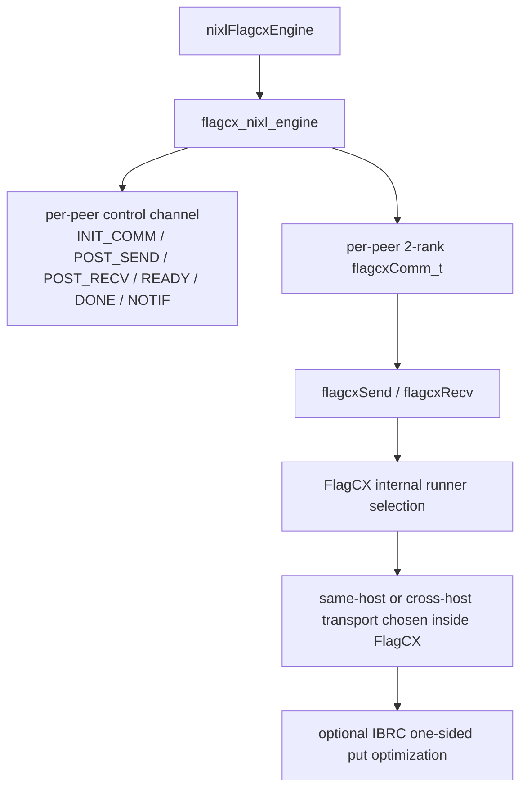

## 0. 前言

这份文档只定义 `flagcx_nixl_engine` 这层 southbound runtime。

这里的目标已经明确收敛成：

- backend 不再自己抽 `deviceAdaptor IPC` 和 `netAdaptor` 两条数据面
- same-host 和 cross-host 都统一走 `FlagCX communicator`
- 每对 `remote_agent` 建一个 `2-rank flagcxComm_t`
- communicator 通过 `flagcxGetUniqueId + flagcxCommInitRank` 建立
- 默认数据调用统一成双边 `flagcxSend/flagcxRecv`
- cross-host 的 `IBRC one-sided put` 只保留为 `FlagCX` 内部优化位点

这意味着 `flagcx_nixl_engine` 的职责不再是“选择 device IPC 还是 net send/recv”，而是：

- 维护 peer 控制通道
- 为每个 peer 建 communicator？？？
- 维护 memory token 表
- 在远端被动投递匹配的 `flagcxRecv/flagcxSend`
- 推进 request / notif / error / close

---

## 1. 总体架构

这张图的重点是：

- `flagcx_nixl_engine` 自己维护控制面
- 数据面只有一条统一的 communicator 路径
- wrapper 不再显式感知 `same-host IPC` 或 `cross-host netAdaptor`
- topology 仍然存在，但只影响：
  - peer rank/telemetry
  - communicator 内部 runner 选择
  - 未来 cross-host `put` 优化的可用性

---

## 2. 设计原则
