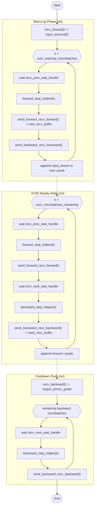

```mermaid
graph TB
    %% ---------------- 外层节点 ----------------
    Start([Start])
    End([End])

    %% ---------- Warm‑up forward passes ----------
    subgraph Warmup["Warm‑up Phase (ori)"]
      direction TB
      W0["recv_forward() -> input_tensors[0]"]
      W1{{"k < num_warmup_microbatches"}}
      W2["wait recv_prev_wait_handle"]
      W3["forward_step_helper(k)"]
      W4["send_forward_recv_forward() -> fwd_recv_buffer"]
      W5["append input_tensor to next chunk"]
      W6["send_backward_recv_backward()"]

      W0 --> W1
      W1 --> W2 --> W3 --> W4 --> W6 --> W5 --> W1
    end

    %% ---------- Steady‑state 1F1B ----------
    subgraph Steady["1F1B Steady‑State (ori)"]
      direction TB
      S0{{"k < num_microbatches_remaining"}}
      S1["wait recv_prev_wait_handle"]
      S2["forward_step_helper(k)"]
      S3["send_forward_recv_forward()"]
      S4["wait recv_next_wait_handle"]
      S5["backward_step_helper(k)"]
      S6["send_backward_recv_backward() -> bwd_recv_buffer"]
      S7["append tensors / grads"]

      S0 --> S1 --> S2 --> S3 --> S4 --> S5 --> S6 --> S7 --> S0
    end

    %% ---------- Cool‑down backward flush ----------
    subgraph Cooldown["Cooldown Flush (ori)"]
      direction TB
      C0["recv_backward() -> output_tensor_grads"]
      C1{{"remaining backward microbatches"}}
      C2["wait recv_next_wait_handle"]
      C3["backward_step_helper(k)"]
      C4["send_backward_recv_backward()"]

      C0 --> C1
      C1 --> C2 --> C3 --> C4 --> C1
    end

    %% ---------- 阶段衔接 ----------
    Start --> W0
    W5 -.-> S0
    S7 -.-> C0
    C4 --> End

```