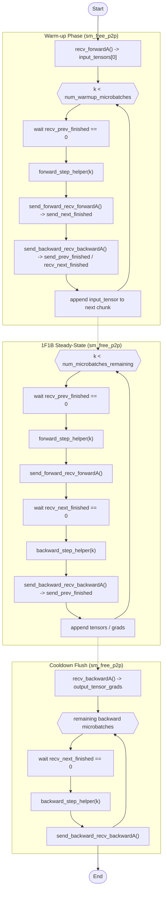

在config内的pp大于1的时会打开interleving，

```txt
时间         PP0 (rank0-3)           ┆          PP1 (rank4-7)
--------------------------------------------------------------------
t=0          FWD MB0  ──────────►    ┆         （等待）
t=1          FWD MB1  ──────────►    ┆  FWD MB0
t=2          (等梯度)   ◄── BWD MB0   ┆  FWD MB1
t=3          BWD MB0                 ┆  BWD MB1
t=4          BWD MB1  （完成）        ┆  （完成）
```