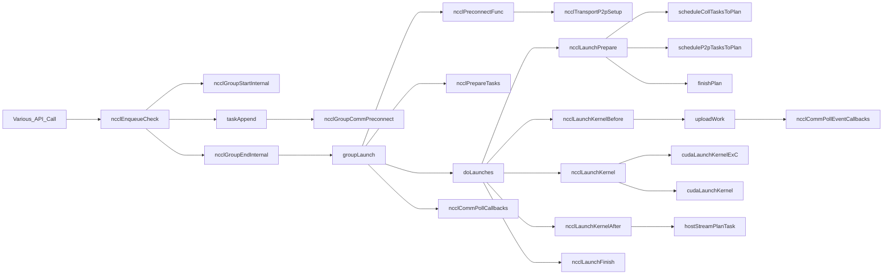
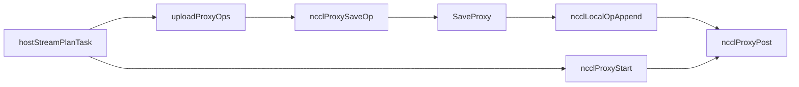

### Structs

```cpp
struct ncclGroupJob {
  struct ncclAsyncJob base;
  struct ncclComm **groupCommHeadPtr;
  struct ncclComm **groupCommPreconnectHeadPtr;
  ncclResult_t *groupErrorPtr;
  bool *abortFlagPtr;
  int *groupBlockingPtr;
  struct ncclIntruQueue<struct ncclAsyncJob, &ncclAsyncJob::next> *asyncJobsPtr;
  bool initialized;
};

struct ncclAsyncJob {
  struct ncclAsyncJob* next;
  pthread_t thread;
  ncclResult_t result;
  ncclResult_t(*func)(struct ncclAsyncJob*);
  void(*undo)(struct ncclAsyncJob*);
  void(*destructor)(void*);
  ncclGroupJobState_t state;
  uint32_t* abortFlag; /* point to comm abortFlag */
  uint32_t* abortFlagDev; /* point to comm abortFlagDev */
  uint32_t* childAbortFlag; /* point to child abortFlag */
  uint32_t* childAbortFlagDev; /* point to child abortFlagDev */
  ncclComm_t comm;
  int destroyFlag;
};

typedef enum ncclGroupJobState {
  ncclGroupJobRunning = 0,
  ncclGroupJobDone    = 1,
  ncclGroupJobJoined  = 2,
} ncclGroupJobState_t;

```

### ncclTasks

we restrict the user that all streams must be captured in the same graph or not captured at all.

```
struct ncclCudaStreamList {
  struct ncclCudaStreamList *next;
  cudaStream_t stream;
};
struct ncclTasks {
  struct Peer {
    bool sendSeen, recvSeen;
    struct ncclIntruQueue<struct ncclTaskP2p, &ncclTaskP2p::next> sendQueue;
    struct ncclIntruQueue<struct ncclTaskP2p, &ncclTaskP2p::next> recvQueue;
  };
  struct ncclIntruQueue<struct ncclInfo, &ncclInfo::next> collQueue;
  // Queue for user-tuned executed collectives
  struct ncclIntruQueue<struct ncclInfo, &ncclInfo::next> collTunedQueue;
  // Queue for continuous bytes distribution (CBD) collectives
  struct ncclIntruQueue<struct ncclInfo, &ncclInfo::next> collCBDQueue;
  // Queue for collnet
  struct ncclIntruQueue<struct ncclInfo, &ncclInfo::next> collnetQueue;
  size_t workBytesTotal;
  int usableChannels;
  bool sorted;
  struct Peer* peers/*[nRanks]*/;
  int *p2pSendOrder, *p2pRecvOrder;
  int p2pOrderSteps;
  int nTasksColl, nTasksP2p;

  // The list of user streams aggregated over all tasks present.
  // yzhang35: duplicated item is removed.
  struct ncclCudaStreamList* streams;
  // The most recent user stream. Ignored if streams==nullptr
  cudaStream_t streamRecent;
  // The graph capturing all user streams or invalid if none. Thus we restrict the
  // user that all streams must be captured in the same graph or not captured
  // at all. Technically we could probably relax this, but that would mean
  // collecting a different `ncclTasks` per graph and one for non-graph.
  struct ncclCudaGraph capturingGraph;
};

```

### Cross Multiple Comm

### Call Graph



### ncclEnqueueCheck()

Entry point for all nccl call

```cpp
ncclResult_t ncclEnqueueCheck(struct ncclInfo* info) {
  NCCLCHECK(ncclGroupStartInternal());
  // 1. arguments check
  NCCLCHECKGOTO(taskAppend(info->comm, info), ret, fail);
  NCCLCHECK(ncclGroupEndInternal());
}

```

### taskAppend

Converts `info` to a task.

Task are recorded in comm->tasks->peers structs, meanwhile, update comm->tasks.nTaskP2p.

Peers mean the remote rank of a p2p communication.

Note that the stream list is kept in reverse order.

```
// Converts `info` to a task and adds it to `comm->planner`. The exception is
// with single rank communicators, collectives are issued as `ncclMemcpyAsync`s // and thus don't need a task.
static ncclResult_t taskAppend(struct ncclComm* comm, struct ncclInfo* info) {
  ncclTasks *tasks = &comm->tasks;
  if (info->coll == ncclFuncSend || info->coll == ncclFuncRecv) {
      // Must be in thread local group before tasks can be alloc'd in `comm->memScoped`.
    ncclGroupCommJoin(info->comm);
    // yzhang35: create a taskP2p and enqueue it.
        struct ncclTaskP2p* p2p = ncclMemoryPoolAlloc<struct ncclTaskP2p>(&comm->memPool_ncclTaskP2p, &comm->memPermanent);
    ncclIntruQueueEnqueue(isSendNotRecv ? &tasks->peers[peer].sendQueue :
                                                    &tasks->peers[peer].recvQueue, p2p);
    tasks->nTasksP2p += 1;
    // Mark channels that need pre-connect
    if (comm->rank != peer) {
            ncclGroupCommPreconnect(comm);
        }
  } else {
        if (comm->nRanks == 1) {
      NCCLCHECK(ncclLaunchOneRank(info->recvbuff, info->sendbuff, info->count, info->opFull, info->datatype, info->stream));
      return ncclSuccess;
    } else {
          // yzhang35: sort coll by ncclFunc_t enum
          ncclIntruQueueSortEnqueue(&tasks->collQueue, t, collCmp);
          // yzhang35: only coll calc bytesTotal??
          tasks->workBytesTotal += info->count * ncclTypeSize(info->datatype);
      tasks->nTasksColl += 1;
    }
  }
  // yzhang35: maintain tasks->streams & tasks->streamRecent fields. streamRecent only used in this func, so it does not mean anything important
}

```

### ncclGroupCommPreconnect

```
// Add comm to this thread's group needing preconnect
inline void ncclGroupCommPreconnect(struct ncclComm* comm) {
  if (comm->preconnectNext == reinterpret_cast<struct ncclComm*>(0x1)) {
    comm->preconnectNext = ncclGroupCommPreconnectHead;
    ncclGroupCommPreconnectHead = comm;
  }
}

```

### ncclGroupEndInternal

```
ncclResult_t ncclGroupEndInternal(ncclSimInfo_t* simInfo) {
  if ((--ncclGroupDepth) > 0) goto exit;
  if (ncclGroupCommHead != nullptr || !ncclIntruQueueEmpty(&ncclAsyncJobs) || ncclGroupCommPreconnectHead != nullptr) {
  // maintain ncclGroupJobMain
  // yzhang35: pytorch sets ncclGroupBlocking = 1
  if (ncclGroupBlocking == 0) {
          ncclGroupJobMainPtr->base.func = groupLaunchNonBlocking;
      PTHREADCHECKGOTO(pthread_create(&ncclGroupJobMainPtr->base.thread, NULL, ncclAsyncJobMain, (void*)&ncclGroupJobMainPtr->base), "pthread_create", ret, fail);
  } else {
          NCCLCHECKGOTO(groupLaunch(&ncclGroupJobMainPtr->base, internalSimInfoPtr), ret, fail);
  }
}

```

### groupLaunch

```
static ncclResult_t groupLaunch(struct ncclAsyncJob *job_, ncclSimInfo_t* simInfo = NULL) {
        if (groupCommPreconnectHeadMain != nullptr) {
                // yzhang35: put preconnectFunc into queue.
                do {
                    struct ncclPreconnectJob* job;
                    job->base.func = ncclPreconnectFunc;
                        ncclIntruQueueEnqueue(asyncJobsMain, &job->base);
                        struct ncclComm* next = comm->preconnectNext;
                    comm->preconnectNext = reinterpret_cast<struct ncclComm*>(0x1);
                    comm = next;
            } while (comm != nullptr);
        }

        if (!ncclIntruQueueEmpty(asyncJobsMain)) {
                // yzhang35: start those jobs async
            struct ncclAsyncJob* job = ncclIntruQueueHead(asyncJobsMain);
            do {
                    SYSCHECKGOTO(pthread_create(&job->thread, nullptr, ncclAsyncJobMain, job), ret, fail);
                    job = job->next;
                } while (job != nullptr);
                // yzhang35: check job finished state
                do {
                        jobsDone = true;
                    job = ncclIntruQueueHead(asyncJobsMain);
                    do {
                            ncclGroupJobState_t state = __atomic_load_n(&job->state, __ATOMIC_ACQUIRE);
                        if (state == ncclGroupJobRunning) {
                                jobsDone = false;
                        } else if (state == ncclGroupJobDone) {
                                if (pthread_join(job->thread, nullptr) != 0) {/*...*/}
                                    job = job->next;
                            }
                        } while (job != nullptr);
                } while (jobsDone == false);
        }

        // yzhang35: NOTE not exist in nccl-2.21.5
        NCCLCHECKGOTO(ncclPrepareTasks(comm, algoNeedConnect, &needConnect, simInfo), ret, fail);
        NCCLCHECKGOTO(doLaunches(groupCommHeadMain), ret, fail);
        // yzhang35: clean up stuff
        // ...
}

```

### doLaunches

```
static ncclResult_t doLaunches(struct ncclComm* head) {
// yzhang35: for one gpu per process/rank case. intraComm0 == comm itself.
struct ncclComm* cliqueComm0 = head->intraComm0;
struct ncclComm* cliqueHead = head;
do {
        do {
            NCCLCHECKGOTO(ncclLaunchPrepare(comm), result, failure);
            // yzhang35: NCCL_LAUNCH_MODE default to PARALLEL. No barrier
            if (useBarrier) ncclCommIntraBarrierIn(comm, 1);
            comm = comm->groupNext;
        } while (comm != nullptr && comm->intraComm0 == cliqueComm0);
        cliqueNextHead = comm;
        while (true) {
                bool moreRounds = false;
                comm = cliqueHead;
                do {
                        // yzhang35: update moreRounds var
                        moreRounds |= comm->unlaunchedPlansHead != nullptr;
                    if (moreRounds) {
                                NCCLCHECKGOTO(ncclLaunchKernelBefore_NoUncapturedCuda(comm, plan), result, failure);
                                NCCLCHECKGOTO(ncclLaunchKernel(comm, plan), result, failure);
                                NCCLCHECKGOTO(ncclLaunchKernelAfter_NoCuda(comm, plan), result, failure);
                        } else {
                            NCCLCHECKGOTO(ncclLaunchFinish(comm), result, failure);
                        }
                        struct ncclComm* next = comm->groupNext;
                        comm = next;
                } while (comm != cliqueNextHead);
                if (!moreRounds) break;
        }
        cliqueHead = cliqueNextHead;
} while (cliqueHead != nullptr);
}

```

### ncclLaunchPrepare

```cpp
ncclResult_t ncclLaunchPrepare(struct ncclComm* comm) {
  // yzhang35: persistent=1 if cudagraph used inside group start/end pair.
  bool persistent = ncclCudaGraphValid(tasks->capturingGraph);
  if (tasks->nTasksColl + tasks->nTasksP2p != 0) {
    do {
          // yzhang35: alloc a new plan
      struct ncclKernelPlan* plan = ncclMemoryPoolAlloc<struct ncclKernelPlan>(&comm->memPool_ncclKernelPlan, &comm->memPermanent);
      ncclIntruQueueEnqueue(&comm->planQueue, plan);

      // Non-persistent kernels fill up at most half of our fifo per kernel.
      int nWorkBudget = plan->persistent ? INT_MAX : comm->workFifoDepth/2;
      int nWorkBudgetOld = nWorkBudget;

      // Drain coll tasks first. This is essential since we partition tasks based
      // on the work budget and p2p work isn't collective. If we were to drain p2p
      // first, the place where we cut the kernel could vary by rank which would
      // cause the "shortest channel first" channel picker to have divergent results.
      if (tasks->nTasksColl != 0) {
        NCCLCHECKGOTO(scheduleCollTasksToPlan(comm, plan, &nWorkBudget), result, failure);
      }
      // And only drain p2p tasks once colls are depleted.
      if (tasks->nTasksColl == 0 && tasks->nTasksP2p != 0) {
        NCCLCHECKGOTO(scheduleP2pTasksToPlan(comm, plan, &nWorkBudget), result, failure);
      }
      if (nWorkBudget == nWorkBudgetOld) {
        // We weren't able to fit any tasks into our budget which means now we're
        // stuck in an infinite loop. We defer this check until here, instead of
        // doing it in comm init, to permit testing with insanely shallow queues
        // for cases where that's expected to still work (e.g. few channels).
        WARN("'NCCL_WORK_FIFO_DEPTH=%d' is too small. Minimum value is %d", comm->workFifoDepth, 2*MAXCHANNELS);
        result = ncclInvalidUsage;
        goto failure;
      }
      finishPlan(plan);
    } while (tasks->nTasksColl + tasks->nTasksP2p != 0);
    // Semantically we want these dependencies for the kernels launched:
    //   1. Launch host task on hostStream.
    //   2. Launch kernel, depends on all of {deviceStream, hostStream, userStream[i]...}
    //   3. {deviceStream, userStream[i]...} depend on kernel.
    // We achieve this by:
    //   1. userStream[0] waits on deviceStream
    //   2. deviceStream waits on each of userStream[1...]
    //   3. host task launch on hostStream
    //   4. userStream[0] waits on hostStream
    //   5. kernel launch on userStream[0]
    //   6. deviceStream waits on userStream[0]
    //   7. userStream[1...] each waits on deviceStream
    // The two-level fan-in fan-out is because ncclStrongStreamWaitStream() requires
    // at least one of the two streams to be strong-stream.
    if (persistent || comm->persistentRefs != 0 || ncclCudaLaunchBlocking) {
                for (struct ncclKernelPlan* plan=planHead; plan != nullptr; plan = plan->next) {
                    if (plan->hasProxyOps) {
                            // yzhang35: launch hostStreamPlanCallback hostfunc
                        NCCLCHECKGOTO(ncclStrongStreamLaunchHost(tasks->capturingGraph, &comm->sharedRes->hostStream, hostStreamPlanCallback, plan), result, failure);
                }
        }
    }
}

```

### ncclLaunchKernelBefore_NoUncapturedCuda

not allowed to call CUDA unless the kernel launch is captured.

```
ncclResult_t ncclLaunchKernelBefore_NoUncapturedCuda(struct ncclComm* comm, struct ncclKernelPlan* plan) {
  // This code is called after we've checked in to the intra-process barrier
  // but before launching the kernel. We are not allowed to call CUDA unless the
  // kernel launch is captured.
  NCCLCHECK(uploadWork(comm, plan));
  return ncclSuccess;
}

```

### uploadWork

yzhang35: for my understanding, this is used for uploading the work to GPU side.

### ncclLaunchKernel

最终NCCL侧调用底层cuda kernel的入口。（TODO: 是否唯一，不唯一的话入口有哪些）

```
ncclResult_t ncclLaunchKernel(struct ncclComm* comm, struct ncclKernelPlan* plan) {
  struct ncclKernelPlanner* planner = &comm->planner;
  cudaStream_t launchStream = planner->streams->stream;
  #if CUDART_VERSION >= 11080
  CUlaunchConfig launchConfig = {0};
  // yzhang35: only the latest stream is used
  CUCHECK(cuLaunchKernelEx(&launchConfig, fn, nullptr, extra));
  return ncclSuccess;
  #endif
  CUCHECK(cuLaunchKernel(fn, grid.x, grid.y, grid.z, block.x, block.y, block.z,            smem, launchStream, nullptr, extra));
  return ncclSuccess;
}

```

### ncclLaunchKernelAfter_NoCuda

ncclCudaLaunchBlocking is the environment "CUDA_LAUNCH_BLOCKING" default to 0

```
ncclResult_t ncclLaunchKernelAfter_NoCuda(struct ncclComm* comm, struct ncclKernelPlan* plan) {
  // yzhang35: exactly not condition inside ncclLaunchPrepare
  if (!(plan->persistent || comm->persistentRefs != 0 || ncclCudaLaunchBlocking)) {
        // yzhang35: if this condition branch is not reached, hostStreamPlanTask will called inside ncclStrongStreamLaunchKernel.
    // We are not using the host stream for proxy ops and reclaimation submission.
    NCCLCHECK(hostStreamPlanTask(comm, plan));
  } else {
    // We are using the host stream for proxy ops and reclaimation submission.
    // Only plans with proxy ops have a callback pushed by ncclLaunchPrepare.
    // Since non-persistent plans also require reclaimation, we have to do it
    // here.
    // yzhang35: callbackQueue is dequeued via ncclCommPollCallbacks()
    if (!plan->persistent && !plan->hasProxyOps) {
      ncclIntruQueueMpscEnqueue(&comm->callbackQueue, &plan->reclaimer);
    }
  }
  return ncclSuccess;
}

```

### ncclLaunchFinish

yzhang35: Acquire deviceStream at the very beginning of the sequence op in LaunchPrepare. Release deviceStream at last of the sequence op in LaunchFinish().

yzhang35: It seems that the ONLY reason to use deviceStream is for synchronization between many streams.

```
ncclResult_t ncclLaunchFinish(struct ncclComm* comm) {
        // yzhang35: reset comm->planQueue without destroying.
        if (!ncclIntruQueueEmpty(&comm->planQueue)) {
            // Reset queue to empty without destroying plans since those will be sent
            // back to us for reclaiming via callbackQueue.
            ncclIntruQueueConstruct(&comm->planQueue);
            // yzhang35: manage stream wait dependency.
            // ...
            // yzhang35: reset tasks->streams
            tasks->streams = nullptr; // Reset comm->tasks.streams to empty.
                // Release device stream as acquired in ncclLaunchPrepare()
                NCCLCHECKGOTO(ncclStrongStreamRelease(tasks->capturingGraph, &comm->sharedRes->deviceStream), result, resume3);
        }
}

```

### groupCleanup

only called if a failure encountered?

```cpp
static void groupCleanup(...) {
  /* reset all thread local variables */
  *groupCommHeadPtr = NULL;
  *groupCommPreconnectHeadPtr = NULL;
  *groupErrorPtr = ncclSuccess;
  *groupBlockingPtr = -1;
  *groupJobAbortFlagPtr = false;
  while (comm != nullptr) {
    struct ncclComm* next = comm->groupNext;
        // Reset comm->tasks to empty.
    comm->tasks.nTasksColl = 0;
    comm->tasks.nTasksP2p = 0;
    comm->tasks.workBytesTotal = 0;
    comm->tasks.streams = nullptr;
    comm = next;
  }
}

```

## Structs

### ncclKernelPlan

nccl-2.26.6

```
struct ncclKernelPlan {
  // A kernel plan is also a callback that reclaims itself. Hence this must
  // be the first member.
  struct ncclCommCallback reclaimer;

  struct ncclComm* comm;
  struct ncclKernelPlan* next;

  bool persistent; // aka captured in a graph
  bool isHostCbEnq;
  enum ncclDevWorkStorageType workStorageType;
  bool kernelSpecialized;
  void *kernelFn;
  struct ncclDevKernelArgs* kernelArgs;
  size_t kernelArgsSize;
  uint64_t channelMask; // bitset of which channels are present
  bool hasProxyOps; // does any channel have a non-empty proxyOpQueue
  int threadPerBlock;

  int collOpCount; // Number of collectives in this plan.
  int nWorkBatches; // Number of work batches.
  size_t workBytes; // Sum size of all work (in the fifo) in bytes.
  struct ncclIntruQueue<struct ncclWorkList, &ncclWorkList::next> workQueue;
  struct ncclIntruQueue<struct ncclCommCallback, &ncclCommCallback::next> cleanupQueue;
  void* workBufPersistent;

  struct ncclIntruQueue<struct ncclTaskP2p, &ncclTaskP2p::next> p2pTaskQueue;
  struct ncclIntruQueue<struct ncclTaskColl, &ncclTaskColl::next> collTaskQueue;
  struct ncclIntruQueue<struct ncclProxyOp, &ncclProxyOp::enqNext> proxyOpQueue;

  // Profiler plugin
  void* groupEventHandle;
};

```

### ncclKernelPlanBudget

```
struct ncclKernelPlanBudget {
  ssize_t inArgsBytes; // Space available within kernel args struct
  ssize_t outArgsBytes; // Space available outside of args struct (fifo or persistent buf)
};

```

### ncclDevWorkP2p

```
struct alignas(16) ncclDevWorkP2p {
  void *sendAddr, *recvAddr;
  size_t sendBytes, recvBytes;
  int sendRank, recvRank;
  // From the part index, nP2pChannels, and channelBase the device code can
  // calculate which part of the transfer a channel is responsible for.
  uint8_t nP2pChannels; // Always equal to comm->p2pnChannels
  uint8_t channelBase; // Channel owning first part.
  // Zero channels indicates no work in that direction.
  uint8_t nSendChannels, nRecvChannels;
  // Chunk size stored in 8 bits via u32fp8Encode/Decode.
  uint8_t sendChunkSize_u32fp8, recvChunkSize_u32fp8;

  uint8_t sendProtoLL:1, recvProtoLL:1;
  uint8_t sendRegistered:1, recvRegistered:1;
  uint8_t sendIpcReg:1, recvIpcReg:1;
};

```

### ncclProxyOps

```
struct ncclProxyOps {
  ncclProxyOpsPool* pool; // yzhang35: pointed to the same struct of ncclProxyProgressState->opsPool created by proxyProgressInit
  ncclShmHandle_t handle;
  int count;
  int freeOp;
  int nextOps;
  int nextOpsEnd;
};

```

## Task To Plan

### P2pTaskToPlan

```
graph TD
scheduleP2pTasksToPlan ---> testBudget & addP2pToPlan
addP2pToPlan ---> addWorkBatchToPlan & addProxyOpIfNeeded
addProxyOpIfNeeded ---> ncclProxySaveOp
ncclProxySaveOp ---> SaveProxy

```

### scheduleP2pTasksToPlan

schedule all p2pTasks into plans

nccl-2.26.6

```
static ncclResult_t scheduleP2pTasksToPlan(
    struct ncclComm* comm, struct ncclKernelPlan* plan, struct ncclKernelPlanBudget* budget
  ) {
  int nRanks = comm->nRanks;
  struct ncclKernelPlanner::Peer* peers = comm->planner.peers;

  plan->threadPerBlock = std::max(plan->threadPerBlock, NCCL_MAX_NTHREADS);
  // yzhang35: there is a specialized kernel function for this???
  if (!plan->kernelSpecialized) {
    plan->kernelFn = ncclDevKernelForFunc[ncclDevFuncId_P2p()];
    plan->kernelSpecialized = ncclDevKernelForFuncIsSpecialized[ncclDevFuncId_P2p()];
  }

  // Compute how much to split operations
  // Try to use all channels
  int nChannelsMax = comm->p2pnChannelsPerPeer;
  int nChannelsMin = nChannelsMax;
  // Try to use all channels, but one channel per operation.
  while (nChannelsMin*nRanks > comm->p2pnChannels && nChannelsMin > 1) nChannelsMin /= 2;

  while (comm->planner.nTasksP2p != 0) {
    for (int round=0; round < nRanks; round++) {
          // yzhang35: p2pSchedule is added in nccl-2.22.3
      int sendRank = comm->p2pSchedule[round].sendRank;
      int recvRank = comm->p2pSchedule[round].recvRank;
      struct ncclTaskP2p* send = ncclIntruQueueHead(&peers[sendRank].sendQueue);
      struct ncclTaskP2p* recv = ncclIntruQueueHead(&peers[recvRank].recvQueue);
      if (send == nullptr && recv == nullptr) continue;

      if (sendRank == comm->rank) {
        if (send != nullptr && recv == nullptr) {
          WARN("Trying to send to self without a matching recv");
          return ncclInvalidUsage;
        }
        if (send == nullptr && recv != nullptr) {
          WARN("Trying to recv to self without a matching send");
          return ncclInvalidUsage;
        }
      }
      ssize_t sendBytes = send ? send->bytes : -1;
      ssize_t recvBytes = recv ? recv->bytes : -1;
      void* sendBuff = send ? send->buff : nullptr;
      void* recvBuff = recv ? recv->buff : nullptr;

          // yzhang35: what if out-of-place self send.
      if (sendRank == comm->rank && send->buff == recv->buff) {
        // Skip send to self in-place (we don't need to support this).
        ncclIntruQueueDequeue(&peers[sendRank].sendQueue);
        ncclIntruQueueDequeue(&peers[recvRank].recvQueue);
        ncclMemoryPoolFree(&comm->memPool_ncclTaskP2p, send);
        ncclMemoryPoolFree(&comm->memPool_ncclTaskP2p, recv);
        comm->planner.nTasksP2p -= 2;
      } else {
        // yzhang35: what happened exactly here???
        // Ensure room for worst case of one new batch per channel.
        if (!testBudget(budget, plan->nWorkBatches+nChannelsMax, plan->workBytes + sizeof(struct ncclDevWorkP2p))) {
          return ncclSuccess;
        }
        struct ncclTaskP2p* p2pTasks[2] = { recv, send };
        // yzhang35: means a single P2pTasks can call addP2pToPlan() at most number of rounds times???
        NCCLCHECK(addP2pToPlan(comm, plan, nChannelsMin, nChannelsMax, round, sendRank, sendBuff, sendBytes, recvRank, recvBuff, recvBytes, p2pTasks));
        if (send != nullptr) {
          ncclIntruQueueDequeue(&peers[sendRank].sendQueue);
          ncclIntruQueueEnqueue(&plan->p2pTaskQueue, send);
          comm->planner.nTasksP2p -= 1;
        }
        if (recv != nullptr) {
          ncclIntruQueueDequeue(&peers[recvRank].recvQueue);
          ncclIntruQueueEnqueue(&plan->p2pTaskQueue, recv);
          comm->planner.nTasksP2p -= 1;
        }
      }
    }
  }
  return ncclSuccess;
}

```

### testBudget

in ncclLaunchPrepare func

```
//src/init.cc
NCCL_PARAM(WorkArgsBytes, "WORK_ARGS_BYTES", INT64_MAX);
// yzhang35: 4K is the full amount of kernel argument space permitted.
__host__ __device__ constexpr int ncclMaxKernelArgsSize(/*int cudaDriver, */int cudaArch=NCCL_CUDA_ARCH) {
  //return (cudaArch < 700 || cudaDriver < 12010) ? 4<<10 : (32<<10)-4;
  return 4<<10;
}
comm->workArgsBytes = std::min<size_t>(ncclParamWorkArgsBytes(), ncclMaxKernelArgsSize(comm->cudaArch));

```

yzhang35: WorkFifoBytes can be disabled????

```
NCCL_PARAM(WorkFifoBytes, "WORK_FIFO_BYTES", -1);
#define NCCL_WORK_FIFO_BYTES_DEFAULT (1<<20)

int64_t workFifoBytesParam = ncclParamWorkFifoBytes();
if (workFifoBytesParam == -1) {
  if (comm->MNNVL && (comm->compCap >= 100)) {
        // WAR: Disable work fifo for Blackwell all2all hang issue on MNNVL
        INFO(NCCL_INIT, "Disabling work fifo");
        comm->workFifoBytes = 0;
  } else {
        comm->workFifoBytes = NCCL_WORK_FIFO_BYTES_DEFAULT;
  }
} else {
  if (0 != (workFifoBytesParam & (workFifoBytesParam-1))) {
        WARN("NCCL_WORK_FIFO_BYTES=%ld is being ignored because it is not a power of 2.", workFifoBytesParam);
        comm->workFifoBytes = NCCL_WORK_FIFO_BYTES_DEFAULT;
  }
  comm->workFifoBytes = std::min<uint64_t>(workFifoBytesParam, 1ul<<30);
}

```

```
budget.inArgsBytes = comm->workArgsBytes - sizeof(struct ncclDevKernelArgs);
// Non-persistent kernels fill up at most half of our fifo per kernel.
budget.outArgsBytes = plan->persistent ? (1<<30) : comm->workFifoBytes/2;

```

```
struct ncclKernelPlanBudget {
  // yzhang35: default to 4k
  ssize_t inArgsBytes; // Space available within kernel args struct
  // yzhang35: default to 1M??
  ssize_t outArgsBytes; // Space available outside of args struct (fifo or persistent buf)
};

// yzhang35: workBytes is part of inArgs.
// yzhang35: budget is "const" parameter. No other plans share this budget?
static bool testBudget(
    struct ncclKernelPlanBudget* budget, int nWorkBatches, ssize_t workBytes
  ) {
  // yzhang35: batch arguments?
  ssize_t batchBytes = nWorkBatches*sizeof(struct ncclDevWorkBatch);
  bool ok = false;
  ok |= (batchBytes + workBytes <= budget->inArgsBytes);
  ok |= (batchBytes <= budget->inArgsBytes) && (workBytes <= budget->outArgsBytes);
  return ok;
}

```

### addP2pToPlan

for nccl-2.26.6

```
// Put p2p op in plan assuming there is sizeof(ncclDevWorkBatch) in batch budget
// and sizeof(ncclDevWorkP2p) in work budget. "sendRank" and "recvRank" must
// match the corresponding values for this round of the p2p schedule (no -1's).
// No-op's are encoded with a -1 size.
static ncclResult_t addP2pToPlan(...) {
        // yzhang35: whether need send/recv ncclTransportComm
        bool network[2] = {false, false}; // recv 0, send 1
        // yzhang35: whether use registered net
        bool netRegistered[2] = {false, false};

        if (!selfSend) {
                network[dir] |= conn->transportComm == (dir ? &netTransport.send : &netTransport.recv);
        }

        for (int dir=0; dir < 2; dir++) { // 0=recv, 1=send
                if (network[dir]) {
                        // yzhang35: pxn used logic
                        bool pxnUsed = !ncclPxnDisable(comm) && comm->isAllNvlink && comm->maxLocalRanks > 1;
                        // yzhang35: according to release note. Do not disable user buffer registration unless PXN is really used
                        if (bytes[dir] > 0 && proxySameProcess[dir] && protocol[dir] == NCCL_PROTO_SIMPLE && (!pxnUsed)) {
                                int regFlag = 0;
                                // only call ncclRegisterP2pNetBuffer if needed.
                                netRegistered[dir] = regFlag ? true : false;
                        }
                }
        }
}

```

for nccl-2.23.4

```
// Put p2p op in plan assuming there is sizeof(ncclDevWorkBatch) in batch budget
// and sizeof(ncclDevWorkP2p) in work budget. "sendRank" and "recvRank" must
// match the corresponding values for this round of the p2p schedule (no -1's).
// No-op's are encoded with a -1 size.
static ncclResult_t addP2pToPlan(
    struct ncclComm* comm, struct ncclKernelPlan* plan,
    int nChannelsMin, int nChannelsMax, int p2pRound,
    int sendRank, void* sendAddr, ssize_t sendBytes,
    int recvRank, void* recvAddr, ssize_t recvBytes,
    struct ncclTaskP2p** p2pTasks) {

    NCCLCHECK(ncclRegFind(comm, addrs[dir], bytes[dir], &regRecord));
    NCCLCHECK(registerP2pBuffer(comm, addrs[dir], peerRank, bytes[dir], &regFlag, &regAddr, &plan->cleanupQueue));

        // create ncclWorkList
        // yzhang35: meta info keeping the work meta info, the real work is described in ProxyOp
        struct ncclWorkList* workNode = ncclMemoryStackAllocInlineArray<ncclWorkList, ncclDevWorkP2p>(&comm->memScoped, 1);
        // enqueue the workNode to plan
        ncclIntruQueueEnqueue(&plan->workQueue, workNode);

  for (int part=0; part < nChannelsMax; part++) {
    addWorkBatchToPlan(comm, plan, channelId, ncclDevWorkTypeP2p, ncclDevFuncId_P2p(), workOffset, p2pRound);
    NCCLCHECK(addProxyOpIfNeeded(comm, plan, &proxyOps[dir]));
 }
}

```

### addWorkBatchToPlan

```
// yzhang35: make sure the plan can handle a batch this large.

```

### addProxyOpIfNeeded

```
static ncclResult_t addProxyOpIfNeeded(struct ncclComm* comm, struct ncclKernelPlan* plan, struct ncclProxyOp* op) {
        bool needed = true;
        NCCLCHECK(ncclProxySaveOp(comm, op, &needed));
        if (needed) {
                ncclIntruQueueEnqueue(&comm->planner.wipPlan.channels[op->channelId].proxyOpQueue, q);
  }
}

```

### CollTasksToPlan

```
graph TD
scheduleCollTasksToPlan ---> addWorkBatchToPlan

```

### scheduleCollTasksToPlan

## task执行阶段



### uploadProxyOps

```
static ncclResult_t uploadProxyOps(struct ncclComm* comm, struct ncclKernelPlan* plan) {
  struct ncclProxyOp* op = ncclIntruQueueHead(&plan->proxyOpQueue);
  while (op != nullptr) {
    NCCLCHECK(ncclProxySaveOp(comm, op, nullptr));
    struct ncclProxyOp* opNext = op->enqNext;
    op = opNext;
  }
}

```

### ncclProxySaveOp

```cpp
ncclResult_t ncclProxySaveOp(struct ncclComm* comm, struct ncclProxyOp* op, bool* justInquire) {
  struct ncclChannel* channel = &comm->channels[op->channelId];
  if (justInquire) *justInquire = false;
  switch (op->pattern) {
  .......
  // check {ring, tree, collNet, NVLS, PAT, Profiler, P2P}
  case ncclPatternSend:
  case ncclPatternRecv: {
      if (op->root == comm->rank) return ncclSuccess;
      NCCLCHECK(SaveProxy(comm, channel, op->pattern == ncclPatternSend ? proxySend : proxyRecv, op->root, op, 1, justInquire));
    } break;
  }
}
```
### SaveProxy

```cpp
static ncclResult_t SaveProxy(struct ncclComm* comm, struct ncclChannel* channel, int type, int peer, struct ncclProxyOp* op, int connIndex, bool* justInquire) {
  if (peer < 0) return ncclSuccess;
  op->peerRank = peer;
  op->rank = comm->rank;

  struct ncclChannelPeer* peerComm = channel->peers[peer];
  struct ncclConnector* connector = type == proxyRecv ? peerComm->recv+connIndex : peerComm->send+connIndex;
  if (connector->transportComm == NULL) {
    return ncclInternalError;
  }
  if (connector->proxyConn.proxyProgress == NULL) return ncclSuccess;

  if (justInquire) *justInquire = true;
  else {
    op->peer = peer;
    NCCLCHECK(ncclLocalOpAppend(comm, &connector->proxyConn, op));
  }
}
```
* 先是获取对端rank的通信channel，然后根据`peerComm`获取当前send/recv的connector。
* 检查是否存在传输通信和代理进度函数
* 最后如果不是查询模式直接调用`ncclLocalOpAppend`将操作添加到连接器的代理连接中。
### ncclLocalOpAppend

based on nccl-2.26.6

```cpp
static ncclResult_t ncclLocalOpAppend(struct ncclComm* comm, struct ncclProxyConnector* proxyConn, struct ncclProxyOp* proxyOp) {
        // yzhang35: finding the corresponding ncclProxyOpsPool
        int tpLocalRank = comm->topParentLocalRanks[comm->localRank];
        struct ncclProxyOps* proxyOps = comm->proxyState->proxyOps;
        if (proxyOps == NULL) return ncclInternalError;
        proxyOps += proxyConn->tpLocalRank;
        struct ncclProxyOpsPool* pool = proxyOps->pool;

        // yzhang35: TODO, maintains proxyOps
    NCCLCHECK(ncclProxyPost(proxyOps->pool, nextOps, lastOp));

```

### ncclProxyPost

call ncclProxyPost inside main thread, it will pthread_cond_signal, while the proxyprogress thread is waiting on that condition.

```
ncclResult_t ncclProxyPost(struct ncclProxyOpsPool* pool, int nextOps, int nextOpsEnd) {
        // yzhang35: post nextOps into the pool
        pthread_mutex_lock(&pool->mutex);
        if (pool->nextOps == -1) {
            pool->nextOps = nextOps;
            pthread_cond_signal(&pool->cond);
        } else {
            pool->ops[pool->nextOpsEnd].next = nextOps;
        }
        pool->nextOpsEnd = nextOpsEnd;
        pthread_mutex_unlock(&pool->mutex);
        return ncclSuccess;
}

```

### ncclProxyStart

```
ncclResult_t ncclProxyStart(struct ncclComm* comm) {
  for (int r = 0; r < comm->sharedRes->tpNLocalRanks; r++) {
    NCCLCHECK(ncclProxyPost(ops->pool, ops->nextOps, ops->nextOpsEnd));
  }
}

```

```
graph TD
ncclKernelMain ---> loadWorkBatchToShmem

```

## SendRecv

### [generate.py](http://generate.py)

```
        s = "DEFINE_ncclDevKernel({sym}, ncclFunc{coll}, {redop_cxx}, {ty_cxx}, NCCL_ALGO_{algo}, NCCL_PROTO_{proto}, {fn_id})\\n"

```

### build/obj/device/gensrc/sendrecv.cu

```
#include "common.h"
#include "sendrecv.h"
DEFINE_ncclDevKernel(SendRecv, ncclFuncSendRecv, FuncCopy, int8_t, NCCL_ALGO_RING, NCCL_PROTO_SIMPLE, 669)
DEFINE_ncclDevFunc(SendRecv, ncclFuncSendRecv, FuncCopy, int8_t, NCCL_ALGO_RING, NCCL_PROTO_SIMPLE)

```

### src/device/common.h

```cpp
#define DEFINE_ncclDevKernel(suffix, coll, redop, ty, algo, proto, specializedFnId) \\
  __global__ void ncclDevKernel_##suffix(ncclDevKernelArgs4K NCCL_GRID_CONSTANT const args4K) { \\
    ncclKernelMain<specializedFnId, RunWorkBatch<coll, ty, redop<ty>, algo, proto>>(&args4K.args); \\
  }

// Specialized for P2p in sendrecv.h
template<typename T, typename RedOp>
struct RunWorkBatch<ncclFuncSendRecv, T, RedOp, NCCL_ALGO_RING, NCCL_PROTO_SIMPLE>;

template<int SpecializedFnId, typename SpecializedRunWorkBatch>
__device__ __forceinline__ void ncclKernelMain(struct ncclDevKernelArgs const* args) {
  // To map blockId to channelId, we need the n'th set bit of channelMask which
  // is the inverse of counting the number of set bits among the the first n.
  // PTX has the fns instruction which does this but is extremely slow. We can
  // do better when we know all threads are querying the same bitmask.
  if (tid < MAXCHANNELS && (args->channelMask & (1ull<<tid))) {
    int n = __popcll(args->channelMask & ((1ull<<tid)-1));
    if (blockIdx.x == n) ncclShmem.channelId = tid;
  }
  __syncthreads(); // publish ncclShmem.{args, channelId}

  while (ncclShmem.aborted == 0) {
    loadWorkBatchToShmem(tid, tn, args, batchIx);
  }
}

```

### src/device/sendrecv.h

```cpp
template<typename T, typename RedOp>
struct RunWorkBatch<ncclFuncSendRecv, T, RedOp, NCCL_ALGO_RING, NCCL_PROTO_SIMPLE> {
        // yzhang35: entry point of the send/recv
        __device__ __forceinline__ void run() {
        }
}

```

### src/device/common.h

this seams to be a global variable. Used only by kernel??

```
struct ncclShmemData {
  struct ncclDevKernelArgs args;
  int channelId;
  int aborted;
  alignas(16) struct ncclDevComm comm;
  alignas(16) struct ncclDevChannel channel;

  int batchIx, nextBatchIx;
  enum ncclDevWorkType workType;
  uint8_t directMode;
  uint16_t funcId;
  int nWorks;
  int workSize;
  uint32_t workConsumed;
  uint64_t workCounter;
  bool profilerEnabled;
  struct ncclShmemGroup groups[NCCL_MAX_GROUPS];
  uint64_t redOpArgs[NCCL_MAX_NVLS_ARITY+1];

  alignas(16) char workStorage[1024];

  alignas(16) union {
    unpackShmem unpack;
  } devicePlugin;
};

extern __shared__ ncclShmemData ncclShmem;

```