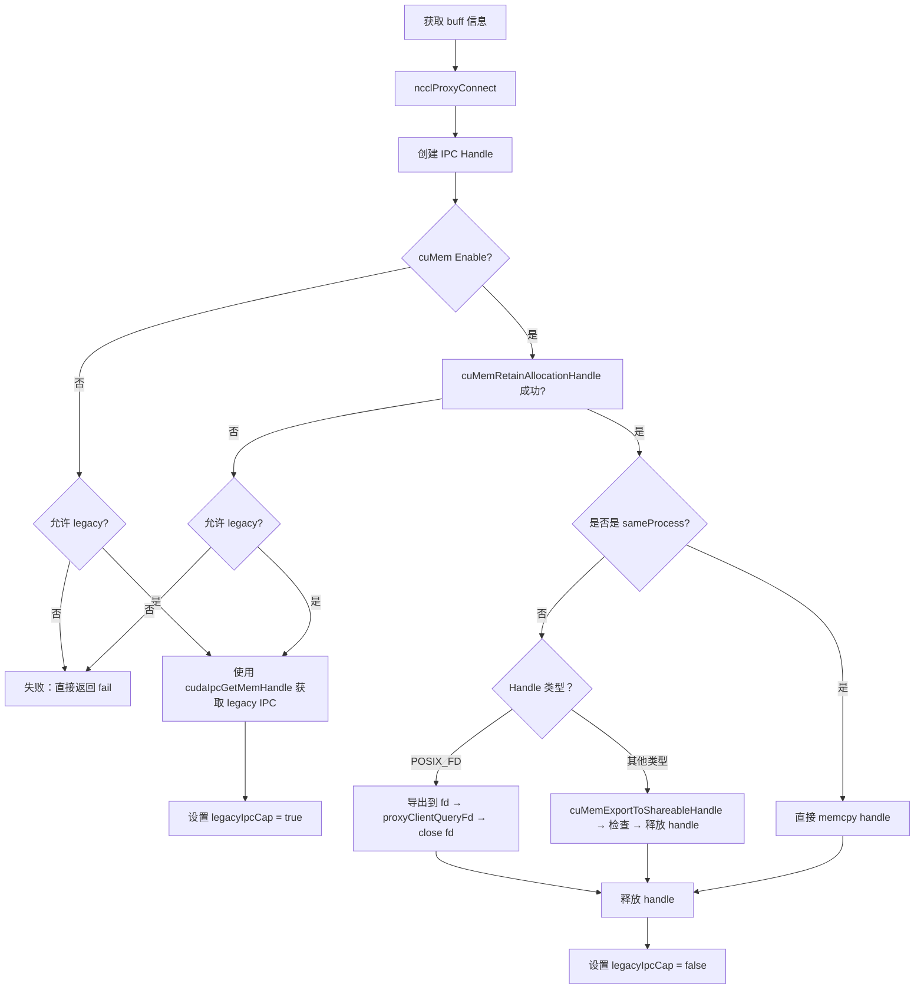

## 1->2->3
## 1. ncclRegisterP2pIpcBuffer
在enqueue.cc内的调用是：
```cpp
NCCLCHECK(ncclRegisterP2pIpcBuffer(comm, addrs[dir], bytes[dir], peerRank, &regFlag, &regAddr, &plan->cleanupQueue));
```
会走到sendrecv_reg.cc，这里的 `ncclRegisterP2pIpcBuffer` 实现：
* ncclParamLocalRegister()环境变量开启的话就会走到ncclIpcLocalRegisterBuffer，这里的NCCL_IPC_SENDRECV是0，最重要的就是这里的regAddr。返回出来的 `regAddr` 地址是对端的地址加上偏移peerRmtAddrs + offset；
* ncclIpcGraphRegisterBuffer类似
```cpp
ncclResult_t ncclRegisterP2pIpcBuffer(
    struct ncclComm* comm,           // NCCL 通信器，包含所有通信上下文信息
    void* userbuff,                  // 用户要注册的 buffer 地址（本地 buffer）
    size_t size,                     // buffer 的大小（字节数）
    int peerRank,                    // 对端 rank ID（要与哪个 rank 进行 P2P 通信）
    int* regFlag,                    // 输出参数：注册是否成功的标志（0=失败，1=成功）
    void** regAddr,                  // 输出参数：注册后获得的远程地址（对端 buffer 地址）
    struct ncclIntruQueue<struct ncclCommCallback, &ncclCommCallback::next>* cleanupQueue  // 清理队列，用于管理资源释放
) {
  ncclResult_t ret = ncclSuccess;
  uintptr_t offset = 0;
  uintptr_t* peerRmtAddrs = NULL;

  *regFlag = 0;
  if (comm->planner.persistent && ncclParamGraphRegister()) {
    ncclIpcGraphRegisterBuffer(comm, userbuff, size, &peerRank, 1, NCCL_IPC_SENDRECV, regFlag, &offset, &peerRmtAddrs, reinterpret_cast<void*>(cleanupQueue), NULL);
  }
  if (*regFlag == 0 && ncclParamLocalRegister()) {
    ncclIpcLocalRegisterBuffer(comm, userbuff, size, &peerRank, 1, NCCL_IPC_SENDRECV, regFlag, &offset, &peerRmtAddrs);
  }

  if (*regFlag)
    *regAddr = (void*)((uintptr_t)peerRmtAddrs + offset);
  return ret;
}
```
## 2. ncclIpcLocalRegisterBuffer(..., 1, 0,...)
`ncclIpcLocalRegisterBuffer` 调用真正的 `ipcRegisterBuffer` 之前，多创建了一个 `ncclReg` 结构的 `regRecord` 去:
1. 查找是否已经注册( `ncclRegFind(comm, userbuff, buffSize, &regRecord)` )
2. 注册过的地址是否有效(  `ncclRegLocalIsValid(regRecord, &isValid)` )
ncclReg内与ipc相关的是：regIpcAddrs内存对端进程访问本地进程sendbuff的地址，devPeerRmtAddrs只有cc通信会用 p2p通信没用这个字段。
```cpp
struct ncclReg {
  // common attributes
  size_t pages;
  int localRefs;
  int graphRefs;
  uintptr_t addr;
  uint32_t state;
  // net reg
  struct ncclRegNetHandles* netHandleHead;
  // nvls reg
	...
  // collnet reg
	...
  // general ipc reg
  struct ncclPeerRegIpcAddr regIpcAddrs;
  struct ncclIpcRegInfo* ipcInfos[NCCL_MAX_LOCAL_RANKS];
};
```

```cpp

ncclResult_t ncclIpcLocalRegisterBuffer(
    ncclComm* comm,                    // NCCL 通信器
    const void* userbuff,              // 用户要注册的 buffer 地址
    size_t buffSize,                   // buffer 大小
    int* peerRanks,                    // 对端 rank 数组
    int nPeers,                        // 对端数量 这里上面丢下来的是1
    ncclIpcRegType type,               // 注册类型 (NCCL_IPC_SENDRECV=0)
    int* regBufFlag,                   // 输出：注册成功标志
    uintptr_t* offsetOut,              // 输出：buffer 在注册内存中的偏移
    uintptr_t** peerRmtAddrsOut        // 输出：对端远程地址数组
) {
  ncclResult_t ret = ncclSuccess;
  struct ncclReg *regRecord = NULL;
  bool isValid = false;

  *regBufFlag = 0;
  *offsetOut = 0;
  *peerRmtAddrsOut = NULL;
  if (comm && userbuff && buffSize > 0 && nPeers > 0) {
    NCCLCHECKGOTO(ncclRegFind(comm, userbuff, buffSize, &regRecord), ret, fail);
    NCCLCHECKGOTO(ncclRegLocalIsValid(regRecord, &isValid), ret, fail);
    if (isValid)
      NCCLCHECKGOTO(ipcRegisterBuffer(comm, userbuff, buffSize, peerRanks, nPeers, type, regRecord, regBufFlag, offsetOut, peerRmtAddrsOut, NULL), ret, fail);
  }

exit:
  return ret;
fail:
  *regBufFlag = 0;
  *offsetOut = 0;
  *peerRmtAddrsOut = NULL;
  goto exit;
}
```
## 3. ipcRegisterBuffer(..., regRecord,..., isLegacyIpc)
跨process P2P通信内存映射的实现，本地进程可以直接access对端进程的内存。
1. 首先则立初始化了局部变量 还有要返回的变量
```cpp
static ncclResult_t ipcRegisterBuffer(ncclComm* comm, const void* userbuff, size_t buffSize, int* peerRanks, int nPeers, ncclIpcRegType type, struct ncclReg* regRecord, int* regBufFlag, uintptr_t* offsetOut, uintptr_t** peerRmtAddrsOut, bool* isLegacyIpc) {
	// 初始化局部变量
	ncclResult_t ret = ncclSuccess;
	struct ncclIpcRegInfo* newInfo = NULL;      // 新的 IPC 注册信息
	uintptr_t* peerRmtAddrs = NULL;             // 对端远程地址数组
	int legacyIpcCap = 0;                       // Legacy IPC 能力标志
	size_t baseSize = 0;                        // 基地址大小
	void* baseAddr = NULL;                      // 基地址
	bool needUpdate = false;                    // 是否需要更新设备端地址数组
	
	// 初始化所有输出参数为默认值
	*regBufFlag = 0;
	*offsetOut = 0;
	*peerRmtAddrsOut = NULL;
	if (isLegacyIpc) *isLegacyIpc = false;
```
2. 主注册loop，这里会遍历所有对端。主要是global rank号转换成local rank号
```cpp
if (regRecord) {
    int peerLocalRank = -1;
    for (int p = 0; p < nPeers; p++) {
        int peerRank = peerRanks[p];                           // 全局的对端rank
        peerLocalRank = comm->rankToLocalRank[peerRank];       // 转换为本地rank
```
3. 检查是否在regRecord内注册过了，如果注册过的话，直接去复用
```cpp
if (regRecord->ipcInfos[peerLocalRank]) {
        // We already have IPC info for peerLocalRank, no need to register it, we can reuse it
        *regBufFlag = 1;
        if (isLegacyIpc) *isLegacyIpc = regRecord->ipcInfos[peerLocalRank]->impInfo.legacyIpcCap;
        INFO(NCCL_REG, "rank %d - IPC reuse buffer %p size %ld (baseAddr %p size %ld) to peer %d regAddr %p", comm->rank, userbuff, buffSize, (void*)regRecord->addr, regRecord->pages * comm->regCache.pageSize, peerRank, regRecord->ipcInfos[peerLocalRank]->impInfo.rmtRegAddr);
}
```
4. 没注册的话就开始注册，这一步大致包括获取buff信息->建立proxy连接->创建IPC Handle：
```cpp
// Register buffer with peerLocalRank
        struct ncclProxyConnector* proxyConn = NULL;
        struct p2pIpcExpInfo ipcInfo;

        if (baseAddr == NULL) {
          CUCHECKGOTO(cuMemGetAddressRange((CUdeviceptr*)&baseAddr, &baseSize, (CUdeviceptr)userbuff), ret, fail);
          CUCHECKGOTO(cuPointerGetAttribute((void*)&legacyIpcCap, CU_POINTER_ATTRIBUTE_IS_LEGACY_CUDA_IPC_CAPABLE, (CUdeviceptr)baseAddr), ret, fail);
        }
        if (comm->gproxyConn[peerRank].initialized == false)
          NCCLCHECKGOTO(ncclProxyConnect(comm, TRANSPORT_P2P, 1, peerRank, &comm->gproxyConn[peerRank]), ret, fail);
        proxyConn = &comm->gproxyConn[peerRank];

        // Get the mem handle for that buffer. It may have been allocated through cudaMalloc in which case we'll
        // get the CUDA legacy mem handle, or through cuMem*.
        if (ncclCuMemEnable()) {
          CUmemGenericAllocationHandle handle;
          if (CUPFN(cuMemRetainAllocationHandle(&handle, baseAddr)) != CUDA_SUCCESS) {
            // if cuMem* export fails, retry legacy export
            if (comm->directMode || !ncclParamLegacyCudaRegister()) goto fail;
            CUDACHECKGOTO(cudaIpcGetMemHandle(&ipcInfo.ipcDesc.devIpc, baseAddr), ret, fail);
            ipcInfo.legacyIpcCap = true;
            if (isLegacyIpc) *isLegacyIpc = true;
          } else {
            ipcInfo.legacyIpcCap = false;
            if (isLegacyIpc) *isLegacyIpc = false;
            // cuMem* export to file descriptor or fabric handle
            if (proxyConn->sameProcess) {
              memcpy(&ipcInfo.ipcDesc.memHandle, &handle, sizeof(CUmemGenericAllocationHandle));
            } else {
              if (ncclCuMemHandleType == CU_MEM_HANDLE_TYPE_POSIX_FILE_DESCRIPTOR) {
                // **** 这里是最最最最最最重要的部分********
                int expFd = -1;
                // 这里的cuMem的handle导出成文件描述符expFd
                CUCHECKGOTO(cuMemExportToShareableHandle(&expFd, handle, ncclCuMemHandleType, 0), ret, fail);
                // 发送expFd到对端的进程，调用UDS
                NCCLCHECKGOTO(ncclProxyClientQueryFdBlocking(comm, proxyConn, expFd, &ipcInfo.impFd), ret, fail);
                SYSCHECKGOTO(close(expFd), "close", ret, fail);
              } else {
                // Allow this to silently fail for cases where the user buff cannot be registered
                if (CUPFN(cuMemExportToShareableHandle(&ipcInfo.ipcDesc.cuDesc.handle, handle, ncclCuMemHandleType, 0)) != CUDA_SUCCESS) {
                  CUCHECKGOTO(cuMemRelease(handle), ret, fail);
                  goto fail;
                }
              }
            }
            CUCHECKGOTO(cuMemRelease(handle), ret, fail);
          }
        } else if (legacyIpcCap) {
          // legacy export
          if (comm->directMode || !ncclParamLegacyCudaRegister()) goto fail;
          CUDACHECKGOTO(cudaIpcGetMemHandle(&ipcInfo.ipcDesc.devIpc, baseAddr), ret, fail);
          ipcInfo.legacyIpcCap = true;
          if (isLegacyIpc) *isLegacyIpc = true;
        } else {
          // nothing works, just return
          goto fail;
        }
```
* ncclProxyConnect(comm, TRANSPORT_P2P, 1, peerRank, &comm->gproxyConn[peerRank]), ret, fail);
* ncclProxyCallBlocking(comm, proxyConn, ncclProxyMsgRegister, &ipcInfo, sizeof(p2pIpcExpInfo), &rmtRegAddr, sizeof(void*)), ret, fail);
两次触发proxy，都会对应的去走 `p2pTransport` 内的 `p2pSendProxyConnect` ，`p2pProxyRegister`，还有 `p2pProxyDeRegister`。 [[p2p.cc]]

5. 向对端注册并获取远程地址
在第4步中一开始就在向 `p2pIpcExpInfo` 结构的 `ipcInfo` 中填写接下来注册需要的信息。然后 `ncclProxyConnector` 结构的proxyConn内有连接的信息。这两者包含了注册所需要的所有信息，通过具体p2p传输层的proxy向对端注册，并拿到对端proxy返回的注册地址 `rmtRegAddr` ：
```cpp
void* rmtRegAddr = NULL;
        ipcInfo.size = baseSize;
        // offset是用户注册的内存区域在完整内存块中的偏移，给后面保存主测信息用
        ipcInfo.offset = regRecord->addr - (uintptr_t)baseAddr;
        // Now ipcInfo contains all necessary registration info. Start to register buffer on proxy side
        // and get the remote register address back.
        if (proxyConn) {
          INFO(NCCL_REG, "rank %d - IPC registering buffer %p size %ld (baseAddr %p size %ld) to peer %d", comm->rank, userbuff, buffSize, (void*)regRecord->addr, ipcInfo.size, peerRank);
          NCCLCHECKGOTO(ncclProxyCallBlocking(comm, proxyConn, ncclProxyMsgRegister, &ipcInfo, sizeof(p2pIpcExpInfo), &rmtRegAddr, sizeof(void*)), ret, fail);
        }
```
6. 保存注册信息
这里的 `rmtRegAddr` 是rank1（对端）进程中访问我本端rank0的sendBuff的地址。

```cpp
if (rmtRegAddr) {
    NCCLCHECKGOTO(ncclCalloc(&newInfo, 1), ret, fail);
    
    // 更新注册记录状态
    regRecord->state |= IPC_REG_COMPLETE;
    
    // 填充注册信息
    newInfo->peerRank = peerRank;
    newInfo->baseAddr = baseAddr;
    newInfo->impInfo.rmtRegAddr = rmtRegAddr;
    newInfo->impInfo.offset = ipcInfo.offset;
    newInfo->impInfo.legacyIpcCap = ipcInfo.legacyIpcCap;
    newInfo->ipcProxyconn = proxyConn;
    
    // 保存到 regRecord
    regRecord->ipcInfos[peerLocalRank] = newInfo;
    
    // 初始化主机端地址数组
    if (regRecord->regIpcAddrs.hostPeerRmtAddrs == NULL) {
        NCCLCHECKGOTO(ncclCalloc(&regRecord->regIpcAddrs.hostPeerRmtAddrs, comm->localRanks), ret, fail);
    }
    regRecord->regIpcAddrs.hostPeerRmtAddrs[peerLocalRank] = (uintptr_t)rmtRegAddr;
    
    needUpdate = true;
    *regBufFlag = 1;  // 标记注册成功
}
```
7. 返回peer对的地址
* p2p走的else分支，直接把对端的地址写到peerRmtAddrsOut指针内，由 `ipcRegisterBuffer` 返回给调用方
* cc则会维护所有对端地址数组
```cpp
if (*regBufFlag) {
      if (type == NCCL_IPC_COLLECTIVE) {
        if (regRecord->regIpcAddrs.devPeerRmtAddrs == NULL || needUpdate) {
            // 获取 CUDA 流
            cudaStream_t hostStream, deviceStream;
            NCCLCHECKGOTO(ncclStrongStreamAcquire(ncclCudaGraphNone(), &comm->sharedRes->hostStream, false, &hostStream), ret, fail);
            NCCLCHECKGOTO(ncclStrongStreamAcquire(ncclCudaGraphNone(), &comm->sharedRes->deviceStream, false, &deviceStream), ret, fail);
            
            // 分配设备端地址数组
            if (regRecord->regIpcAddrs.devPeerRmtAddrs == NULL)
                NCCLCHECKGOTO(ncclCudaCallocAsync(&regRecord->regIpcAddrs.devPeerRmtAddrs, comm->localRanks, hostStream), ret, fail);
            
            // 将主机端地址数组复制到设备端
            if (needUpdate)
                NCCLCHECKGOTO(ncclCudaMemcpyAsync(regRecord->regIpcAddrs.devPeerRmtAddrs, regRecord->regIpcAddrs.hostPeerRmtAddrs, comm->localRanks, hostStream), ret, fail);
            
            // 同步流
            NCCLCHECKGOTO(ncclStreamWaitStream(deviceStream, hostStream, comm->sharedRes->scratchEvent), ret, fail);
            NCCLCHECKGOTO(ncclStrongStreamRelease(ncclCudaGraphNone(), &comm->sharedRes->hostStream, false), ret, fail);
            NCCLCHECKGOTO(ncclStrongStreamRelease(ncclCudaGraphNone(), &comm->sharedRes->deviceStream, false), ret, fail);
        }
        peerRmtAddrs = regRecord->regIpcAddrs.devPeerRmtAddrs;
      } else {
        assert(nPeers == 1);
        // p2p always returns remote addr here since remote buffer addr is passed in ncclDevWorkP2p struct
        peerRmtAddrs = (uintptr_t*)regRecord->regIpcAddrs.hostPeerRmtAddrs[peerLocalRank];
      }
      *offsetOut = (uintptr_t)userbuff - regRecord->addr;
      *peerRmtAddrsOut = peerRmtAddrs;
    }
```

## 4. summary
handle是**物理内存的标识符**，在 CUDA 统一内存管理中，物理内存和虚拟地址是分离的。
* **File Descriptor(FD)**：利用 Linux 内核的文件描述符机制，可以跨进程传递
* **Fabric Handle(FH)**：NVIDIA 的网络互连技术，支持跨节点的内存共享
```cpp
// rank1 进程导出 FD
int expFd;
cuMemExportToShareableHandle(&expFd, handle, CU_MEM_HANDLE_TYPE_POSIX_FILE_DESCRIPTOR, 0);

// 通过 Unix Domain Socket 发送到 rank2
ncclProxyClientQueryFdBlocking(comm, proxyConn, expFd, &impFd);

// rank2 进程接收 FD 并导入
cuMemImportFromShareableHandle(&newHandle, &impFd, CU_MEM_HANDLE_TYPE_POSIX_FILE_DESCRIPTOR);
```
![[sendrecv_reg 2025-08-05 17.02.47.excalidraw|100%]]
这个过程就是:
1. rank1 的物理内存通过 handle 被 rank2 进程导入
2. rank2 在自己的虚拟地址空间B中创建映射 [regAddr]
3. [rmtRegAddr] 就是 rank2 进程中指向 rank1 内存的虚拟地址A
4. rank1 告诉rank2："要访问我的内存，请使用 rank2 进程中的地址 [rmtRegAdd]
