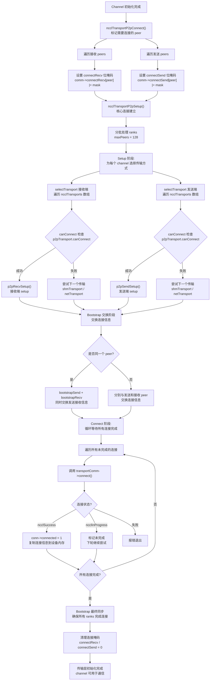

### 1. ncclTransportP2pConnect
标记需要建立连接的发送和接收peer，为后续批量连接做准备
* 设置connectSend/connectRecv位掩码
* 跳过无效peer和已连接的连接
```cpp
ncclResult_t ncclTransportP2pConnect(struct ncclComm* comm, int channelId, int nrecv, int* peerRecv, int nsend, int* peerSend, int connIndex) {
  TRACE(NCCL_INIT, "nsend %d nrecv %d", nsend, nrecv);
  struct ncclChannel* channel = &comm->channels[channelId];
  uint64_t mask = 1UL << channel->id;
  
  // 标记需要接收连接的peers
  for (int i=0; i<nrecv; i++) {
    int peer = peerRecv[i];
    if (peer == -1 || peer >= comm->nRanks || peer == comm->rank || channel->peers[peer]->recv[connIndex].connected) continue;
    comm->connectRecv[peer] |= mask; // 设置该channel的接收连接标记
  }
  
  // 标记需要发送连接的peers  
  for (int i=0; i<nsend; i++) {
    int peer = peerSend[i];
    if (peer == -1 || peer >= comm->nRanks || peer == comm->rank || channel->peers[peer]->send[connIndex].connected) continue;
    comm->connectSend[peer] |= mask; // 设置该channel的发送连接标记
  }
  return ncclSuccess;
}
```
### 2. ncclTransportP2pSetup
p2p的peer建立双向连接：
* 批量处理连接以提高效率
* Bootstrap协议交换连接信息
* 循环等待所有连接完成
* 最终同步确保连接稳定
```cpp
ncclResult_t ncclTransportP2pSetup(struct ncclComm* comm, struct ncclTopoGraph* graph, int connIndex) {
  struct ncclConnect** data; // 存储中间连接数据
  struct ncclConnect** recvData = NULL; 
  struct ncclConnect** sendData = NULL;
  int done = 0;
  int maxPeers = ncclParamConnectRoundMaxPeers(); // 每轮最大处理peer数
  NCCLCHECK(ncclCalloc(&data, maxPeers));
  NCCLCHECKGOTO(ncclCalloc(&recvData, maxPeers), ret, fail);
  NCCLCHECKGOTO(ncclCalloc(&sendData, maxPeers), ret, fail);
  // 分批处理所有ranks
  for (int i=1; i<comm->nRanks; i++) {
    int bootstrapTag = (i<<8) + (graph ? graph->id+1 : 0);
    int recvPeer = (comm->rank - i + comm->nRanks) % comm->nRanks;
    int sendPeer = (comm->rank + i) % comm->nRanks;
    uint64_t recvMask = comm->connectRecv[recvPeer];
    uint64_t sendMask = comm->connectSend[sendPeer];
    // 为每个需要连接的channel分配数据结构
    int p = i-(done+1);
    if (recvMask || sendMask) {
      if (data[p] == NULL) NCCLCHECKGOTO(ncclCalloc(data + p, 2 * MAXCHANNELS), ret, fail);
    }
    
    // Setup阶段：为每个channel选择传输并setup
    recvData[p] = data[p];
    int sendChannels = 0, recvChannels = 0;
    for (int c=0; c<MAXCHANNELS; c++) {
      if (recvMask & (1UL<<c)) {
        NCCLCHECKGOTO(selectTransport<0>(comm, graph, recvData[p]+recvChannels++, c, recvPeer, connIndex, &type), ret, fail);
      }
    }
    sendData[p] = recvData[p]+recvChannels;
    for (int c=0; c<MAXCHANNELS; c++) {
      if (sendMask & (1UL<<c)) {
        NCCLCHECKGOTO(selectTransport<1>(comm, graph, sendData[p]+sendChannels++, c, sendPeer, connIndex, &type), ret, fail);
      }
    }
    // Bootstrap交换连接信息
    if (sendPeer == recvPeer) {
      // 同一个peer既发送又接收
      if (recvChannels+sendChannels) {
        NCCLCHECKGOTO(bootstrapSend(comm->bootstrap, recvPeer, bootstrapTag, data[p], sizeof(struct ncclConnect)*(recvChannels+sendChannels)), ret, fail);
        NCCLCHECKGOTO(bootstrapRecv(comm->bootstrap, recvPeer, bootstrapTag, data[p], sizeof(struct ncclConnect)*(recvChannels+sendChannels)), ret, fail);
      }
    } else {
      // 分别与发送和接收peer交换信息
      if (recvChannels) NCCLCHECKGOTO(bootstrapSend(comm->bootstrap, recvPeer, bootstrapTag, recvData[p], sizeof(struct ncclConnect)*recvChannels), ret, fail);
      if (sendChannels) NCCLCHECKGOTO(bootstrapSend(comm->bootstrap, sendPeer, bootstrapTag, sendData[p], sizeof(struct ncclConnect)*sendChannels), ret, fail);
      if (sendChannels) NCCLCHECKGOTO(bootstrapRecv(comm->bootstrap, sendPeer, bootstrapTag, sendData[p], sizeof(struct ncclConnect)*sendChannels), ret, fail);
      if (recvChannels) NCCLCHECKGOTO(bootstrapRecv(comm->bootstrap, recvPeer, bootstrapTag, recvData[p], sizeof(struct ncclConnect)*recvChannels), ret, fail);
    }
    // 分批处理连接
    if (i-done == maxPeers || i == comm->nRanks-1) {
      // Connect阶段：循环等待所有连接完成
      bool allChannelsConnected = false;
      while (!allChannelsConnected) {
        allChannelsConnected = true;
        for (int j=done+1; j<=i; j++) {
          // 尝试连接每个channel
          for (int c=0; c<MAXCHANNELS; c++) {
            if (sendMask & (1UL<<c)) {
              struct ncclConnector* conn = comm->channels[c].peers[sendPeer]->send + connIndex;
              if (conn->connected == 0) {
                NCCLCHECKGOTO(conn->transportComm->connect(comm, sendData[p] + sendDataOffset, 1, comm->rank, conn), ret, fail);
                if (ret == ncclSuccess) {
                  conn->connected = 1;
                  // 将连接信息复制到设备内存
                  CUDACHECKGOTO(cudaMemcpyAsync(&comm->channels[c].devPeersHostPtr[sendPeer]->send[connIndex], &conn->conn, sizeof(struct ncclConnInfo), cudaMemcpyHostToDevice, hostStream), ret, fail);
                } else if (ret == ncclInProgress) {
                  allChannelsConnected = false; // 仍有连接未完成
                }
              }
            }
            // 接收连接处理类似...
          }
        }
      }
      done = i;
    }
  }
  // 最终同步：确保所有ranks完成连接
  for (int i = 1; i < comm->nRanks; i++) {
    int bootstrapTag = (i << 8) + (1 << 7) + (graph ? graph->id + 1 : 0);
    // Bootstrap同步确保连接稳定
    // 清理连接掩码
    comm->connectRecv[recvPeer] = comm->connectSend[sendPeer] = 0UL;
  }
  return ret;
}
```
### 3. selectTransport
* 为每个连接选择最适合的传输方式，按优先级顺序尝试
* 遍历所有可用传输方式
* 调用各传输的canConnect(net.cc)检查连接能力
* 选择第一个可用的传输并完成setup
```cpp
template <int type>
static ncclResult_t selectTransport(struct ncclComm* comm, struct ncclTopoGraph* graph, struct ncclConnect* connect, int channelId, int peer, int connIndex, int* transportType) {
  struct ncclPeerInfo* myInfo = comm->peerInfo+comm->rank;
  struct ncclPeerInfo* peerInfo = comm->peerInfo+peer;
  struct ncclConnector* connector = (type == 1) ? comm->channels[channelId].peers[peer]->send + connIndex :
                                                  comm->channels[channelId].peers[peer]->recv + connIndex;
  // 按优先级遍历所有传输方式
  for (int t=0; t<NTRANSPORTS; t++) {
    struct ncclTransport *transport = ncclTransports[t];
    struct ncclTransportComm* transportComm = type == 1 ? &transport->send : &transport->recv;
    int ret = 0;
    // 检查该传输是否能连接这两个节点
    NCCLCHECK(transport->canConnect(&ret, comm, graph, myInfo, peerInfo));
    if (ret) {
      // 找到可用传输，设置连接器并执行setup
      connector->transportComm = transportComm;
      NCCLCHECK(transportComm->setup(comm, graph, myInfo, peerInfo, connect, connector, channelId, connIndex));
      if (transportType) *transportType = t;
      return ncclSuccess;
    }
  }
  WARN("No transport found for rank %d[%lx] -> rank %d[%lx]", myInfo->rank, myInfo->busId, peerInfo->rank, peerInfo->busId);
  return ncclSystemError;
}
```
### 4. structure

