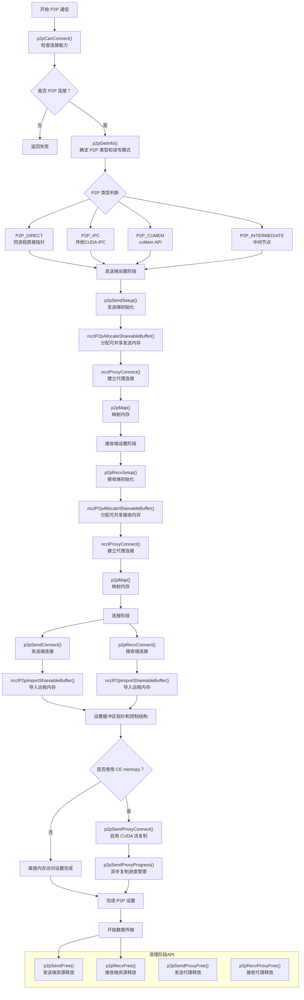

```mermaid
graph TB
    A[开始 P2P 通信] --> B["p2pCanConnect()<br/>检查连接能力"]
    
    B --> C{能否 P2P 连接？}
    C -->|否| D[返回失败]
    C -->|是| E["p2pGetInfo()<br/>确定 P2P 类型和读写模式"]
    
    E --> F{P2P 类型判断}
    F --> G["P2P_DIRECT<br/>同进程直接指针"]
    F --> H["P2P_IPC<br/>传统CUDA IPC"]
    F --> I["P2P_CUMEM<br/>cuMem API"]
    F --> J["P2P_INTERMEDIATE<br/>中间节点"]
    
    G --> K[发送端设置阶段]
    H --> K
    I --> K
    J --> K
    
    K --> L["p2pSendSetup()<br/>发送端初始化"]
    L --> M["ncclP2pAllocateShareableBuffer()<br/>分配可共享发送内存"]
    M --> N["ncclProxyConnect()<br/>建立代理连接"]
    N --> O["p2pMap()<br/>映射内存"]
    
    O --> P[接收端设置阶段]
    P --> Q["p2pRecvSetup()<br/>接收端初始化"]
    Q --> R["ncclP2pAllocateShareableBuffer()<br/>分配可共享接收内存"]
    R --> S["ncclProxyConnect()<br/>建立代理连接"]
    S --> T["p2pMap()<br/>映射内存"]
    
    T --> U[连接阶段]
    U --> V["p2pSendConnect()<br/>发送端连接"]
    U --> W["p2pRecvConnect()<br/>接收端连接"]
    
    V --> X["ncclP2pImportShareableBuffer()<br/>导入远程内存"]
    W --> Y["ncclP2pImportShareableBuffer()<br/>导入远程内存"]
    
    X --> Z["设置缓冲区指针和控制结构"]
    Y --> Z
    
    Z --> AA{是否使用 CE memcpy？}
    AA -->|是| BB["p2pSendProxyConnect()<br/>启用 CUDA 流复制"]
    AA -->|否| CC[直接内存访问设置完成]
    
    BB --> DD["p2pSendProxyProgress()<br/>异步复制进度管理"]
    CC --> EE[完成 P2P 设置]
    DD --> EE
    
    EE --> FF[开始数据传输]
    
    subgraph "清理阶段API"
        SS["p2pSendFree()<br/>发送端资源释放"]
        TT["p2pRecvFree()<br/>接收端资源释放"]
        UU["p2pSendProxyFree()<br/>发送代理释放"]
        VV["p2pRecvProxyFree()<br/>接收代理释放"]
    end
    
    FF --> SS
    FF --> TT
```