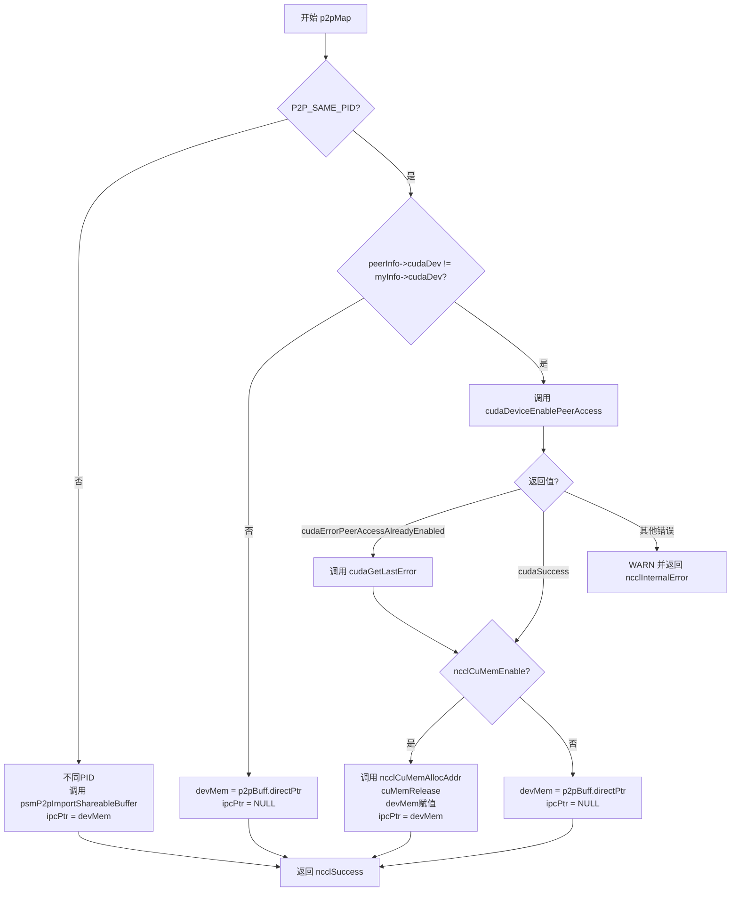
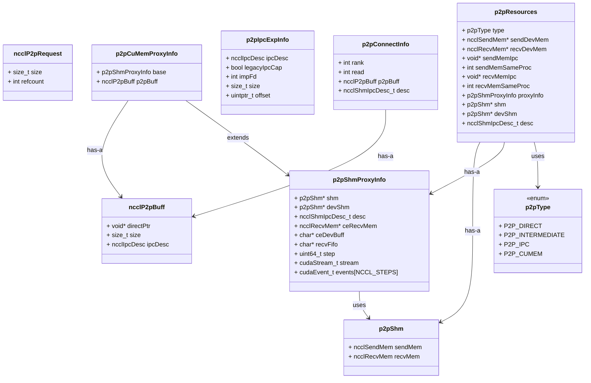

## 1. 初始化阶段
### p2pCanConnect
检查两个gpu之间能否建立p2p通信连接。
* 初始化CE操作`initCeOperation()`
* 检查拓扑结构和P2P级别`ncclTopoCheckP2p`
* 检查是否应该使用网络传输`ncclTopoCheckNet`
* 检查主机位置
* 转换设备ID`busIdToCudaDev()`
* 检查CUDA P2P能力`cudaDeviceCanAccessPeer()`
* 检查Legacy IPC支持(cuMem or 传统cuda IPC)
* 最终P2P检查
```cpp
ncclResult_t p2pCanConnect(int* ret, struct ncclComm* comm, struct ncclTopoGraph* graph, struct ncclPeerInfo* info1, struct ncclPeerInfo* info2) {
  initCeOperation(); // Init Cuda Engine

  // Check topology / p2p level.
  int intermediateRank;
  NCCLCHECK(ncclTopoCheckP2p(comm, comm->topo, info1->rank, info2->rank, ret, NULL, &intermediateRank));
  if (*ret == 0) return ncclSuccess;// 拓扑检查失败就直接返回
  if (intermediateRank != -1) {
    if (useMemcpy) *ret = 0;
    return ncclSuccess;
  }

  // Check if NET would work better
  int useNet = 0;
  NCCLCHECK(ncclTopoCheckNet(comm->topo, info1->rank, info2->rank, &useNet));
  if (useNet) {
    *ret = 0;
    return ncclSuccess;
  }

  if (info1->hostHash != comm->peerInfo[comm->rank].hostHash ||
      info1->hostHash != info2->hostHash) {
    // 比较节点的主机哈希值, 任一节点不在本地主机上，则允许P2P（假设已通过前面检查）
    return ncclSuccess;
  }

  // Convert the peer's busId into a local cudaDev index (cf. CUDA_VISIBLE_DEVICES)
  int cudaDev1 = busIdToCudaDev(info1->busId);
  int cudaDev2 = busIdToCudaDev(info2->busId);
  if (cudaDev1 == -1 || cudaDev2 == -1) {
#if CUDART_VERSION >= 10010
    // CUDA 10.1 and later can use P2P with invisible devices.
    return ncclSuccess;
#else
    // Peer's CUDA device is not visible in this process : we can't communicate with it.
    *ret = 0;
    return ncclSuccess;
#endif
  }
  // Check that CUDA can do P2P
  // p2p = 0: 不支持P2P访问
  // p2p = 1: 支持P2P访问
  int p2p;
  if (cudaDeviceCanAccessPeer(&p2p, cudaDev1, cudaDev2) != cudaSuccess) {
    INFO(NCCL_INIT|NCCL_P2P,"peer query failed between dev %d(=%lx) and dev %d(=%lx)",
         cudaDev1, info1->busId, cudaDev2, info2->busId);
    *ret = 0;
    return ncclSuccess;
  }

  // This will always fail when using NCCL_CUMEM_ENABLE=1
  if (p2p != 0 && !ncclCuMemEnable()) {
    // Cached result of the legacyIPC detection
    static int legacyIPC = -1;
    if (legacyIPC >= 0) {
      *ret = legacyIPC;
      return ncclSuccess;
    }
    // Check that legacy IPC support is available (WSL WAR)
    char *dummy;
    cudaIpcMemHandle_t ipc;
    NCCLCHECK(ncclCudaMalloc(&dummy, CUDA_IPC_MIN));
    if (cudaIpcGetMemHandle(&ipc, dummy) != cudaSuccess) {
      INFO(NCCL_INIT|NCCL_P2P,"Legacy IPC not supported");
      *ret = 0;
    }
    NCCLCHECK(ncclCudaFree(dummy));
    legacyIPC = *ret;
    return ncclSuccess;
  }

  if (p2p == 0) {
    INFO(NCCL_INIT|NCCL_P2P,"Could not enable P2P between dev %d(=%lx) and dev %d(=%lx)",
         cudaDev1, info1->busId, cudaDev2, info2->busId);
    *ret = 0;
    return ncclSuccess;
  }
  return ncclSuccess;
}
```

#### initCeOperation
- 基础P2P模式: 直接内存访问，不需要代理
- CE (CUDA Engine) 模式: 使用 cudaMemcpyAsync + 代理进程
```cpp
static void initCeOperation() {
  static int init = 0;
  if (!init) {
    useMemcpy = ncclParamP2pUseCudaMemcpy();//决定是否使用CudaMemcpyAsync
    if (useMemcpy) {
      p2pTransport.send.proxyConnect = p2pSendProxyConnect;
      p2pTransport.send.proxyProgress = p2pSendProxyProgress;
    }
    init = 1;
  }
}
```
#### ncclTopoCheckP2p
* 检查拓扑结构中两个rank之间是否支持P2P
* 验证硬件连接距离和NVML P2P状态
* 针对NVLink+Ampere架构启用P2P读模式
```cpp
ncclResult_t ncclTopoCheckP2p(struct ncclComm* comm, struct ncclTopoSystem* system, int rank1, int rank2,
                              int* p2p, int *read, int* intermediateRank) {
  *p2p = 0;
  if (read) *read = 0;
  if (intermediateRank) *intermediateRank = -1;

  // 检查主机哈希和容器隔离
  if (comm) {
    struct ncclPeerInfo* info1 = comm->peerInfo+rank1;
    struct ncclPeerInfo* info2 = comm->peerInfo+rank2;
    if (info1->hostHash != info2->hostHash) {
      // 不同主机，检查MNNVL支持
      if (comm->MNNVL) {
        NCCLCHECK(ncclTopoCheckMNNVL(comm->topo, info1, info2, &mnnvl));
        if (!mnnvl) return ncclSuccess;
      } else {
        return ncclSuccess;
      }
    }
  }

  // 获取GPU拓扑节点和路径
  int g1, g2;
  NCCLCHECK(ncclTopoRankToIndex(system, rank1, &g1));
  struct ncclTopoNode* gpu1 = system->nodes[GPU].nodes+g1;
  struct ncclTopoLinkList* path = gpu1->paths[GPU]+g2;
  
  // 检查中间节点
  if (path->count == 2) {
    struct ncclTopoNode* intermediateNode = path->list[0]->remNode;
    if (intermediateNode->type == GPU) {
      if (intermediateRank) *intermediateRank = intermediateNode->gpu.rank;
    }
  }

  // 比较路径类型与P2P级别阈值
  int p2pLevel = PATH_PXB; // 默认只允许PXB及更近距离
  if (path->type <= p2pLevel) *p2p = 1;

  // NVML验证P2P状态
  if (*p2p == 1) {
    // 检查NVML报告的P2P读写状态
    for (int i=1; i < verticeN; i++) {
      nvmlGpuP2PStatus_t status;
      status = ncclNvmlDevicePairs[indexes[i-1]][indexes[i-0]].p2pStatusRead;
      bool good = status == NVML_P2P_STATUS_OK;
      if (!good) *p2p = 0; // NVML报告P2P不可用
    }
  }

  // NVLink+Ampere特殊优化：启用P2P读模式
  if (path->type == PATH_NVL) {
    if (read && (gpu1->gpu.cudaCompCap == 80)) *read = 1;
  }

  return ncclSuccess;
}
```
#### ncclTopoCheckNet
- 比较GPU间P2P带宽与网络带宽
- 判断是否应该使用网络传输替代P2P
```cpp
ncclResult_t ncclTopoCheckNet(struct ncclTopoSystem* system, int rank1, int rank2, int* net) {
  if (ncclParamNetDisableIntra() == 1) {
    *net = 0; // 用户禁用了intra-node网络
    return ncclSuccess;
  }
  *net = 1; // 默认推荐网络

  // 获取GPU间直接P2P带宽
  int g1, g2;
  NCCLCHECK(ncclTopoRankToIndex(system, rank1, &g1));
  NCCLCHECK(ncclTopoRankToIndex(system, rank2, &g2));
  struct ncclTopoNode* gpu1 = system->nodes[GPU].nodes+g1;
  float speed = gpu1->paths[GPU][g2].bw; // GPU间P2P带宽

  // 获取每个GPU到网络的最大带宽
  float netSpeed1 = 0, netSpeed2 = 0;
  for (int n=0; n<system->nodes[NET].count; n++) {
    struct ncclTopoLinkList* path = gpu1->paths[NET]+n;
    if (path->type <= PATH_PXB && path->bw > netSpeed1) netSpeed1 = path->bw;
    path = gpu2->paths[NET]+n;
    if (path->type <= PATH_PXB && path->bw > netSpeed2) netSpeed2 = path->bw;
  }

  // 如果两个GPU到网络的带宽都大于GPU间P2P带宽，推荐使用网络
  if (netSpeed1 > speed && netSpeed2 > speed) return ncclSuccess;
  *net = 0; // 否则P2P更优
  return ncclSuccess;
}
```
#### busIdToCudaDev()
- 将PCI总线ID转换为本地CUDA设备索引
- 考虑CUDA_VISIBLE_DEVICES环境变量的影响
```cpp
static int busIdToCudaDev(int64_t busId) {
  int ndev;
  if (cudaGetDeviceCount(&ndev) != cudaSuccess)
    return -1;
  for (int i = 0; i < ndev; i++) {
    char devBusIdStr[NVML_DEVICE_PCI_BUS_ID_BUFFER_SIZE];
    if (cudaDeviceGetPCIBusId(devBusIdStr, NVML_DEVICE_PCI_BUS_ID_BUFFER_SIZE, i) != cudaSuccess)
      return -1;
    int64_t devBusId;
    NCCLCHECK(busIdToInt64(devBusIdStr, &devBusId));
    if (busId == devBusId) return i; // 找到匹配的设备索引
  }
  return -1; // 设备在当前进程中不可见
}
```
### p2pGetInfo()
获取P2P连接信息（读/写模式，中间节点等）
## 2. 设置阶段
### p2pSendSetup()
发送端设置，分配资源
### p2pRecvSetup()
接收端设置，分配资源
### ncclP2pAllocateShareableBuffer() 
分配可在进程间共享的内存缓冲区
### p2pMap() 
将远程内存映射到本地地址空间；以P2pRecvSetup内会调一次p2pMap为例（这里是同进程的）：
```cpp
NCCLCHECK(p2pMap(comm, &recv->proxyConn, myInfo, comm->peerInfo+info->rank, &info->p2pBuff, (void**)&resources->recvDevMem, &resources->recvMemIpc));
```
p2pMap的函数签名是：
```cpp
static ncclResult_t p2pMap(struct ncclComm *comm, struct ncclProxyConnector* proxyConn, struct ncclPeerInfo* myInfo, struct ncclPeerInfo* peerInfo, struct ncclP2pBuff* p2pBuff, void** devMem, void** ipcPtr) {...}
```
输入：
1. comm ： NCCL通信器对象
2. &recv->proxyConn - 接收端的代理连接器
3. comm->peerInfo+rank - 当前进程的peer信息（myInfo）
4. comm->peerInfo+info->rank - 目标peer的信息（peerInfo）
5. &info->p2pBuff - P2P缓冲区描述符，包含：
	* directPtr - 直接指针
	* size - 缓冲区大小
	* ipcDesc - IPC描述符（用于跨进程通信）
6. (void**)&remDevMem - 输出参数：映射后的设备内存指针
7. &resources->sendMemIpc - 输出参数：IPC指针

输出：
1. devMem：
    - 同进程：直接指针或映射后的cuMem地址
    - 跨进程：导入的共享内存地址
2. ipcPtr（通过resources->sendMemIpc返回）：
    - 同进程同GPU：NULL
    - 同进程不同GPU：等于devMem（如果使用cuMem）或NULL
    - 跨进程：等于devMem
具体的p2pMap的逻辑是：

在p2p.cc内有四次调用，两次setup阶段调用是同进程发送端或者接收端映射本地的发送缓冲区。connect阶段就是发端映射对端的接收缓冲区和收端映射对端的发送缓冲区。
p2pMap 的作用就是把这个 p2pBuff（directPtr + ipcDesc）在接收端“映射/导入”成接收进程本地可用的 device 指针（devMem），并把这个指针保存在 resources->recvDevMem（或 send 对应字段），从而完成“p2pBuff ↔ recvDevMem”的绑定。
## 3. 连接阶段
### p2pSendConnect() 
建立发送端连接
### p2pRecvConnect()
建立接收端连接

### ncclP2pImportShareableBuffer()
导入远程共享内存
![[p2p.cc 2025-08-12 14.33.12.excalidraw|100%]]
## 4. 代理相关（CE memcpy模式）
### p2pSendProxySetup()
发送代理设置
### p2pRecvProxySetup()
接收代理设置
### p2pSendProxyConnect()
发送代理连接
### p2pSendProxyProgress()

## 5. 注册
### p2pProxyRegister()
`ipcRegisterBuffer` 触发proxy注册前是传递了：proxyConn和ipcInfo到ncclProxyMsgRegister内。
```cpp
NCCLCHECKGOTO(ncclProxyCallBlocking(comm, proxyConn, ncclProxyMsgRegister, &ipcInfo, sizeof(p2pIpcExpInfo), &rmtRegAddr, sizeof(void*)), ret, fail);
```
具体来看：`p2pProxyRegister`实现：
1. 首先就是void* reqBuff指针指向的地址，也就是上面传下来的ipcInfo。变为ipcExpInfo后从里面取需要的信息。也就是之前 `ipcRegisterBuffer` 计算得到的size，offset，用cuda ipc/cuMem，和ipc描述符（ipcDesc）。
```cpp
static ncclResult_t p2pProxyRegister(
    struct ncclProxyConnection* connection,    // proxy 连接信息
    struct ncclProxyState* proxyState,        // proxy 状态
    void* reqBuff,                            // 请求缓冲区 (p2pIpcExpInfo)
    int reqSize,                              // 请求大小
    void* respBuff,                           // 响应缓冲区 (void* regAddr)
    int respSize,                             // 响应大小
    int* done                                 // 完成标志
) {
	struct p2pIpcExpInfo* ipcExpInfo = (struct p2pIpcExpInfo*)reqBuff;
	void* regAddr = NULL;
	ncclResult_t ret = ncclSuccess;
	bool mapped = false;
	bool imported = false;
	CUmemGenericAllocationHandle handle;
	
	assert(sizeof(struct p2pIpcExpInfo) == reqSize);   // 确认请求大小
	assert(sizeof(void*) == respSize);                 // 确认响应大小
}
```
2. 如果走传统cuda ipc那么就是走:
```cpp
if (ipcExpInfo->legacyIpcCap) {
    // legacy import
    CUDACHECKGOTO(cudaIpcOpenMemHandle(&regAddr, ipcExpInfo->ipcDesc.devIpc, cudaIpcMemLazyEnablePeerAccess), ret, fail);
    regAddr = (void*)((uintptr_t)regAddr + ipcExpInfo->offset);
  } else {
```
但是大部分都是cuMem，ipcExpInfo->legacyIpcCap是false的。所以会走cuMem的ipc：
这里的P2pProxyRegister运行于对端的Proxy进程，完成 `cuMemImportFromShareableHandle`   + `cuMemMap` ，在对端jin
```cpp
} else {
    // cuMem import
    if (connection->sameProcess) {
      // 同进程直接复制handle
      memcpy(&handle, &ipcExpInfo->ipcDesc.memHandle, sizeof(CUmemGenericAllocationHandle));
    } else {
      // 跨进程：需要导入句柄
        if (ncclCuMemHandleType == CU_MEM_HANDLE_TYPE_POSIX_FILE_DESCRIPTOR) {
            // 文件描述符方式
            CUCHECKGOTO(cuMemImportFromShareableHandle(&handle, (void*)(uintptr_t)ipcExpInfo->impFd, ncclCuMemHandleType), ret, fail);
            SYSCHECKGOTO(close(ipcExpInfo->impFd), "close", ret, fail);
        } else {
            // Fabric Handle 方式
            CUCHECKGOTO(cuMemImportFromShareableHandle(&handle, (void*)&ipcExpInfo->ipcDesc.cuDesc, ncclCuMemHandleType), ret, fail);
        }
    }
    imported = true;
    // 接着就会去cuMem内存映射
    // 预留虚拟地址空间
    CUCHECKGOTO(cuMemAddressReserve((CUdeviceptr*)&regAddr, ipcExpInfo->size, /* alignment */ 0, /* addr */ 0, /* flags */ 0), ret, fail);
    
    // 将物理内存映射到虚拟地址
    CUCHECKGOTO(cuMemMap((CUdeviceptr)regAddr, ipcExpInfo->size, /* offset */ 0, handle, /* flags */ 0), ret, fail);
    mapped = true;
    
    // 设置访问权限
    CUmemAccessDesc accessDesc = {};
    accessDesc.location.type = CU_MEM_LOCATION_TYPE_DEVICE;
    accessDesc.location.id = proxyState->cudaDev;                // 本地 GPU ID
    accessDesc.flags = CU_MEM_ACCESS_FLAGS_PROT_READWRITE;       // 读写权限
    CUCHECKGOTO(cuMemSetAccess((CUdeviceptr)regAddr, ipcExpInfo->size, &accessDesc, 1), ret, fail);
    
    // 加上偏移量，指向实际的用户 buffer
    regAddr = (void*)((uintptr_t)regAddr + ipcExpInfo->offset);
}
```
3. 返回结果
这里respBuff是proxy返回的参数，调用者 `ipcRegisterBuffer` 内的rmtRegAddr会拿到respBuff。
```cpp
exit:
  memcpy(respBuff, (void*)&regAddr, sizeof(void*));  // 将 regAddr 复制到响应缓冲区
  *done = 1;                                          // 标记操作完成
  return ret;
```
4. 打印p2p
## 6. 清理阶段
### p2pSendFree()
释放发送端资源
### p2pRecvFree()
释放接收端资源
### p2pSendProxyFree()
释放发送代理资源
### p2pRecvProxyFree()
释放接收代理资源

## 6. sharebuffer分配
在 `psmP2pSendProxySetup` 内


## 7. struct

