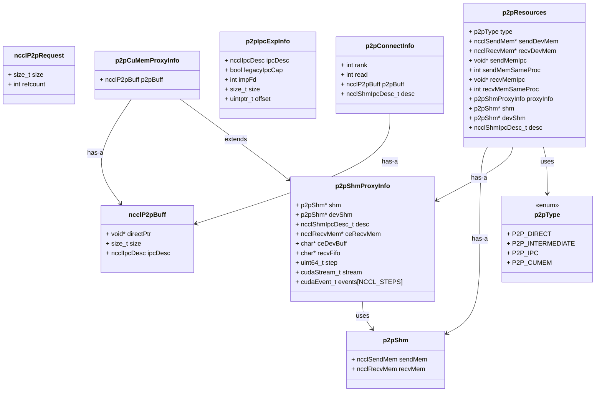

### 1. entrance
`ncclTransports`内有增加的`psmP2pTransport`层。
```cpp
// transport.cc
static ncclResult_t selectTransport(struct ncclComm* comm, struct ncclTopoGraph* graph, struct ncclConnect* connect, int channelId, int peer, int connIndex, int* transportType) {
	for loop(NTRANSPORTS) {
		struct ncclTransport *transport = ncclTransports[t];
		NCCLCHECK(transport->canConnect(&ret, comm, graph, myInfo, peerInfo));
		if (ret) NCCLCHECK(transportComm->setup(comm, graph, myInfo, peerInfo, connect, connector, channelId, connIndex));
	}
}
```
#### psmP2pTransport
* psmP2pSendProxyProgress和psmP2pRecvProxyProgress是独有的。
```cpp
struct ncclTransport psmP2pTransport = {
  "PSM_P2P",
  psmP2pCanConnect,
  {
    psmP2pSendSetup, psmP2pSendConnect, psmP2pSendFree, NULL,
    psmP2pSendProxySetup, psmP2pSendProxyConnect, psmP2pSendProxyFree,
    psmP2pSendProxyProgress, psmP2pProxyRegister, psmP2pProxyDeregister
  },
  {
    psmP2pRecvSetup, psmP2pRecvConnect, psmP2pRecvFree, NULL,
    psmP2pRecvProxySetup, psmP2pRecvProxyConnect, psmP2pRecvProxyFree,
    psmP2pRecvProxyProgress, psmP2pProxyRegister, psmP2pProxyDeregister
  }
};
```
---
### 2. psm_p2p.cc function
* psm_p2p和有核p2p需要的结构体之前的vccl2.21全部放在了src/include/all_p2p.h内，这里需要考虑是否搬回，单独考虑psm需要的p2p结构体（因为新的2.26不打算动p2p.cc）。
* psm_p2p和有核p2p需要的函数现在全部放在2.26的psm_p2p.cc内，依旧是不改动p2p.cc。
* TODO： `proxyRegister`、 `proxyDeregister`是2.26新增的，考虑加/不加。
#### 2.1 小改动部分
`ncclTransportComm`内的`setup`、`connect`、`free`、`proxySetup` 、`proxyConnect`、 `proxyFree`的实现（对应我`psmP2pTransport`内函数）。p2p没有`proxySharedInit`。

#### 2.2 大改动部分
`ncclTransportComm`内的`proxyProgress`对应的`psmP2pSendProxyProgress`和`psmP2pRecvProxyProgress`是2.21的psm/psm_p2p.cc。
##### share buffer分配--2.21
这里2.21的实现总结来看就是有两种：
* 大龙自己写了一个状态的sharedbuffer（用来后面传输数据的时候同步本端和对端的传输status）。
* 大龙使用了recv端的recvFifo当数据的sharedbuffer，这块buffer是原生开辟出来的。另外，原生的p2p.cc（2.21）内 `p2pSendProxySetup` 的PassSm分支，只分配ceDevBuff，不调用ncclP2pAllocateShareableBuffer，所以发端没有这个数据的sharedbuffer，只有收端有。
###### a. 状态的sharedbuffer
首先就是2.21对p2p增加了四个字段，删除了一些原生的字段。
```cpp
struct p2pCuMemProxyInfo {
  struct p2pShmProxyInfo base; // 2.21增加的，这里把p2pShmProxyInfo结构体放到了p2pCuMemProxyInfo内
  struct ncclP2pBuff p2pBuff;
};
```
然后，`p2pShmProxyInfo` 内则增加了如下三个字段：
```cpp
  int buffSizes[NCCL_NUM_PROTOCOLS];
  int *share_ptr;
  cudaStream_t cpStream;
```
* 2.21在`p2pShmProxyInfo`结构内放了 `share_ptr` ，然后让`proxyInfo->share_ptr = ptr;` 
* shared_ptr工作流程：`shm_open(共享物理内存的临时文件)` -> 根据size大小设定 `shm_fd` 大小 -> `mmap` 会把这段内存映射到当前进程 -> 变成ptr在 CPU上读写 -> `proxyInfo->stream` 去执行异步无核拷贝任务。
 * 在 `psmP2pSendProxyProgress`的时候再用这个 `share_ptr` 看当前状态应该去读还是写。
```cpp
static ncclResult_t p2pSendProxySetup(...) {
	struct p2pShmProxyInfo* proxyInfo;
	if(ncclParamPassSm() && connection->connIndex == 1) {
	      char shm_name[64];
	      int shm_fd = shm_open(shm_name, O_CREAT | O_RDWR, 0666);
	      size_t size = 16 * sizeof(int); // 共享内存大小
	      if(ftruncate(shm_fd, size)) return ncclSystemError;
	      int* ptr = (int *)mmap(0, size, PROT_WRITE, MAP_SHARED, shm_fd, 0);
	      for(int i = 0; i < size / sizeof(int); i++){
	        ptr[i] = 0;
	      }
	      proxyInfo->share_ptr = ptr;
	      cudaStreamCreateWithFlags(&proxyInfo->cpStream, cudaStreamNonBlocking);
	    }
}
```
* 这里的ptr定义完之后放到了 `proxyInfo->base.share_ptr = ptr;`，而这个proxyInfo是 `p2pCuMemProxyInfo` 类型的结构体。
```cpp
ncclResult_t p2pRecvConnect(...) {
	if(ncclParamPassSm() && recv->proxyConn.connection->connIndex == 1){
      char shm_name[64];
      sprintf(shm_name, "vccl_share_%d_%d_%ld", recv->proxyConn.connection->peerRank, recv->proxyConn.connection->rank, comm->groupHash);
      INFO(NCCL_P2P, "setup load   file = [ %s ]", shm_name);
      size_t size = 16 * sizeof(int); // 共享内存大小
      int shm_fd = shm_open(shm_name, O_RDWR, 0666);
      if(shm_fd < 0) INFO(NCCL_P2P, "open share mem error");
      int* ptr = (int *)mmap(0, size, PROT_READ | PROT_WRITE, MAP_SHARED, shm_fd, 0);
      struct p2pCuMemProxyInfo* proxyInfo;
      proxyInfo = (struct p2pCuMemProxyInfo *)recv->proxyConn.connection->transportResources;
      proxyInfo->base.share_ptr = ptr;
      cudaStreamCreateWithFlags(&proxyInfo->base.cpStream, cudaStreamNonBlocking);
      INFO(NCCL_P2P, "share_ptr [ recv ] = %p", ptr);
      for (int i=0; i<16; i++) {
        CUDACHECK(cudaEventCreate(proxyInfo->base.events+i));
      }
      shm_unlink(shm_name);
    }
}
```
综上：
* 发送端初始化 结构体直接使用 p2pShmProxyInfo，访问则直接访问 share_ptr 字段。
* 接收端连接时 结构体使用扩展的 p2pCuMemProxyInfo 访问: 通过 base.share_ptr 访问嵌套的字段
不同的原因就是cuMem功能需要 `ncclP2pBuff` 。
```txt
p2pShmProxyInfo:
┌─────────────────┐
│ shm             │
│ devShm          │
│ ...             │
│ share_ptr  ←────┼─── 直接访问(发送端)
│ cpStream        │
└─────────────────┘

p2pCuMemProxyInfo:
┌─────────────────┐
│ base:           │
│ ┌─────────────┐ │
│ │ shm         │ │
│ │ devShm      │ │
│ │ ...         │ │
│ │ share_ptr ←─┼─┼─── 通过base.share_ptr访问(接收端)
│ │ cpStream    │ │
│ └─────────────┘ │
│ p2pBuff:        │
│ ┌─────────────┐ │
│ │ directPtr   │ │
│ │ size        │ │
│ │ ipcDesc     │ │
│ └─────────────┘ │
└─────────────────┘
```
###### b. 数据的sharedbuffer
发端直接用的就是收端的sharebuffer，这个字段其实就在p2pShmProxyInfo内的 `recvFifo` 。
```cpp
static ncclResult_t p2pSendProxyConnect(...) {
  struct p2pShmProxyInfo* proxyInfo = (struct p2pShmProxyInfo*)connection->transportResources;
  
  if (reqSize != sizeof(void*)) return ncclInternalError;
  proxyInfo->recvFifo = *((char**)reqBuff);  // 接收Recv端buffer的指针！
  INFO(NCCL_P2P, "proxyInfo->recvFifo [ set ] = %p", proxyInfo->recvFifo);
  // ...
}

// struct
struct p2pShmProxyInfo {
  ...
  // Receiver buffer
  char* recvFifo;
  ...
};
```
所以在progress内2.21的cudaMemcpy内的参数全都能说得通了：
```cpp
if(info->share_ptr[step] == 0){
    args->subs[step].stepSize = std::min(args->chunkSize, size - args->totalCopySize);
    args->subs[step].stepBuff = info->recvFifo + (args->chunkSize * step);
    cudaMemcpyAsync(args->subs[step].stepBuff, (char *)data + args->totalCopySize, args->subs[step].stepSize, cudaMemcpyDeviceToDevice, info->cpStream);
	args->totalCopySize += args->subs[step].stepSize;
	args->copied ++;
}
```
这里的 `share_ptr` 是0，那么说明发端空闲，就开始往对端的sharedbuffer用cudaMemcpy写数据。cudaMemcpy第一个参数就是recvFifo就是收端创建的sharedbuffer，然后传的数据直接就是data，这是2.21新加的字段，直接从collective.cc内把用户的data拿来发送。
收端的progress函数亦是如此。

---
##### share buffer分配--2.26
###### a. introduction
**建立阶段：**
* 发端 创建状态的sharedbuffer（`p2pShmProxyInfo`），控制信息全存在这里
	在proxy setup阶段用`ncclShmAllocateShareableBuffer` 创建，这里的实现是用 `cudaHostRegister` 给mmap分配出来的主机内存变成pinned memory，然后CPU是用shm来访问，GPU是用devshm来访问，这样就避免的拷贝。
* 收端 创建数据的sharedbuffer（ `ncclP2pBuff` ），全部都用来数据传输
	在Proxy setup阶段用 `psmP2pAllocateShareableBuffer` 创建

**连接阶段：**
* 发端 在SendConnect阶段 让sender内的 `send->conn.xxx`和 `ceRecvMem`、`devShm`内的tail、connFifo等等与共享内存连接起来。在SendProxyConnect内拿到收端传来的recvFifo，后面传输阶段从自己显存写数据到这个recvFifo。
* 收端 在RecvConnect阶段 `ncclShmImportShareableBuffer`导入发送端的状态sharedbuffer（这里可以考虑删除大龙在p2pCuMemProxyInfo结构体内的加的 `p2pShmProxyInfo`）。在RecvProxyConnect内拿到收端传来的recvFifo，后面传输阶段拿这个来取这个recvFifo地址的数据到自己显存。

**传输阶段：**
这里与2.21不同的是，现在一个sub对应一次send/recv，不同于之前一次args对应一次send/recv。
* 发端 `psmP2pSendProxyProgress`：
* 收端 `psmP2pRecvProxyProgress`：
###### b. method
等价于三个问题的答案：
* 状态的sharedbuffer怎么开辟 怎么使用（CPU/GPU）？
* 数据的sharedbuffer怎么对齐原生？
* 两个progress从2.21 args力度的send/recv怎么升级到2.26 sub力度的send/recv？

**问题1: 状态的sharedbuffer怎么开辟 怎么使用（CPU/GPU）？**
状态的sharedbuffer就是shm。我们需要后续progress用shm（CPU）来去看 `recvMem.connFifo` 的大小。 `psmP2pSendProxySetup` 内用原生的 `ncclShmImportShareableBuffer` 来分配shm，devshm出来。调用和相应的结构体如下：
```cpp
static ncclResult_t psmP2pSendProxySetup(struct ncclProxyConnection* connection, struct ncclProxyState* proxyState, void* reqBuff, int reqSize, void* respBuff, int respSize, int* done) {
	...
	NCCLCHECK(ncclCudaCalloc(&proxyInfo->ceDevBuff, proxyState->buffSizes[NCCL_PROTO_SIMPLE]));
	...
	NCCLCHECK(ncclShmAllocateShareableBuffer(shmSize, false, &proxyInfo->desc, (void**)&proxyInfo->shm, (void**)&proxyInfo->devShm));
	if(ncclParamPassSm()) {
	  proxyInfo->shm->sendMem.head = 0;
	  proxyInfo->shm->recvMem.tail = 0;
	  memset((void*)proxyInfo->shm->recvMem.connFifo, 0, sizeof(proxyInfo->shm->recvMem.connFifo));
	  cudaStreamCreateWithFlags(&proxyInfo->stream, cudaStreamNonBlocking);
	}
	...
}

// 数据结构
struct p2pShm {
  struct ncclSendMem sendMem;
  struct ncclRecvMem recvMem;
};
struct ncclSendMem {
  union {
    struct {
      uint64_t head;
      char pad1[CACHE_LINE_SIZE-sizeof(uint64_t)];
      void* ptrExchange;
      uint64_t redOpArgExchange[2];
      char pad2[CACHE_LINE_SIZE-sizeof(void*)-2*sizeof(uint64_t)];
      int offsFifo[NCCL_STEPS];
    };
    char pad3[MEM_ALIGN];
  };
};
struct ncclRecvMem {
  union {
    struct {
      uint64_t tail;
      char pad1[CACHE_LINE_SIZE-sizeof(uint64_t)];
      struct ncclConnFifo connFifo[NCCL_STEPS];
      int flush; // For GDRCopy-based flush
    };
    char pad4[MEM_ALIGN];
  };
};
```
> 这里使用了 `proxyInfo->shm->recvMem.connFifo` 来代替2.21的 `proxyInfo->share_ptr` 的功能。因为在net.cc内两个progress内使用了 `connFifo[buffSlot].size != -1`（-1是空闲，>0就是实际数据大小）

**问题2：数据的sharedbuffer怎么对齐原生？**
因为我们多了receiver的proxy，所以收端proxy的setup，connect，progress，free都需要改变。
另外从GPU视角看，共享内存被存储在：
```cpp
struct p2pResources* resources = (struct p2pResources*)recv->transportResources;
   // 共享内存存储在 resources->shm 和 resources->devShm
```
从Proxy端看，也就是两个Progress内看，共享存储在：
```cpp
struct p2pShmProxyInfo* resources = (struct p2pShmProxyInfo*) (sub->connection->transportResources);
volatile struct ncclConnFifo* connFifo = resources->shm->recvMem.connFifo;
```
**问题3:两个progress从2.21 args力度的send/recv怎么升级到2.26 sub力度的send/recv？**
框架就是:等到readyEvent-> 初始化每个sub的status-> for loop处理每个sub -> 完成一个sub就done++，done=nsub就quit。与原生的逻辑相同，但是现在每个sub需要用cudaMemcpy完成数据传输。
原生的 `p2pSendProxyProgress` 内的post和transmit具体计算逻辑：

```cpp
struct ncclProxySubArgs {
    uint64_t base;          // 当前操作的起始步骤号  
    uint64_t transmitted;   // 已传输的步骤数
    uint64_t done;          // 已完成的步骤数
    int nsteps;             // 总步骤数
    // ...
};

static ncclResult_t p2pSendProxyProgress(...) {
  int p = args->protocol; // 取到simple协议， #define NCCL_PROTO_SIMPLE 2
  int stepSize = proxyState->buffSizes[p] / NCCL_STEPS; // 每步大小 = 4MB/8 = 512KB
  for (auto sub : args) {
	  // post阶段，判断
	  if (sub->transmitted < sub->done + NCCL_STEPS && sub->transmitted < sub->nsteps) {
	    int buffSlot = (sub->base+sub->transmitted)%NCCL_STEPS; //base+transmit来算下一个要传输的数据槽位
	    volatile struct ncclConnFifo* connFifo = resources->ceRecvMem->connFifo;
		volatile uint64_t* recvTail = &resources->ceRecvMem->tail;// GPU更新的尾指针（已发送的数据）
		if ((*recvTail > sub->base+sub->transmitted)) {
          int size = connFifo[buffSlot].size;// GPU 设置的数据大小，表示该槽位有多少数据
          /* 
          dst：接收方的 FIFO 缓冲区基地址 + 当前槽位的偏移量
          src: 发送方的设备缓冲区基地址（由 proxy 分配）+ 同样的槽位偏移量
          size: GPU 通过 connFifo 通知 proxy 的实际数据大小
          */
          CUDACHECK(cudaMemcpyAsync(resources->recvFifo+buffSlot*stepSize, resources->ceDevBuff+buffSlot*stepSize, size, cudaMemcpyDeviceToDevice, resources->stream));
          CUDACHECK(cudaEventRecord(resources->events[buffSlot], resources->stream));
          sub->transmitted += args->sliceSteps;
        }
	}  
	  // transmit阶段
	  if (sub->done < sub->transmitted) {
        int buffSlot = (sub->base+sub->done)%NCCL_STEPS;//base+done来算下一个要检查完成的数据槽位
        cudaError_t res = cudaEventQuery(resources->events[buffSlot]);
        if (res == cudaSuccess) {
          sub->done += args->sliceSteps;
          // Notify SHM
          resources->shm->recvMem.tail = sub->base + sub->done;
        }
        if (sub->done == sub->nsteps) {
          resources->step = sub->base + sub->nsteps;//下次操作的起点
          args->done++;//完成的子操作计数
        }
      }
  }
}
```
原生的方案实现了：
1. 先完成 cudaMemcpy
2. 确认cudaEvent完成
3. 更新head/tail给对方
4. sync_synchronize，机内没有，机间有。

我们的机内cudaMemcpy则同上应该在两个progress内实现相同的功能：
**Sender：**
enqueue.cc内拿到这次传输的总字节量：`proxyOps[dir].nbytes = partEnd-partBeg` ；还拿到了： `proxyOps[dir].nsteps = divUp(partEnd-partBeg, chunkDataSize)`。
>例如16MB数据，这里nsteps就等于16MB/512KB = 32步
```shell
node201:2319771:2319863 [1] NCCL INFO PSM Recv Debug: transmitted=6, chunkSize=524288, nbytes=16777216, stepOffset=3145728, size=524288
node201:2319771:2319863 [1] NCCL INFO PSM Recv Debug: recvbuff=0x7f11a9000000, recvFifo=0x7f11aa001000, buffSlot=6, stepSize=524288, nsteps=32
```
然后现在progress内我的stepSize= `proxyState->buffSizes[p] / NCCL_STEPS` 。这个p是2，因为是simple通信协议，所以这个buffSizes是4MB，除了NCCL_STEPS后现在的stepSize就是512KB。符合上面打印出来的值。
然后槽位就是通过 `buffSlot = (sub->base + sub->transmitted) % NCCL_STEPS;` ，0, 1, 2, 3, 4, 5, 6, 7, 0, 1, 2... (循环)。发送端通过在recvFifo上一直按照 `buffSlot * args->chunkSize` 这个偏移来写。
再往下用户缓冲区域的偏移量：`stepOffset = sub->transmitted * stepSize;` ，这个transmitted是已经传输的步数（0, 1, 2, 3...），stepSize是每步读取的数据量（512KB），所以这里的stepOffset可以表示从用户缓冲区的哪个位置开始读取。
我们在收端done阶段对 `recvTail` 更新一个NCCL_STEPS通知发端，发端done阶段把自己的 `sendHead`当前位置更新给收端，只用确保 `recvTail` 小于 `sendHead`。
最后就是chunkSize和bufferSize的关系：
现在在 `psmP2pRecvSetup` 内给无核模式多加了一些bufferSize:
* 原生的这里recvSize已经有大概69.5MB大小
* 无核加了64MB之后大概134MB左右
```cpp
for (int p=0; p<NCCL_NUM_PROTOCOLS; p++) if (!(info->read && p == NCCL_PROTO_SIMPLE)) recvSize += comm->buffSizes[p];
if(ncclParamPassSm() && connIndex == 1) recvSize += 64 * 1024 * 1024;
```
`psmP2pRecvSetup` 内会:
```cpp
req.size = recvSize; // 设置总大小
// 发送给 proxy
ncclProxyCallBlocking(..., &req, ..., &info->p2pBuff, ...);
```
然后 `psmP2pRecvProxySetup` 内就通过：
```cpp
struct ncclP2pRequest* req = (struct ncclP2pRequest*)reqBuff;
int size = req->size; // 收到总大小（134MB）
// 分配整个缓冲区
psmP2pAllocateShareableBuffer(size, ...);
```

**Receiver：**

#### 3. psm_p2p.cc data structure：

#### 4. 外部需要考虑的内容： 
###### ncclTransportComm & ncclTransport
```cpp
struct ncclTransportComm {
  ncclResult_t (*setup)(struct ncclComm* comm, struct ncclTopoGraph* graph, struct ncclPeerInfo*, struct ncclPeerInfo*, struct ncclConnect*, struct ncclConnector*, int channelId, int connIndex);
  ncclResult_t (*connect)(struct ncclComm* comm, struct ncclConnect*, int nranks, int rank, struct ncclConnector*);
  ncclResult_t (*free)(struct ncclConnector*);
  ncclResult_t (*proxySharedInit)(struct ncclProxyConnection* connection, struct ncclProxyState* proxyState, int nChannels);
  ncclResult_t (*proxySetup)(struct ncclProxyConnection* connection, struct ncclProxyState* proxyState, void* reqBuff, int reqSize, void* respBuff, int respSize, int* done);
  ncclResult_t (*proxyConnect)(struct ncclProxyConnection* connection, struct ncclProxyState* proxyState, void* reqBuff, int reqSize, void* respBuff, int respSize, int* done);
  ncclResult_t (*proxyFree)(struct ncclProxyConnection* connection, struct ncclProxyState* proxyState);
  ncclResult_t (*proxyProgress)(struct ncclProxyState* proxyState, struct ncclProxyArgs*);
  ncclResult_t (*proxyRegister)(struct ncclProxyConnection* connection, struct ncclProxyState* proxyState, void* reqBuff, int reqSize, void* respBuff, int respSize, int* done);
  ncclResult_t (*proxyDeregister)(struct ncclProxyConnection* connection, struct ncclProxyState* proxyState, void* reqBuff, int reqSize, int* done);
};

struct ncclTransport {
  const char name[8];
  ncclResult_t (*canConnect)(int*, struct ncclComm* comm, struct ncclTopoGraph* graph, struct ncclPeerInfo*, struct ncclPeerInfo*);
  struct ncclTransportComm send;
  struct ncclTransportComm recv;
};
```

#### TODO:
- [x] 测试/修复下面的东西能传到psm_p2p.cc
extern int64_t ncclParamP2pReadEnable();
extern int64_t ncclParamP2pDirectDisable();
extern int64_t ncclParamP2pUseCudaMemcpy();
- [x] psmP2pAllocateShareableBuffer相关逻辑，现在存在resources->shm的地址是空。
- [x] proxyState相关
- [x] 确定一下recvFifo在psmP2pSendProxySetup内为什么是reqBuff 但是reqBuff传进来的地址又是0x0
- [x] args相关
- [x] 多个sub是否共用一个resources????????
- [x] post和transmit结束的时候return  ncclsuccess????
struct ncclProxyArgs* args内需要：
```cpp
cudaEvent_t eventReady;
std::atomic<int>* doneCounter;

int sendStepMask;
int copied;
int transmitted;
size_t totalCopySize;
```
struct ncclProxySubArgs内需要：
```cpp
int stepSize;
void *stepBuff;
```

#### BUG Q&A：
我去掉p2pCuMemProxyInfo的base字段，那么在recvProgress内拿到的resources在前面的setup和connect的时候需要传一些什么给proxy？都正常传进去为什么会crash？原生的为什么在recvsetup的时候用p2pCuMemProxyInfo，我该怎么妥善处理这里的p2pbuff和shm、devshm的关系？
1. NCCLCHECK(ncclProxyCallBlocking(comm, &recv->proxyConn, ncclProxyMsgConnect, shmPtrs, sizeof(void*), NULL, 0));这个ncclProxyCallBlocking在干嘛？通知给proxy的信息需要干什么？
	答：计算线程把一条“指令”写进 proxy 线程的队列，指令类型：比如当前是 `ncclProxyMsgConnect` ，把 `shmPtrs` 给proxy，那么在 `psmP2pRecvProxyConnect` 里面从 `(struct p2pShmProxyInfo*)connection->transportResources` 拿到自己的 `p2pShmProxyInfo` 的时候就可以去 `shmPtrs` 里面找自己要的东西。
	 * 调用者用 `ncclProxyMsgConnect` 传递shmPtrs, sizeof(void*), NULL, 0这四个东西下去：
	 * 接收者用相应的 (recv->proxyConn)ProxyConnect的函数去处理，比如：
	static ncclResult_t psmP2pRecvProxyConnect(struct ncclProxyConnection* connection, struct ncclProxyState* proxyState, void* reqBuff, int reqSize, void* respBuff, int respSize, int* done) 这里面的reqBuff就是shmPtrs，然后reqsize就是我给的长度，respBuff和respSize就是proxy的回包的东西。
2. recv的setup内需要给proxy什么？原生的会走到CuMem内，然后就会开辟 `p2pCuMemProxyInfo` 这个结构去取 `p2pBuff`，我们是不是不需要这个p2pBuff？
	
	答：cuMem路径proxy线程去映射一块GPU显存（p2pBuff），但是看到原生CE-Memcpy和cuMem是分开的逻辑。也就是说我们的PassSm可能和CE-Memcpy对齐，不需要这个映射，只需要stream、event、shm和recvFifo。
	 在 `psmP2pRecvProxySetup` 内用了 `psmP2pAllocateShareableBuffer` 把我们定义好的大小的req变成p2pBuff的directPtr和ipcDesc。
	* directPtr：这块显存在 创建方进程 的 device 指针；
	*  ipcDesc ：用来让 对端进程 打开同一块显存的 IPC 句柄。
	 
	 然后在 psmP2pRecvSetup 内拿到 `p2pBuff` ，后面p2pMap会用这个 p2pBuff 去 cudaIpcOpenMemHandle 或cuMemImport，把远端显存映射成 resources->recvDevMem / sendDevMem。这个recvDevMem后面的地址就是我们的recvFifo。
	 所以在send-proxy就是写数据到recvFifo，更新shm->sendMem.head。这个recvDevMem不是我们使用的shm内的recvMem。
3. psmP2pRecvSetup是不是需要考虑一下哪些是需要new出来，资源是要放在堆上？
	 答：psmP2pRecvSetup内我calloc了struct p2pResources* resources; psmP2pRecvProxySetup内calloc了struct p2pShmProxyInfo* proxyInfo;
4. char* buff = (char*)(remDevMem+1); 那我的PSM_BUFFER_SIZE大小的多出来的地址怎么用上？
	 答：
5. 我该怎么妥善处理这里的p2pbuff和shm、devshm的关系?
	答：psmP2pRecvConnect内导入shm的sharedbuffer之后，也就是ncclShmImportShareableBuffer之后直接把这些东西给proxyInfo。p2pbuff是gpu显存上的地址，要用p2pMap转换成recvDevMem才能变成recvFifo。shm和devshm则是通过info->desc来让sender和receiver都能够持有这两个字段。

解决alltoall 8卡大数据会hang 大于4GB的思路：
1. 4GB数据是512的nsteps，卡在320step
	答：在sub->base == 320 这个条件下看其他参数的状态。
	a. 不是readyEvent的问题 因为我不query也会出现opCount减不完，说明就是有progress没有完成，一直卡在send的progress没有完成。一直 recvTail == sub->base + sub->transmitted所以不能进行CudaMemcpy， 所以recv的progress一直不能完成。所以就不能完成opCount的减法。所以一直卡在send的Progress内。
	 也能看到recv侧的一直hang在这个条件sendHead > sub->base + sub->transmitted里面，但是这里是sendProgress的recvTail和recvProgress的sendHead看到recvTail是333，而sendHead已经到380左右了。
	 但是这个数据量的大小在sendrecv没有问题，所以不是progress的问题。
2. 原生的会在p2pSendConnect内拿到send->conn.tail = &resources->proxyInfo.ceRecvMem->tail;send->conn.head = &resources->proxyInfo.devShm->sendMem.head;然后progress阶段并没有单独给每个sub初始化head和tail，反而是直接用，初始化和清理在别的地方（待验证），这里不确定是如何让sendProgress内的第一次cudaMemcpyAsync实现if ((*recvTail > sub->base+sub->transmitted)) 是true条件的！

	答：这里的ceRecvMem是 `ncclRecvMem`结构，把ceRecvMem内的tail和head保存到send这个ncclConnector里面的ncclConnInfo的tail和head，这里的ncclConnInfo内的tail和head表示的是：`uint64_t *tail; // Local for recv, remote for send` 和 `uint64_t *head; // Local for send, remote for recv` ，在 src/device/prims_simple.h内kernel会去用这俩来做流控。无核内的双progress不需要kernel读conn.tail和conn.head。

psm_p2p内的receiver创建stream会hang的问题：
1. 我如果打开psmP2pRecvProxyConnect这个里面的CUDACHECK(cudaStreamCreateWithFlags(&proxyInfo->stream, cudaStreamNonBlocking));那么就会出现hang。我打印了psmP2pRecvProxyConnect内如果创建了stream那么我psmP2pRecvProxyProgress内用的stream地址看上去是正常的，如果不创建stream那么psmP2pRecvProxyProgress内用的stream地址就全是0，但是不会hang。
解1: 我在recvsetup一开始的地方创建完 `NCCLCHECK(ncclCalloc(&proxyInfo, 1));` 就给`proxyInfo->stream = 0;` 显示初始化为0。❌
解2:收端的Event方案变为query stream，我正常创建stream，确保是async的stream，绝对不能用默认的同步stream0。 ✅

# Optimizer
## 0. Introduction
由于现在支持了多channel的无核send recv，那么现在对于性能的影响主要就是四大项：
* buffersize
	这是我们传输的时候用的recvFifo这快buffer（中转站）的大小，sender往上写，receiver从里面取，通过双指针控制双方的生产消费节奏。
* chunksize 
	sender往buffer里面写一次数据的大小，receiver同理。通过公式（1）得到:$$chunksize = \frac{buffersize}{PSM\_STEPS}\tag{1}$$
* PSM_STEPS
	这个参数就是说我这个中转站上有多少个槽，比如当前是8个槽。这里的每个槽就是一个chunksize的大小。
	
* nP2pChannels
	这个就是nccl的环境变量 `NCCL_MAX_P2P_NCHANNELS=x` 所等价的变量。默认是x = 32。底层send内的args会被这个nP2pChannels数整除，比如32MB数据，如果nP2pChannels=2，那么每个args就是16MB。这个切分是为了聚合相同opCount的操作，和我下面切分的槽不同。
## 1. baseline + compare
[https://infrawaves.feishu.cn/wiki/VclxwuGHkiBWiKkdZZvcWM6Pnhf?from=from_copylink](https://infrawaves.feishu.cn/wiki/VclxwuGHkiBWiKkdZZvcWM6Pnhf?from=from_copylink)
经过测试发现，现在无核的`NCCL_MAX_P2P_NCHANNELS`环境变量对于cc是没有影响的。
公式（1）内的最多同时调整两个参数，也就是buffersize和psm_steps。并上现在的 `NCCL_MAX_P2P_NCHANNELS` 这个参数，现在优化无核p2p的参数集合就是:{buffersize, PSM_STEPS, `NCCL_MAX_P2P_NCHANNELS` }。

## 2. fine-tune the parameters
数据段包括三段：
* [1KB, 4MB)
* [4Mb, 256MB]
* (256MB, 8GB]

通过在不同大小数据段的n轮尝试后发现以下规律：
1. chunksize 大于 64MB之后，基本上不再带来性能提升。chunksize小的时候对于小数据有性能提升。由于chunksize就是buffersize和PSM_STEPS的比，所以现在应该让chunksize随着数据的大小动态变化。
2. 槽数大于2后开始性能变差。
3. 机内无核在[1KB,256MB]的数据表现上超过原生，在512MB开始性能会差一些。
4. `NCCL_MAX_P2P_NCHANNELS=2` 的性能最佳，如果等于1性能差，大于2不会带来提升。

所以优化思路总结为：
数据大，就加大buffersize降低槽数。数据小，就降低buffersize增加一个槽数。也就是说chunksize的取值是4MB和64MB之间，PSM_STEPS在1和2之间。NCCL_MAX_P2P_NCHANNELS固定为2。

## 3.  modify code
src/graph/paths.cc在前期计算p2p topo的channel的API `ncclTopoComputeP2pChannels` 内我们修改comm->p2pnchannels在无核开启的时候是 `std::min(comm->p2pnChannels, 2)`。
修改后可以看到性能对齐在外侧环境变量的设置`NCCL_MAX_P2P_NCHANNELS=2` ：
然后就是transport的psm_p2p.cc内的progress内，需要对buffersize和PSM_STEPS动态调整。核心逻辑就是:
```cpp
size_t dynamic_buffer = proxyState->buffSizes[p];
      if (sub->nbytes >= PSM_BUFFER_SIZE) {
        dynamic_buffer = PSM_BUFFER_SIZE;
      } else {
        size_t msize = sub->nbytes / (1024 * 1024);
        int adjustFactor;
        if (msize >= 32) adjustFactor = 1;
        else if (msize >= 16) adjustFactor = 2;
        else if (msize >= 8) adjustFactor = 4;
        else if (msize >= 4) adjustFactor = 8;
        else if (msize >= 2) adjustFactor = 16;
        else if (msize >= 1) adjustFactor = 32;
        else adjustFactor = 64;
        dynamic_buffer = PSM_BUFFER_SIZE / adjustFactor;
        }
      sub->chunkSize = dynamic_buffer / PSM_STEPS;
```
让这里的chunksize与当前的数据的size贴近。
调整后1KB到8GB与原生的对比如下：
无核：
```shell
mpirun -np 4\
    --host 10.1.3.201:4\
    --allow-run-as-root \
    -x NCCL_DEBUG=warn \
    -x MASTER_PORT=29500 \
    -x UCX_TLS=tcp,self \
    -x LD_LIBRARY_PATH=/workspace/infrawaves/share/liuda/vc226/vccl_2.26.6-1/build/lib:$LD_LIBRARY_PATH \
    -x NCCL_IB_GID_INDEX=3 \
    -x NCCL_PASS_SM=1 \
    ./build/sendrecv_perf -b 1KB -e 8GB -f 2 -g 1
```

原生：
```shell
mpirun -np 4\
    --host 10.1.3.201:4\
    --allow-run-as-root \
    -x NCCL_DEBUG=warn \
    -x MASTER_PORT=29500 \
    -x UCX_TLS=tcp,self \
    -x LD_LIBRARY_PATH=/workspace/infrawaves/share/liuda/vc226/vccl_2.26.6-1/build/lib:$LD_LIBRARY_PATH \
    -x NCCL_IB_GID_INDEX=3 \
    ./build/sendrecv_perf -b 1KB -e 8GB -f 2 -g 1
```
