## 1. struct
![[1d45e817-ba03-4cbb-a871-3e1bac980564.png]]

## 2. rmaCollTaskAppend
主要是colllective.cc内 `ncclEnqueueCheck` 会把INFO参数解析成什么，并以什么形式放到planner内。新增的rmaTaskAppend接口参考： [[enqueue.cc#2.1 rmaTaskAppend|rmaTaskAppend]]。下面是开始coding前一些需要考虑的代码因素：
* 新增的结构体 && 变量：
    * 新的cc类型就是 `ncclFuncAlltoAllV` ✅
    * 新的任务结构体是 `ncclTaskRmaColl` ，任务链表为：`collRmaTaskQueue`，挂到planner内。✅
    * 我们多了displays / 额外的count / relaybuff，可能需要在 `ncclInfo` 结构体内增加5个变量。✅
* p2pcheduler需要在rmaCollTaskAppend阶段在rmaColl内使用上。
    * `round = (peer - rank + nranks) % nranks` 需要先生成任务列表，然后按round排序，最后ncclIntroQueueEnqueue。
* relaybuff，当rank i 发给rank j的时候（跨机）：
    *  1. i 侧使用putSignal到 i' 节点的relaybuff，给 i' 发一个signal
    * 2. i' 侧 NVL/CE 的put操作从relay_buff拷贝到recvbuff，给j发signal
    * 3. j 侧waitSignal等 i' 的signal
* 在rmaTaskAppend的时候，如果total bytes大于1GB需要再重新入队，我们的Append需要考虑进去。
* rmaCollTaskAppend内直接算`relaybuff`，`sendbuff`, `recvbuff` 的偏移，如下：
    * 
* `planner.rmaTaskQueues` 是一个数组，大小为 numRmaCtx。不同context的任务可以并行，且互不干扰，同一context任务批处理。我需要对应创建为 `collRmaTaskQueue` 数组吗？？？多个ctx，每个ctx内4个具体任务que，竖着按que取任务来做batch。不需要，我直接就一个queue就行，不弄ctx，因为在调度或者执行阶段还可以从这个里面拆出来去决定走哪个stream or ctx。

### pseudocode
综上，核心逻辑如下：
```cpp
rmaCollTaskAppend(){

}
```

## 3. schedule
A. RDMA 跨机：同轨 对端 → 本地 relay 的 PutSignal + WaitSignal
* WaitSignal（remote-in）：等待“同轨 rank 发给我 relay 的多个 PutSignal”
* PutSignal（remote-out）：我向同轨对端 relay 发多个 PutSignal
B. NVL/CE 机内：relay → 本机多 rank 的 PutSignal + WaitSignal
* PutSignal（local-out）：我把 relaybuff 的数据分发给本机多 rank
* WaitSignal（local-in）：等待本机其他 rank 把 relaybuff 中的数据拷给我
## 4. summary

```mermaid
graph TB
    subgraph "RMA Task (ncclTaskRma) 调用路径"
        A1[用户 API 调用] --> A2["ncclPutSignal<br/>ncclWaitSignal<br/>ncclSignal"]
        A2 --> A3["enqueue.cc<br/>rmaTaskAppend()"]
        A3 --> A4["创建 ncclTaskRma<br/>设置 ctx, func, peer 等"]
        
        A4 --> A5{"判断操作类型"}
        A5 -->|WaitSignal| A6["创建单个任务<br/>设置 peers[], nsignals[]"]
        A5 -->|PutSignal/Signal| A7["可能分块处理<br/>大操作拆分成多个任务"]
        
        A6 --> A8["planner.rmaTaskQueues[ctx]<br/>按 context 分类入队"]
        A7 --> A8
        
        A8 --> A9["scheduleRmaTasksToPlan()<br/>rma.cc"]
        A9 --> A10["查找第一个非空 context<br/>ctx = findFirstNonEmpty()"]
        A10 --> A11["从 rmaTaskQueues[ctx]<br/>取出任务"]
        
        A11 --> A12{"判断 LSA 可访问性<br/>isLsaAccessible()"}
        A12 -->|可访问| A13["plan.rmaTaskQueueCe<br/>CE 路径队列"]
        A12 -->|不可访问| A14["plan.rmaTaskQueueProxy<br/>Proxy 路径队列"]
        
        A13 --> A15["批处理检查<br/>canBatchRmaTasks()"]
        A14 --> A15
        A15 -->|可批处理| A11
        A15 -->|不可批处理| A16["plan 创建完成"]
        
        A16 --> A17["ncclLaunchRma()<br/>执行计划"]
        A17 --> A18{"判断操作类型"}
        A18 -->|PutSignal/Signal| A19["ncclRmaPut()"]
        A18 -->|WaitSignal| A20["ncclRmaWaitSignal()"]
        
        A19 --> A21{"检查路径"}
        A21 -->|有 Proxy| A22["ncclRmaPutProxy()<br/>rma_proxy.cc"]
        A21 -->|有 CE| A23["ncclRmaPutCe()<br/>rma_ce.cc"]
        A21 -->|两者都有| A24["并行执行<br/>Proxy + CE streams"]
        
        A20 --> A25{"检查路径"}
        A25 -->|有 Proxy| A26["ncclRmaWaitSignalProxy()<br/>rma_proxy.cc"]
        A25 -->|有 CE| A27["ncclRmaWaitSignalCe()<br/>rma_ce.cc"]
        A25 -->|两者都有| A28["并行执行<br/>Proxy + CE streams"]
        
        A22 --> A29[执行完成]
        A23 --> A29
        A24 --> A29
        A26 --> A29
        A27 --> A29
        A28 --> A29
    end
    
    style A1 fill:#e1f5ff
    style A8 fill:#fff4e1
    style A13 fill:#e8f5e9
    style A14 fill:#e8f5e9
    style A17 fill:#f3e5f5
    style A29 fill:#c8e6c9

```


综上，rmaColl内应该的流程如下：

```mermaid
graph TB
    subgraph "RMA Collective Task (ncclTaskRmaColl) 调用路径"
        B1[用户 API 调用] --> B2["ncclAlltoAllV<br/>(使用 RMA 实现)"]
        B2 --> B3["enqueue.cc<br/>rmaCollTaskAppend()"]
        B3 --> B4["创建 ncclTaskRmaColl<br/>包含多个 RMA 操作"]
        
        B4 --> B5["planner.collRmaTaskQueue<br/>RMA Collective 任务队列"]
        
        B5 --> B6["scheduleRmaCollTasksToPlan()<br/>rma_coll.cc<br/>(目前为空实现)"]
        
        B6 --> B7["处理 ncclTaskRmaColl<br/>可能拆分成多个批次"]
        B7 --> B8{"任务数量检查<br/>是否超过批次限制"}
        
        B8 -->|需要拆分| B9["创建多个 ncclRmaWorkBatch<br/>每个 batch 包含部分操作"]
        B8 -->|不需要拆分| B10["创建单个 ncclRmaWorkBatch"]
        
        B9 --> B11["plan.rmaWorkBatchQueue<br/>工作批次队列"]
        B10 --> B11
        
        B11 --> B12["遍历每个 rmaWorkBatch"]
        B12 --> B13["对 batch 内的任务分类"]
        
        B13 --> B14{"判断操作类型和路径"}
        B14 -->|Put/Signal + Proxy| B15["batch.proxyPutQueue"]
        B14 -->|Put/Signal + CE| B16["batch.cePutQueue"]
        B14 -->|WaitSignal + Proxy| B17["batch.proxyWaitSignalQueue"]
        B14 -->|WaitSignal + CE| B18["batch.ceWaitSignalQueue"]
        
        B15 --> B19["batch 内任务分类完成"]
        B16 --> B19
        B17 --> B19
        B18 --> B19
        
        B19 --> B20["ncclLaunchRmaColl()<br/>执行 RMA Collective<br/>(目前为空实现)"]
        
        B20 --> B21["按批次顺序执行<br/>同一 batch 内并行"]
        B21 --> B22{"执行批次内队列"}
        B22 -->|proxyPutQueue| B23["执行 Proxy Put/Signal<br/>并行处理"]
        B22 -->|cePutQueue| B24["执行 CE Put/Signal<br/>并行处理"]
        B22 -->|proxyWaitSignalQueue| B25["执行 Proxy WaitSignal<br/>并行处理"]
        B22 -->|ceWaitSignalQueue| B26["执行 CE WaitSignal<br/>并行处理"]
        
        B23 --> B27{"还有批次?"}
        B24 --> B27
        B25 --> B27
        B26 --> B27
        
        B27 -->|是| B12
        B27 -->|否| B28[执行完成]
    end
    
    style B1 fill:#e1f5ff
    style B5 fill:#fff4e1
    style B11 fill:#e8f5e9
    style B15 fill:#ffecb3
    style B16 fill:#ffecb3
    style B17 fill:#ffecb3
    style B18 fill:#ffecb3
    style B20 fill:#f3e5f5
    style B28 fill:#c8e6c9
```

