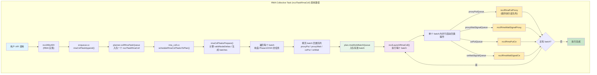
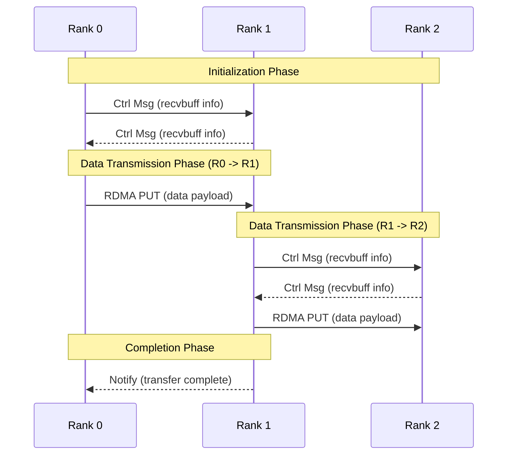

---
tags:
  - moe
  - vccl
  - alltoallv
状态: doing
---
## 1. struct
![[1d45e817-ba03-4cbb-a871-3e1bac980564.png]]

## 2. rmaCollTaskAppend
主要是colllective.cc内 `ncclEnqueueCheck` 会把INFO参数解析成什么，并以什么形式放到planner内。新增的rmaTaskAppend接口参考： [[enqueue.cc#2.1 rmaTaskAppend|rmaTaskAppend]]。以及meta ncclx的实现:[[vccl alltoallv dev log#meta ncclx|meta ncclx]]，下面是开始coding前一些需要考虑的代码因素：
* 新增的结构体 && 变量：
    * 新的cc类型就是 `ncclFuncAlltoAllV` 
    * 新的任务结构体是 `ncclTaskRmaColl` ，任务链表为：`collRmaTaskQueue`，挂到planner内。
    * 我们多了displays / 额外的count / relaybuff，可能需要在 `ncclInfo` 结构体内增加5个变量。
* relaybuff，当rank i 发给rank j的时候（跨机）：
    *  1. i 侧使用putSignal到 i' 节点的relaybuff，给 i' 发一个signal
    * 2. i' 侧 NVL/CE 的put操作从relay_buff拷贝到recvbuff，给j发signal
    * 3. j 侧waitSignal等 i' 的signal
* 在rmaTaskAppend的时候，如果total bytes大于1GB需要再重新入队，我们的Append需要考虑进去。
* rmaCollTaskAppend内直接算`relaybuff`，`sendbuff`, `recvbuff` 的偏移
* `planner.rmaTaskQueues` 是一个数组，大小为 numRmaCtx。不同context的任务可以并行，且互不干扰，同一context任务批处理。我需要对应创建为 `collRmaTaskQueue` 数组吗？？？多个ctx，每个ctx内4个具体任务que，竖着按que取任务来做batch。不需要，我直接就一个queue就行，不弄ctx，因为在调度或者执行阶段还可以从这个里面拆出来去决定走哪个stream or ctx。
* 遍历顺序：参考 [[init.cc#ncclP2pSchedule|p2pschedule逻辑]] 
## 3. schedule
### batch = 0
在batch0内，每个rankR的任务就是我发会机内其他和收机内其他rank的任务（p2pschedule的sendRank/recvRank那套）。rankR会去先执行下一个nodeRound的机间的任务，也就是我这个rank发给下一个节点/收到上一个节点的所有同轨/跨轨任务。如图：
![[vccl alltoallv dev log 2026-01-29 19.36.31.excalidraw.svg]]
%%[[vccl alltoallv dev log 2026-01-29 19.36.31.excalidraw.md|🖋 Edit in Excalidraw]]%%
### batch > 0
从batch1的任务开始，所有机内的任务都是同轨机间任务的转发。比如下面路径13就是上一个节点内localRank=2的gpu发到我当前节点的localRank=2的gpu，再转发到rank R内。同理，路径6就是rankR给路径3的转发。以上完成接收侧pxn。


### batch间跨进程同步
在 [https://github.com/sii-research/VCCL/pull/43](https://github.com/sii-research/VCCL/pull/43) 中，我们使用更多的relaybuffer chunk / bootstrapBarrier来确保这个同步不会出现问题，但是前者会吃大量显存/后者会影响性能。
* 前者方案：按照nNodes-1的数量初始化relaybuffer chunk数量，因为：比如3个node的all2allv，在我们的方案内一个rank需要至少2个对应relaybuffer chunk；同理4节点的就需要3个对应的relaybuffer chunk
* 后者在一个batch结束后增加一个全局的barrier，类似deepep在notify_dispatch kernel内调用的nvshmem_sync_all()
我们的解法：
![[vccl alltoallv dev log 2026-02-11 16.01.18.excalidraw.svg]]
%%[[vccl alltoallv dev log 2026-02-11 16.01.18.excalidraw.md|🖋 Edit in Excalidraw]]%%

## 4. summary

```mermaid
graph TB
    subgraph "RMA Task (ncclTaskRma) 调用路径"
        A1[用户 API 调用] --> A2["ncclPutSignal<br/>ncclWaitSignal<br/>ncclSignal"]
        A2 --> A3["enqueue.cc<br/>rmaTaskAppend()"]
        A3 --> A4["创建 ncclTaskRma<br/>设置 ctx, func, peer 等"]
        
        A4 --> A5{"判断操作类型"}
        A5 -->|WaitSignal| A6["创建单个任务<br/>设置 peers[], nsignals[]"]
        A5 -->|PutSignal/Signal| A7["可能分块处理<br/>大操作拆分成多个任务"]
        
        A6 --> A8["planner.rmaTaskQueues[ctx]<br/>按 context 分类入队"]
        A7 --> A8
        
        A8 --> A9["scheduleRmaTasksToPlan()<br/>rma.cc"]
        A9 --> A10["查找第一个非空 context<br/>ctx = findFirstNonEmpty()"]
        A10 --> A11["从 rmaTaskQueues[ctx]<br/>取出任务"]
        
        A11 --> A12{"判断 LSA 可访问性<br/>isLsaAccessible()"}
        A12 -->|可访问| A13["plan.rmaTaskQueueCe<br/>CE 路径队列"]
        A12 -->|不可访问| A14["plan.rmaTaskQueueProxy<br/>Proxy 路径队列"]
        
        A13 --> A15["批处理检查<br/>canBatchRmaTasks()"]
        A14 --> A15
        A15 -->|可批处理| A11
        A15 -->|不可批处理| A16["plan 创建完成"]
        
        A16 --> A17["ncclLaunchRma()<br/>执行计划"]
        A17 --> A18{"判断操作类型"}
        A18 -->|PutSignal/Signal| A19["ncclRmaPut()"]
        A18 -->|WaitSignal| A20["ncclRmaWaitSignal()"]
        
        A19 --> A21{"检查路径"}
        A21 -->|有 Proxy| A22["ncclRmaPutProxy()<br/>rma_proxy.cc"]
        A21 -->|有 CE| A23["ncclRmaPutCe()<br/>rma_ce.cc"]
        A21 -->|两者都有| A24["并行执行<br/>Proxy + CE streams"]
        
        A20 --> A25{"检查路径"}
        A25 -->|有 Proxy| A26["ncclRmaWaitSignalProxy()<br/>rma_proxy.cc"]
        A25 -->|有 CE| A27["ncclRmaWaitSignalCe()<br/>rma_ce.cc"]
        A25 -->|两者都有| A28["并行执行<br/>Proxy + CE streams"]
        
        A22 --> A29[执行完成]
        A23 --> A29
        A24 --> A29
        A26 --> A29
        A27 --> A29
        A28 --> A29
    end
    
    style A1 fill:#e1f5ff
    style A8 fill:#fff4e1
    style A13 fill:#e8f5e9
    style A14 fill:#e8f5e9
    style A17 fill:#f3e5f5
    style A29 fill:#c8e6c9

```


综上，rmaColl内应该的流程如下：


## 5. ref
### meta ncclx
在meta的alltoallv实现中，代码层面主要分为机间(`ctranAllToAllvIbImpl`)和机内(`ncclKernelAllToAllv`，global修饰)。机间的主要pseudocode如下:
```cpp
commResult_t ctranAllToAllvIbImpl(){
    // 1. 准备从哪发 收谁
    for (i in range nRanks-1){
        peer = (myRank + i) % nRanks;
        sendBuffs[peer] = static_cast<const char*>(sendbuff) + 
                         sDispls[peer] * commTypeSize(datatype);
        ibSendPeers.push_back(peer);
        recvBuffs[peer] = static_cast<char*>(recvbuff) + 
                         rDispls[peer] * commTypeSize(datatype);
        ibRecvPeers.push_back(peer);
    }
    
    // 2. 每个rank找到谁收(ibRecvPeers), 然后底层会去多次把自己的recvBuffs告诉所有对端
    //    每个rank遍历是谁在发它的recvbuff地址过来，然后地址填到自己的remoteRecvBuffs内。
    //    同理AccessKeys也一样
    isendCtrlBatch(recvBuffs, tmpHdl, ibRecvPeers, ...);
    for (auto peer : ibSendPeers){
        irecvCtrl(&remoteRecvBuffs[peer],      // 远程接收缓冲区地址
                  &remoteAccessKeys[peer],      // 远程访问密钥
                  peer, &ibRecvCtrlReqs[idx++]));
    }
    
    // 3. 等上面的操作结束就直接iput数据
    waitRequest();
    for (auto i : ibRecvCtrlReqs) {
        iput(sendBuffs[peer],
            remoteRecvBuffs[peer],
            sendCounts[peer] * commTypeSize(datatype),
            peer);
    }
    
    // 4. 自己等自己的所有put结束，然后自己等自己的接受完成，
    waitAllRequests();
    waitAllNotifies();
}
```
综上，假如node0的rank0发node1的rank1，额，就是直接跨轨走网络，会跨spine。但是逻辑过程图示大致如下：

以上  

## 6. vccl alltoallv tests
repo address: [git@github.com:leoda1/nccl-tests.git](git@github.com:leoda1/nccl-tests.git)


## 7. dev log
- [x] 多机core ✅ 2026-02-05
* 增加`-x OMPI_MCA_coll=^ucc`解决目前ucc和mpi直接冲突的coredump 

- [x] 4节点随机收错 ✅ 2026-02-06
怀疑1: batch0 用 half0 写 → batch1 用 half1 写 → batch2 又要用 half0 写。如果 batch2 的 ProxyPut 没等到 batch1 的 CePut 完成（把 half0 的旧数据搬空），就会覆盖。目前的同步只在“同一 batch 内 stream 之间”，不同 batch 之间没有半区级别的依赖，所以 batch2 的 ProxyPut 可能早于 batch1 的 CePut 结束。 改成完全串行：依旧错误❌
怀疑2: 任何一个rank的stream清空其实没有用 因为他的proxywait/cewait都是在等另一个节点的rank/自己的其他rank 当要proxyPut/cePut的时候并不知道relay的状态（到底是出于机间已经全搬进来了还是机内全部已经搬走了的状态）增加类似deepep notify内nvshemem_sync_all()的barrier可以暂时解决这个问题

- [x] 1. barrier用（环境变量）控制 2.并增加relabuffer自定义个数（环境变量）来控制多节点数据出错的问题 3. 把count从python侧算完后传下来 4. 修复一些小的偏移问题 5. 修复ucc/mpi冲突的问题 ✅ 2026-02-06

- [ ] 在使用relay的rank上多下一个proxyput告诉下一个sender 我现在relay的数据消费完毕 下一个sender的proxyWait等到后再下数据的proxyPut。这里多出来的proxyPut/proxyWait放在另一个ctx内 来让这个时间藏在RMDA里
- [ ] 当前会出现数据size小的时候跨机出现问题
==怀疑1：== 多次alltoallv之间的同步可能有问题？
尝试a. vccl-tests内测试次数 = warmup_iters +  (1 + (iters * agg_iters + datacheck) * `(I+1)` )，通过 `-I 0 -c 1 -n 1 -m 1 -w 0` ，最小减少到2，发现一样数据会错。❌
尝试b.在CheckData前sleep(1) ❌
尝试c. 单次小size到达后，进了L2 cache，然后还不可见，强行flush，cudaDeviceFlushGPUDirectRDMAWrites❌

==怀疑2:== 是不是后发先至 不在一个qp里面 因为1024B就是一个报文 signal在另一个报文 signal在数据的报文前到达？
尝试a. 找到 `NCCL_IB_PCI_RELAXED_ORDERING` 环境变量，默认是2，改成0，强制保证顺序❌
尝试b. 

==怀疑3:== GIN插件本身连续三次小size数据的proxyPut发送就有问题 ❌
尝试a. 写个三次proxyPut + 三次proxyWait，每次只发1024B 验证是否会出现数据发错。结论：GIN没问题

==怀疑4:== wait/put在不同stream上导致的？修改ncclLaunchRmaColl的func都在mainStream上，但是依旧报错。❌
![[vccl alltoallv dev log 2026-02-13 16.52.47.excalidraw.svg]]
%%[[vccl alltoallv dev log 2026-02-13 16.52.47.excalidraw.md|🖋 Edit in Excalidraw]]%%
