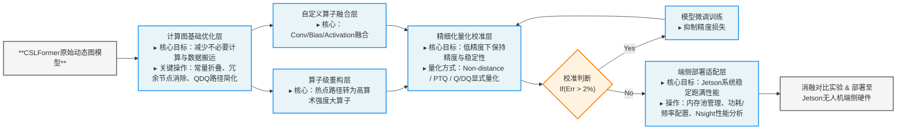

## 5.2流程图
这里需要把这张流程图画成横着的可以放进论文正文的格式

```mermaid
graph LR
    %% 样式定义
    classDef coreLayer fill:#e8f4f8,stroke:#2196f3,stroke-width:2px;
    classDef condLayer fill:#fff3e0,stroke:#f57c00,stroke-width:2px;
    classDef feedbackLayer fill:#fdf2f8,stroke:#e91e63,stroke-width:2px;
    classDef startEnd fill:#f5f5f5,stroke:#666,stroke-width:2px;

    %% 起始节点
    Start["**CSLFormer原始动态图模型**"]:::startEnd --> A

    %% 并行算子优化层
    A["计算图基础优化层<br/>▸ 核心目标：减少不必要计算与数据搬运<br/>▸ 关键操作：常量折叠、冗余节点消除、QDQ路径简化"]:::coreLayer
    A --> B1["算子级重构层<br/>▸ 核心：热点路径转为高算术强度大算子<br/>"]:::coreLayer
    A --> B2["自定义算子融合层<br/>▸ 核心：Conv/Bias/Activation融合<br/>"]:::coreLayer

    %% 量化校准层（包含三种量化方式）
    B1 & B2 --> C["精细化量化校准层<br/>▸ 核心目标：低精度下保持精度与稳定性<br/>▸ 量化方式：Non-distance / PTQ / Q/DQ显式量化"]:::coreLayer

    %% 校准条件判断
    C --> Calib{"校准判断<br/>If(Err > 2%)"}:::condLayer
    Calib -->|Yes| FineTune["模型微调训练<br/>▸ 抑制精度损失"]:::coreLayer
    Calib -->|No| D["端侧部署适配层<br/>▸ 核心目标：Jetson系统稳定跑满性能<br/>▸ 操作：内存池管理、功耗/频率配置、Nsight性能分析"]:::coreLayer
    FineTune --> C

    %% 端侧部署与消融实验
    D --> End["消融对比实验 & 部署至Jetson无人机端侧硬件"]:::startEnd
```
==请你参考我之前自己画的格式：==
